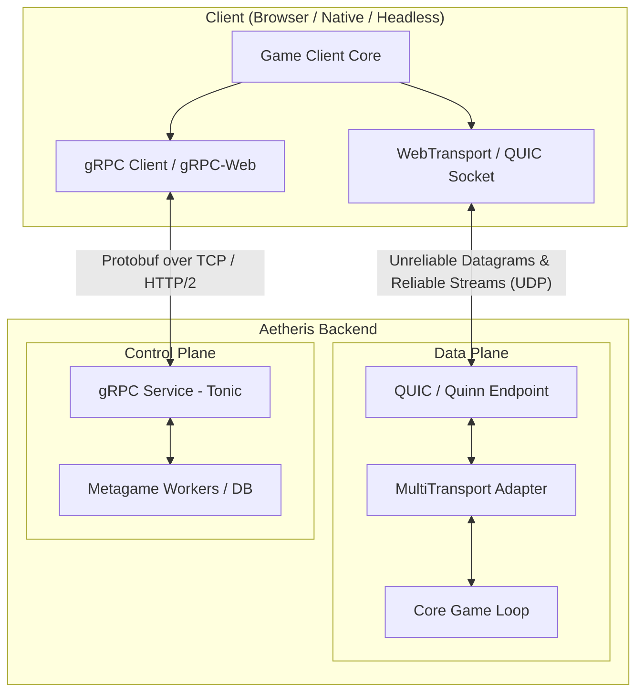
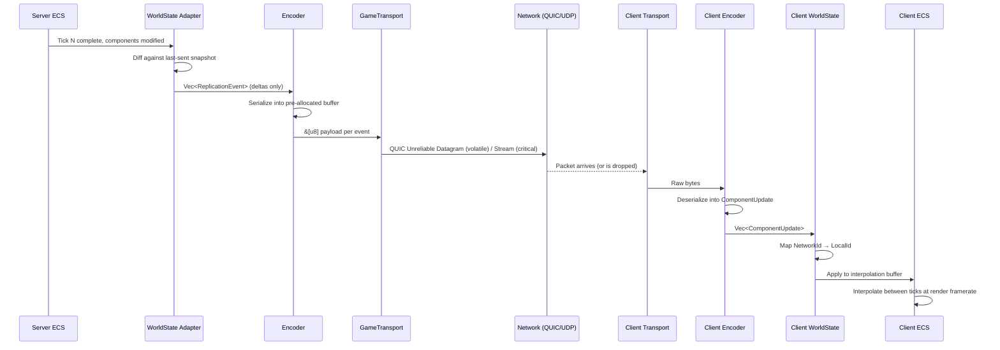

# Aetheris Engine — Technical Design Document

## Table of Contents

1. [Executive Summary](#1-executive-summary)
2. [Architecture Overview](#2-architecture-overview)
3. [Network Topology — Dual-Plane Design](#3-network-topology--dual-plane-design)
4. [The Trait Facade — Core Abstraction Layer](#4-the-trait-facade--core-abstraction-layer)
5. [Data-Oriented State Replication (CRP)](#5-data-oriented-state-replication-crp)
6. [Entity Identity System](#6-entity-identity-system)
7. [Client Architecture — WASM & Beyond](#7-client-architecture--wasm--beyond)
8. [Observability & Telemetry](#8-observability--telemetry)
9. [Crate Structure & Module Layout](#9-crate-structure--module-layout)
10. [Evolutionary Roadmap](#10-evolutionary-roadmap)
11. [Open Questions](#11-open-questions)
12. [Appendix A — Glossary](#appendix-a--glossary)
13. [Appendix B — Decision Log](#appendix-b--decision-log)

---

## Executive Summary

Aetheris is an **asymmetrical, authoritative-server high-performance engine** built natively in Rust. While its primary architecture is optimized for massivemultimedia and real-time gaming, its underlying design is that of a **general-purpose high-performance distributed computing platform**.

Aetheris is designed to support:

- **Game Platforms & Multiverses** — A stable foundation for a single massive game or a persistent group of interconnected games with shared characteristics.
- **Distributed Computing** — Any workload requiring high-frequency state synchronization, massive concurrency, and low-latency communication across heterogeneous nodes.
- **Massive concurrency** — thousands of concurrent units or players in a single world shard.
- **Real-time state replication** — sub-frame latency delta compression over UDP.

### Design Principles

| Principle | Rationale |
|---|---|
| **Multi-Purpose Platform** | Designed to serve as a platform for individual games, game clusters (multiverses), or non-gaming high-performance distributed systems. |
| **Trait-First Abstraction** | All subsystems communicate through Rust traits. The engine never depends on a concrete library type in its core loop. |
| **Data-Oriented Design** | Components are stored in contiguous memory. Iteration favors cache-line efficiency over object graphs. |
| **Measure Before You Optimize** | Every phase transition is justified by telemetry, not intuition. Libraries are only replaced when metrics prove they are the bottleneck. |
| **Didactic Codebase** | Every module, type, and trait includes documentation explaining *why* the design choice was made, not just *what* it does. The codebase is a teaching tool. |

---

## 2. Architecture Overview

Aetheris separates concerns into four orthogonal subsystems. Each subsystem is defined by a trait and backed by a concrete implementation that can be swapped between phases.

```
┌─────────────────────────────────────────────────────────────┐
│                      Core Game Loop                         │
│  ┌───────────┐   ┌───────────┐   ┌───────────┐             │
│  │ WorldState│   │ Encoder   │   │ Transport │             │
│  │  (trait)  │   │  (trait)  │   │  (trait)  │             │
│  └─────┬─────┘   └─────┬─────┘   └─────┬─────┘             │
│        │               │               │                    │
│  Phase 1: Bevy    Phase 1: rmp-serde  Phase 1: Renet       │
│  Phase 3: Custom  Phase 3: Bitpack Phase 3: Quinn/QUIC     │
└─────────────────────────────────────────────────────────────┘
```

The game loop itself is a fixed-timestep tick. On every tick:

1. **POLL** — `GameTransport::poll_events()` drains all inbound network events.
2. **APPLY** — `WorldState::apply_updates()` performs the ownership gate and injects validated component updates and inputs into the ECS. This stage also handles periodic session validation and StartSession commands.
3. **SIMULATE** — The ECS runs authoritative systems (e.g., Newtonian physics, AI).
4. **EXTRACT** — `WorldState::extract_deltas()` produces `ReplicationEvent`s for all changed components.
5. **SEND** — The `ChannelClassifier`, `Encoder` and `GameTransport` handle prioritization/parallel encoding and tokio handle injection; deltas are dispatched to [Priority Channels](PRIORITY_CHANNELS_DESIGN.md) P0→P5, shedding low-priority channels under congestion. This stage offloads serialization to a parallel thread pool and enqueues messages to a non-blocking outbound sender task.

Priority Channels are developer-configurable via the `ChannelRegistry` builder API (see [PRIORITY_CHANNELS_DESIGN.md §3](PRIORITY_CHANNELS_DESIGN.md#3-channel-registry--developer-configurable-channels)). Games define N channels at startup; the engine provides a default 6-channel configuration.

This five-stage pipeline is the heartbeat of the engine. Every architectural decision below exists to make each stage faster, smaller, and more predictable.

> **Canonical References:** Stage 3 input processing is detailed in [INPUT_PIPELINE_DESIGN.md](https://github.com/garnizeh-labs/aetheris-client/blob/main/docs/INPUT_PIPELINE_DESIGN.md). Stage 5 interest filtering is detailed in [INTEREST_MANAGEMENT_DESIGN.md](INTEREST_MANAGEMENT_DESIGN.md) and [SPATIAL_PARTITIONING_DESIGN.md](SPATIAL_PARTITIONING_DESIGN.md).

---

## 3. Network Topology — Dual-Plane Design

Aetheris strictly partitions network traffic into two communication planes. Mixing real-time game state with transactional metagame RPCs on a single channel creates head-of-line blocking, priority inversion, and debugging nightmares. By splitting them, each plane can be independently tuned, monitored, and scaled.

### 3.1 The Data Plane (Real-Time Game Loop)

| Property | Value |
|---|---|
| **Protocol** | QUIC (server) / WebTransport (browser) |
| **Transport** | UDP |
| **Rust Crate (Phase 1)** | `renet` (abstracts UDP reliability) |
| **Rust Crate (Phase 3)** | `quinn` (native QUIC) |
| **Primary Use** | Entity position updates, input commands, physics state |
| **Datagram Strategy** | Unreliable datagrams for volatile data (positions); reliable streams for critical RPCs (spell casts, deaths) |

**Why QUIC over raw UDP?**  
Raw UDP gives zero guarantees. QUIC provides *selective* reliability: unreliable datagrams for fire-and-forget position blasts, plus reliable streams for ordered critical events — all multiplexed on a single UDP port without TCP's head-of-line blocking. A dropped position packet is irrelevant because the next tick carries fresher data. A dropped "player died" event is catastrophic. QUIC lets us treat each case with the correct reliability strategy.

**Why WebTransport for browsers?**  
Browsers cannot open raw UDP sockets. WebTransport is the W3C standard that exposes QUIC semantics (unreliable datagrams + bidirectional streams) to JavaScript and WASM. It is the only browser API that avoids TCP head-of-line blocking for game traffic.

### 3.2 The Control Plane (Transactional / Metagame)

| Property | Value |
|---|---|
| **Protocol** | gRPC over HTTP/2 |
| **Transport** | TCP |
| **Rust Crate** | `tonic` |
| **Primary Use** | Authentication, matchmaking, inventory, leaderboards, guild management |
| **Schema** | Protocol Buffers (`.proto` files) |

**Why gRPC for metagame?**  
Authentication tokens, inventory mutations, and matchmaking requests are infrequent, latency-tolerant, and require strong API contracts. Protocol Buffers give us schema evolution, cross-language codegen, and compile-time type safety — none of which matter for 60-tick position blasts, but all of which matter for a billing API.

### 3.3 Topology Diagram



> **Key insight for native clients:** A native desktop client uses `quinn` directly instead of WebTransport, but the `GameTransport` trait is identical. The trait does not expose browser-specific APIs. When a native client connects via raw QUIC and a browser client connects via WebTransport, the server's `GameTransport` implementation handles both identically behind a unified `client_id`.

---

## 4. The Trait Facade — Core Abstraction Layer

This is the most critical section of the design. The Trait Facade is the firewall between the game engine's core loop and every external dependency. Without it, swapping Bevy for a custom ECS would require rewriting the networking layer. With it, the swap is a single `impl WorldState for CustomEcs` block.

### 4.1 Design Rationale

Coupling an ECS directly to a network protocol (e.g., using Bevy's `Reflect` trait to auto-serialize components into packets) creates a fragile dependency chain:

```
Network Layer → Bevy Reflect → Bevy Component Storage → Bevy Schedule
```

If any link changes, everything downstream breaks. The Trait Facade inverts the dependency:

```
Network Layer → GameTransport trait (we own this)
Game Logic    → WorldState trait (we own this)
Serialization → Encoder trait (we own this)
```

Each trait is a stable contract. Implementations are swappable. The core loop only speaks in terms of these traits.

### 4.2 Trait Definitions

### 4.2 Trait Definitions

> [!IMPORTANT]
> **Canonical Source**: The full trait definitions and protocol types have been moved to [PROTOCOL_DESIGN.md](https://github.com/garnizeh-labs/aetheris-protocol/blob/main/docs/PROTOCOL_DESIGN.md).

#### `GameTransport` — Network Abstraction

See [PROTOCOL_DESIGN.md §2](https://github.com/garnizeh-labs/aetheris-protocol/blob/main/docs/PROTOCOL_DESIGN.md#2-gametransport--network-abstraction) for the canonical trait definition.

#### `WorldState` — ECS Adapter

See [PROTOCOL_DESIGN.md §1](https://github.com/garnizeh-labs/aetheris-protocol/blob/main/docs/PROTOCOL_DESIGN.md#1-worldstate--ecs-adapter) for the canonical trait definition.

#### `Encoder` — Serialization Protocol

See [PROTOCOL_DESIGN.md §3](https://github.com/garnizeh-labs/aetheris-protocol/blob/main/docs/PROTOCOL_DESIGN.md#3-encoder--serialization-protocol) for the canonical trait definition.

### 4.3 Core Protocol Types

See [PROTOCOL_DESIGN.md §Core Protocol Types](https://github.com/garnizeh-labs/aetheris-protocol/blob/main/docs/PROTOCOL_DESIGN.md#core-protocol-types) for definitions of `NetworkId`, `LocalId`, `ClientId`, and `NetworkEvent`.

### 4.4 Error Types

```rust
/// Errors from the transport layer.
#[derive(Debug, thiserror::Error)]
pub enum TransportError {
    #[error("Client {0:?} is not connected")]
    ClientNotConnected(ClientId),
    #[error("Datagram exceeds MTU limit ({size} > {max})")]
    PayloadTooLarge { size: usize, max: usize },
    #[error("Transport I/O error: {0}")]
    Io(#[from] std::io::Error),
}

/// Errors from the serialization layer.
#[derive(Debug, thiserror::Error)]
pub enum EncodeError {
    #[error("Buffer overflow: need {needed} bytes, have {available}")]
    BufferOverflow { needed: usize, available: usize },
    #[error("Malformed payload at byte offset {offset}")]
    MalformedPayload { offset: usize },
    #[error("Unknown component kind: {0:?}")]
    UnknownComponent(ComponentKind),
}

/// Errors from the ECS adapter.
#[derive(Debug, thiserror::Error)]
pub enum WorldError {
    #[error("Entity {0:?} not found")]
    EntityNotFound(NetworkId),
    #[error("Entity {0:?} already exists")]
    EntityAlreadyExists(NetworkId),
}
```

---

## 5. Data-Oriented State Replication (CRP)

The **Component Replication Protocol** is the wire format that carries ECS state changes between server and clients. This section explains *how* data moves through the pipeline and *why* each decision maximizes throughput.

### 5.1 The Replication Pipeline



### 5.2 Delta Compression Strategy

**Phase 1 — Full Snapshots (Simple)**

During the MVP, the `WorldState` adapter emits the *entire component* whenever any field changes. This is wasteful but correct. It allows rapid iteration without worrying about field-level diffing bugs.

```
Tick 5024: Entity 9942's Position changed
  → ReplicationEvent { network_id: 9942, payload: [x: f32, y: f32, z: f32] }
  → Full 12-byte position sent even if only x changed
```

**Phase 2 — Field-Level Deltas (Measured)**

Once telemetry shows bandwidth saturation, only changed fields are sent. Each component type declares a bitmask indicating which fields are dirty:

```
Tick 5024: Entity 9942's Position.x changed
  → ReplicationEvent { payload: [dirty_mask: 0b001, x: f32] }
  → 5 bytes instead of 12
```

**Phase 3 — Bit-Packed Deltas (Optimized)**

The custom bit-packer writes values at their true bit-width. A boolean is 1 bit, not 8. A health value ranging 0–1000 is 10 bits, not 32. Values are packed seamlessly across 32-bit word boundaries and flushed in little-endian order:

```
Tick 5024: Entity 9942
  → [NetworkId: 20 bits] [ComponentKind: 8 bits] [DirtyMask: 3 bits] [x: 23 bits quantized]
  → Total: 54 bits = 7 bytes (vs. 20+ bytes in Phase 1)
```

### 5.3 Reliability Classification

Not all replication events deserve the same delivery guarantee:

| Category | Examples | Delivery | Rationale |
|---|---|---|---|
| **Volatile** | Position, rotation, velocity | Unreliable datagram | Stale data is worse than no data. The next tick carries fresher values. |
| **Critical** | Health depletion, death, respawn | Reliable stream | Loss causes hard desync. Client state diverges permanently. |
| **Ordered** | Inventory mutations, quest progress | Reliable + ordered stream | Must be applied in sequence. Out-of-order application corrupts state. |

The `ComponentKind` type carries metadata about which reliability tier a component belongs to. The game loop consults this when choosing between `send_unreliable` and `send_reliable`.

### 5.4 Client-Side Interpolation

The client never renders raw server state directly. Doing so would cause visual jitter at any latency above 0ms. Instead:

1. The `WorldState` adapter on the client maintains a **two-tick buffer** of incoming states.
2. The render loop interpolates between `tick[n-1]` and `tick[n]` based on local frame time.
3. If a packet is dropped, the client **extrapolates** from the last known velocity for up to 3 ticks before snapping.

This creates a smooth visual experience even at 60Hz server tick rates with 50–100ms network latency.

---

## 6. Entity Identity System

Entity identity is a subtle problem in distributed systems. Two separate ECS instances (server and client) each have their own entity allocation scheme with their own internal IDs. Aetheris solves this with a two-layer identity model.

### 6.1 NetworkId vs. LocalId

```
Server ECS:  Entity(42, gen=3)  ←→  NetworkId(9942)  ←── network wire ──→  NetworkId(9942)  ←→  Entity(17, gen=1)  :Client ECS
              (LocalId)              (Protocol ID)                           (Protocol ID)              (LocalId)
```

- **`NetworkId`** is assigned by the server when an entity is spawned. It is globally unique, monotonically increasing, and never reused. It is the only identifier that crosses the network boundary.
- **`LocalId`** wraps the ECS's native entity handle. In Bevy, this is `Entity`. In a custom ECS, this is an archetype row index. It never leaves the local machine.

### 6.2 Why Not Just Use the ECS Entity ID?

Bevy's `Entity` is a 64-bit value containing a 32-bit index and a 32-bit generation. If we sent it over the wire:

1. The client's Bevy instance would have *different* generations for the same index, causing lookup failures.
2. If we later swap Bevy for a custom ECS with a different ID scheme (e.g., archetype-row), every packet format would break.
3. Entity IDs are a security-sensitive internal detail. Exposing them leaks information about server allocation patterns.

`NetworkId` isolates the protocol from all of these concerns.

### 6.3 Allocation Strategy

```rust
/// Server-side NetworkId allocator.
/// Thread-safe, lock-free, monotonically increasing.
pub struct NetworkIdAllocator {
    next: AtomicU64,
}

impl NetworkIdAllocator {
    pub fn new() -> Self {
        Self { next: AtomicU64::new(1) } // 0 is reserved as "null"
    }

    /// Allocates the next globally unique NetworkId.
    /// Uses Relaxed ordering because monotonicity is guaranteed by
    /// fetch_add atomicity — no other ordering is required.
    pub fn allocate(&self) -> NetworkId {
        NetworkId(self.next.fetch_add(1, Ordering::Relaxed))
    }
}

### 6.4 Authoritative Entity Definitions

The engine treats `aetheris-protocol` as the single source of truth for entity types and their base vitals. Systems that handle spawning (e.g., `spawn_kind`) and damage logic use the `ENTITY_TYPE_*` constants and `get_default_stats()` utility. This centralization ensures that any balance changes to base ship stats only need to be made in the protocol crate to propagate across both the engine simulation and the client-side UI.
```

---

## 7. Client Architecture — WASM & Beyond

Aetheris is designed to ship browser-first via WASM, but the architecture explicitly avoids browser-only assumptions. The `GameTransport` trait does not expose `WebTransport`, `WebSocket`, or any browser API. It exposes `send_unreliable`, `send_reliable`, and `poll_events`. Whether the underlying socket is a browser `WebTransport` session, a native `quinn` QUIC connection, or a headless test harness is an implementation detail hidden behind the trait.

### 7.1 Client Platform Matrix

| Platform | Transport Implementation | Renderer | Build Target |
|---|---|---|---|
| **Browser (WASM)** | WebTransport via `web-sys` bindings | `wgpu` → WebGPU | `wasm32-unknown-unknown` |
| **Native Desktop** (future) | `quinn` QUIC directly | `wgpu` → Vulkan/Metal/DX12 | `x86_64-unknown-linux-gnu`, `x86_64-pc-windows-msvc`, `aarch64-apple-darwin` |
| **Headless Bot** (testing) | In-memory mock channel | None | Host target |
| **Mobile** (future) | `quinn` or platform WebView | `wgpu` → Vulkan/Metal | `aarch64-linux-android`, `aarch64-apple-ios` |

### 7.2 WASM Threading Strategy

Browsers execute JavaScript and WASM on a single main thread by default. A 60FPS render loop, network poller, and game logic step competing for the same thread is a guaranteed frame budget violation. Aetheris decouples these using Web Workers:

```
┌──────────────────────────────────────────────────────┐
│  Main Thread (DOM ownership)                         │
│  - Initializes <canvas>                              │
│  - Calls canvas.transferControlToOffscreen()         │
│  - Transfers OffscreenCanvas to Render Worker        │
│  - Handles UI overlays (HTML/CSS HUD elements)       │
└──────────────────────────────────────────────────────┘
        │ postMessage(OffscreenCanvas)
        ▼
┌──────────────────────────────────────────────────────┐
│  Render Worker (owns GPU context)                    │
│  - Receives OffscreenCanvas                          │
│  - Initializes wgpu with WebGPU backend              │
│  - Runs requestAnimationFrame render loop            │
│  - Reads shared state from game worker via SAB       │
└──────────────────────────────────────────────────────┘
        │ SharedArrayBuffer
        ▼
┌──────────────────────────────────────────────────────┐
│  Game Worker (owns simulation + network)             │
│  - Runs fixed-timestep game loop                     │
│  - Polls GameTransport (WebTransport)                │
│  - Runs WorldState::apply_updates()                  │
│  - Writes interpolation state into SharedArrayBuffer │
└──────────────────────────────────────────────────────┘
```

**`OffscreenCanvas`** allows the GPU render loop to run entirely outside the main thread.  
**`SharedArrayBuffer` (SAB)** provides zero-copy communication between the game worker and render worker. Position/rotation data is written by the game worker and read by the render worker without message-passing overhead.

### 7.3 WASM Binary Optimization

The WASM binary must be small enough for instant-play (no install, no download screen):

| Technique | Tool | Expected Impact |
|---|---|---|
| LTO (Link-Time Optimization) | `lto = true` in `Cargo.toml` | Eliminates dead code across crate boundaries |
| Size optimization | `opt-level = 'z'` | Optimizes for binary size over speed (acceptable for non-hot paths) |
| Symbol stripping | `strip = "symbols"` | Removes debug symbols from release builds |
| `wasm-opt` pass | `wasm-pack build --release` | Binaryen optimizer pass reduces WASM size by 10–20% |
| Panic = abort | `panic = "abort"` | Eliminates unwinding machinery (~50KB savings) |

### 7.4 Native Client Path (Future)

When a native desktop client is introduced, it will share 100% of the game logic crate. The only differences are:

- **Transport:** `impl GameTransport for QuinnTransport` instead of `impl GameTransport for WebTransportBridge`.
- **Renderer initialization:** `wgpu` initializes against Vulkan/Metal/DX12 instead of WebGPU.
- **Threading:** Standard `std::thread` or `tokio` tasks instead of Web Workers.

The `WorldState`, `Encoder`, and all game logic remain byte-for-byte identical.

---

## 8. Observability & Telemetry

Aetheris is built to be measured. Every phase transition (Phase 1 → 2, Phase 2 → 3) is gated by telemetry data, not guesswork. The observability stack is initialized at `main.rs` entry point and permeates all core subsystems.

### 8.1 Instrumentation Points

| Metric | Source | Threshold | Action on Breach |
|---|---|---|---|
| **Tick Duration** | `tracing::span` around core game loop | > 16.6ms (60Hz budget) | Profile `WorldState::extract_deltas()` and `Encoder::encode()`. If ECS iteration is the bottleneck → Phase 3 ECS swap. |
| **Packets/sec** | `GameTransport` wrapper metrics | Approaching NIC saturation | Increase delta compression aggressiveness. Reduce tick rate for distant entities ([interest management](INTEREST_MANAGEMENT_DESIGN.md)). |
| **Datagram Drop Rate** | QUIC path stats from `quinn` | > 5% sustained | Investigate client-side network conditions. Adjust congestion window. Switch volatile components to lower frequency. |
| **Encode/Decode Time** | `tracing::span` around `Encoder` calls | > 1ms per tick | Profile `serde` overhead. If serialization dominates → Phase 3 bit-packer. |
| **Memory Allocation Rate** | Custom global allocator wrapper | Any hot-path allocation | Identify and eliminate heap allocations in tick loop. Pre-allocate buffers. |
| **ECS Query Time** | Spans around `WorldState` methods | > 2ms for delta extraction | Bevy's change detection overhead → Phase 3 manual dirty flags. |
| **Client RTT** | QUIC connection stats | Information only | Feed into client interpolation buffer sizing. Higher RTT = deeper buffer. |

### 8.2 Tooling

| Layer | Tool | Purpose |
|---|---|---|
| **Structured Logging** | `tracing` + `tracing-subscriber` | Span-based structured logs with nanosecond timestamps |
| **Metrics Export** | `opentelemetry` + `opentelemetry-otlp` | OTLP export to Prometheus/Grafana or Jaeger |
| **Profiling** | `tracy` (optional feature flag) | Frame-level CPU profiler for micro-optimization |
| **Allocation Tracking** | Custom `GlobalAlloc` wrapper | Counts allocations per tick, alerts on hot-path heap usage |

### 8.3 Tracing Integration Example

```rust
use tracing::{info_span, instrument};

/// The core server tick, instrumented for observability.
#[instrument(skip_all, fields(tick = %current_tick))]
pub fn server_tick(
    transport: &mut dyn GameTransport,
    world: &mut dyn WorldState,
    encoder: &dyn Encoder,
    current_tick: u64,
) {
    // Phase 1: Poll
    let events = {
        let _span = info_span!("poll_events").entered();
        transport.poll_events()
    };

    // Phase 2: Apply inbound updates
    {
        let _span = info_span!("apply_updates", count = events.len()).entered();
        let updates = events
            .into_iter()
            .filter_map(|e| match e {
                NetworkEvent::UnreliableMessage { data, .. } => encoder.decode(&data).ok(),
                NetworkEvent::ReliableMessage { data, .. } => encoder.decode(&data).ok(),
                _ => None,
            })
            .collect();
        world.apply_updates(updates);
    }

    // Phase 3: Simulate (ECS systems run here)
    // ... ECS step ...

    // Phase 4: Extract and send deltas
    {
        let _span = info_span!("extract_and_send").entered();
        let deltas = world.extract_deltas();
        let mut buffer = [0u8; 1200]; // MTU-safe buffer
        for delta in &deltas {
            if let Ok(len) = encoder.encode(delta, &mut buffer) {
                // Reliability tier is determined by ComponentKind metadata
                let _ = transport.broadcast_unreliable(&buffer[..len]);
            }
        }
    }
}
```

---

## 9. Crate Structure & Module Layout

Aetheris is organized as a Cargo workspace with strict dependency boundaries. No crate may depend on a concrete library that belongs to a different trait boundary.

```
aetheris/
├── Cargo.toml                    # Workspace root
├── crates/
│   ├── aetheris-protocol/        # Core types, traits, error types (ZERO dependencies)
│   │   ├── src/
│   │   │   ├── lib.rs
│   │   │   ├── traits.rs         # GameTransport, WorldState, Encoder
│   │   │   ├── types.rs          # NetworkId, LocalId, ClientId, ComponentKind
│   │   │   ├── events.rs         # ReplicationEvent, ComponentUpdate, NetworkEvent
│   │   │   └── error.rs          # TransportError, EncodeError, WorldError
│   │   └── Cargo.toml
│   │
│   ├── aetheris-transport-renet/ # Phase 1: impl GameTransport for RenetTransport
│   │   ├── src/lib.rs
│   │   └── Cargo.toml            # depends on: aetheris-protocol, renet
│   │
│   ├── aetheris-transport-quinn/ # Phase 3: impl GameTransport for QuinnTransport
│   │   ├── src/lib.rs
│   │   └── Cargo.toml            # depends on: aetheris-protocol, quinn
│   │
│   ├── aetheris-ecs-bevy/        # Phase 1: impl WorldState for BevyWorldAdapter
│   │   ├── src/lib.rs
│   │   └── Cargo.toml            # depends on: aetheris-protocol, bevy_ecs
│   │
│   ├── aetheris-ecs-custom/      # Phase 3: impl WorldState for CustomEcs
│   │   ├── src/lib.rs
│   │   └── Cargo.toml            # depends on: aetheris-protocol (NO external ECS)
│   │
│   ├── aetheris-encoder-serde/   # Phase 1: impl Encoder for SerdeEncoder
│   │   ├── src/lib.rs
│   │   └── Cargo.toml            # depends on: aetheris-protocol, serde, rmp-serde
│   │
│   ├── aetheris-encoder-bitpack/ # Phase 3: impl Encoder for BitpackEncoder
│   │   ├── src/lib.rs
│   │   └── Cargo.toml            # depends on: aetheris-protocol (NO serde)
│   │
│   ├── aetheris-server/          # Server binary: wires traits to implementations
│   │   ├── src/
│   │   │   ├── main.rs           # Entry point: selects Phase 1 or 3 impls via features
│   │   │   └── tick.rs           # The core game loop (trait-only, no concrete types)
│   │   └── Cargo.toml            # depends on: aetheris-protocol + selected impl crates
│   │
│   ├── aetheris-client-wasm/     # Browser client (WASM target)
│   │   ├── src/lib.rs
│   │   └── Cargo.toml            # depends on: aetheris-protocol, wgpu, web-sys
│   │
│   └── aetheris-client-native/   # Future: native desktop client
│       ├── src/main.rs
│       └── Cargo.toml            # depends on: aetheris-protocol, wgpu, quinn
│
├── proto/                         # Protocol Buffer definitions for Control Plane
│   ├── auth.proto
│   ├── matchmaking.proto
│   └── inventory.proto
│
├── docs/
│   └── DESIGN.md                  # This document
│
└── tests/
    ├── integration/               # End-to-end tests with mock transport
    └── load/                      # Phase 2 headless load test harness
```

### 9.1 Dependency Rule

The arrow means "depends on." No arrow may point upward or sideways between implementation crates.

```
aetheris-protocol (traits + types)
    ▲           ▲           ▲
    │           │           │
    ├── transport-renet     ├── ecs-bevy        ├── encoder-serde
    ├── transport-quinn     ├── ecs-custom      ├── encoder-bitpack
    │           │           │
    ▼           ▼           ▼
aetheris-server / aetheris-client-*  (composes implementations)
```

`aetheris-protocol` has **zero** external dependencies (except `thiserror` for ergonomic error types and `async-trait` for async support). It is the stable nucleus of the entire project.

### 9.2 Feature Flags

The server binary uses Cargo feature flags to select implementations at compile time:

```toml
# crates/aetheris-server/Cargo.toml
[features]
default = ["phase1"]
phase1 = ["dep:aetheris-transport-renet", "dep:aetheris-ecs-bevy", "dep:aetheris-encoder-serde"]
phase3 = ["dep:aetheris-transport-quinn", "dep:aetheris-ecs-custom", "dep:aetheris-encoder-bitpack"]
```

This means `cargo build` gives Phase 1, and `cargo build --features phase3 --no-default-features` gives Phase 3. No runtime dispatch, no `dyn` overhead.

---

## 10. Evolutionary Roadmap

See the master [ROADMAP.md](https://github.com/garnize/aetheris/blob/main/docs/ROADMAP.md) for detailed milestone tracking and project status.

| Milestone | Goal | Subsystems | Status |
|---|---|---|---|
| **Phase 1 (MVP)** | Validate core loop with 100 clients | Bevy, Renet, rmp-serde | Active |
| **Phase 2 (Stress)** | Identify scale bottlenecks (10k bots) | Load Testing, Profiling | Planned |
| **Phase 3 (Artisanal)**| Optimized replacement of components | Custom ECS, Bitpacking, Quinn | Planned |
| **Phase 4 (Federate)** | Distributed world sharding | CockroachDB, Gateway | Planned |

---

## 11. Open Questions

| Question | Context | Status |
|---|---|---|
| **Congestion Control Algorithm** | Should we use BBR, CUBIC, or a custom Game-Optimized CC? | Addressed in [NETWORKING_DESIGN.md](https://github.com/garnizeh-labs/aetheris-protocol/blob/main/docs/NETWORKING_DESIGN.md) §7 |
| **Asset Streaming Protocol** | How are large textures/meshes streamed over the Data Plane? | Addressed in ASSET_STREAMING_DESIGN.md (Planned) |
| **Server-Side Rendering (SSR)** | For analytics or headless validation, do we need a server-side wgpu context? | [Restricted module not available yet] |

---

## Appendix A — Glossary

| Term | Definition |
|---|---|
| **Authoritative Server** | The server is the single source of truth. Clients propose inputs; the server validates and broadcasts results. No client can unilaterally modify game state. |
| **CRP** | Component Replication Protocol — Aetheris's wire format for ECS delta transmission. |
| **Data Plane** | The UDP/QUIC channel carrying real-time game state at high frequency. |
| **Control Plane** | The TCP/gRPC channel carrying transactional metagame operations. |
| **Delta Compression** | Sending only the fields that changed since the last tick, rather than full component snapshots. |
| **Dirty Flag / Dirty Bit** | A per-component boolean indicating whether the component was modified this tick. |
| **DOD (Data-Oriented Design)** | Structuring data for cache-line efficiency: arrays of components rather than objects containing components. |
| **ECS** | Entity Component System — a design pattern separating entities (IDs), components (data), and systems (logic). |
| **Head-of-Line Blocking** | TCP's property that a lost packet blocks all subsequent packets in the stream, even if they're independent. Fatal for real-time games. |
| **Interest Management** | Sending entity updates only to clients who can perceive them (e.g., within visual range), reducing bandwidth. |
| **Priority Channel** | A logical grouping of replicated data with a configurable priority level and shedding policy. Defined via the `ChannelRegistry` builder API. See [PRIORITY_CHANNELS_DESIGN.md](PRIORITY_CHANNELS_DESIGN.md). |
| **Priority Shedding** | Selective dropping or frequency reduction of lower-priority channels under congestion. Stage 5 sheds outbound; Stage 1 defers inbound. |
| **Channel Registry** | Immutable, developer-configured set of channel definitions built at server startup. Games define N channels; the engine provides a default 6-channel configuration. |
| **Interpolation** | Smoothly blending between two known server states on the client to eliminate visual jitter. |
| **Extrapolation** | Predicting future state from velocity when server packets are missing. Riskier than interpolation. |
| **MTU** | Maximum Transmission Unit — the largest packet size a network path supports without fragmentation (~1200 bytes for safe UDP). |
| **NetworkId** | A globally unique, server-assigned entity identifier used in all network communication. |
| **LocalId** | An ECS-internal entity handle that never crosses the network boundary. |
| **SoA** | Structure of Arrays — storing each component type in its own contiguous array for cache efficiency. |
| **Tick** | One discrete step of the server simulation. At 60Hz, each tick has a 16.6ms budget. |
| **Trait Facade** | Aetheris's pattern of defining subsystem interfaces as Rust traits, allowing implementation swaps without changing the core loop. |
| **Volatile Data** | Game state that is invalidated by the next update (e.g., position). Safe to send unreliably. |

---

## Appendix B — Decision Log

This log records architectural decisions, their rationale, and what would cause them to be revisited.

| # | Decision | Rationale | Revisit If... | Date |
|---|---|---|---|---|
| D1 | Dual-plane network topology (QUIC + gRPC) | Prevents metagame RPC traffic from interfering with real-time game state. Independent scaling and monitoring. | A unified QUIC-based RPC framework (e.g., QUIC streams for RPCs) proves simpler without adding latency. | 2026-04-15 |
| D2 | Trait Facade over direct library usage | Enables zero-risk library swaps. Core loop is library-agnostic. | Trait overhead becomes measurable in profiling (unlikely with monomorphization). | 2026-04-15 |
| D3 | Renet for Phase 1 transport | Mature, well-tested, Rust-native UDP abstraction. Fastest path to a working prototype. | Renet cannot handle 1000+ clients on a single socket. | 2026-04-15 |
| D4 | Bevy ECS for Phase 1 | Large community, good documentation, Rust-native. Reduces onboarding friction. | Change detection overhead dominates tick budget. | 2026-04-15 |
| D5 | rmp-serde for Phase 1 encoding | Safe, binary serialization (MessagePack). Resolved security advisories. | Encode/decode cost exceeds 10% of tick budget. | 2026-04-15 |
| D6 | NetworkId as u64 (not UUID) | 8 bytes vs. 16 bytes per entity reference. At 10K entities per packet, this saves significant bandwidth. | Entity count exceeds 2^64 (not in this universe). | 2026-04-15 |
| D7 | `opt-level = 'z'` for WASM client | Binary size directly impacts time-to-play. Sub-second load is required for browser games. | CPU-bound rendering in WASM requires `opt-level = 3`. Profile first. | 2026-04-15 |
| D8 | Little-endian flush for bit-packer | x86, ARM, and WASM are all little-endian. Avoiding byte-swap instructions on the hot path. | Big-endian target platform is introduced (unlikely). | 2026-04-15 |
| D9 | Two-tick interpolation buffer on client | Balances visual smoothness against input latency. One tick is too jittery. Three ticks adds perceptible delay. | Adaptive buffering based on measured RTT proves superior. | 2026-04-15 |
| D10 | Feature flags for phase selection | Compile-time selection eliminates all runtime dispatch overhead. | Simultaneous Phase 1 + Phase 3 operation is needed for A/B testing. Switch to runtime `Box<dyn Trait>`. | 2026-04-15 |
| D11 | Priority Channels as first-class pipeline feature | Bidirectional priority processing (Stage 1 ingest + Stage 5 dispatch) with developer-configurable channels via `ChannelRegistry`. See [PRIORITY_CHANNELS_DESIGN.md](PRIORITY_CHANNELS_DESIGN.md). | If channel classification overhead exceeds 0.5ms per tick. | 2026-04-15 |
| D12 | Accept renet/netcode handshake as Time-to-Possess floor | Profiling (run `20260422_101553`) confirmed server-side spawn latency is ~0 ms after A-06 coalescing fix. The remaining ≈6 ms between measured P99 (106 ms) and stretch target (≤100 ms) is caused by renet/netcode UDP handshake round-trips that occur after gRPC auth completes and before `client.is_connected()`. This is not reducible without replacing the Phase 1 transport. `aetheris_session_start_latency_seconds` histogram is wired to detect any server-side regression. | Phase 3 replaces `RenetTransport` with `QuinnTransport`; re-evaluate stretch target then. | 2026-04-22 |
