# Aetheris Engine — Integration & Information Flow

## Executive Summary

Central nexus for engine subsystem communication and information flow.

## 1. Executive Summary

The project has **12 design docs** covering transport, ECS, encoder, client, server,
security, persistence, audit, federation, observability, control plane, and platform.

This document serves as the **Integration Nexus**, defining how these individual
subsystems exchange information, their dependency ordering, and the global tick
pipeline's execution flow.
Each one describes a specific responsibility boundary — and that is precisely why
they need to exist separately: each doc is the canonical source for a cohesive domain.

The problem is that none of them answers the most obvious question for a new developer:

> **"But exactly how does all of this talk to all of this?"**

This document is the glue. It does not repeat implementation — it traces the **information flow**
across all subsystems, shows **when** each component is called, and explains **why**
each boundary exists where it does.

### Map of the 12 Design Docs

| Doc | Domain | Question it answers |
|---|---|---|
| [ENGINE_DESIGN](ENGINE_DESIGN.md) | Tick pipeline | How is the game loop structured and which traits govern it? |
| [ENGINE_DESIGN](ENGINE_DESIGN.md) | The Core Pipeline | How does the tick scheduler drive the simulation stage? |
| [ENCODER_DESIGN](https://github.com/garnizeh-labs/aetheris-protocol/blob/main/docs/ENCODER_DESIGN.md) | Serialization | How are network bytes translated to Rust structs and back? |
| [TRANSPORT_DESIGN](https://github.com/garnizeh-labs/aetheris-protocol/blob/main/docs/TRANSPORT_DESIGN.md) | Networking | How do packets arrive at and leave the server? |
| [CLIENT_DESIGN](https://github.com/garnizeh-labs/aetheris-client/blob/main/docs/CLIENT_DESIGN.md) | Browser client | How does WASM run across 3 threads without blocking the DOM? |
| [CONTROL_PLANE_DESIGN](https://github.com/garnizeh-labs/aetheris-protocol/blob/main/docs/CONTROL_PLANE_DESIGN.md) | Auth/Matchmaking | How does the client authenticate and receive the server address? |
| [SECURITY_DESIGN](SECURITY_DESIGN.md) | Layered security | How are cheats detected without blocking the tick? |
| [PERSISTENCE_DESIGN](PERSISTENCE_DESIGN.md) | Tiered persistence | How do events reach the database without touching the tick budget? |
| [AUDIT_DESIGN](https://github.com/garnizeh-labs/nexus/blob/main/docs/AUDIT_DESIGN.md) | Auditing (P3) | How does the Audit Worker verify integrity offline? |
| [OBSERVABILITY_DESIGN](OBSERVABILITY_DESIGN.md) | Telemetry | How do spans, metrics, and logs flow to Grafana/Jaeger? |
| [FEDERATION_DESIGN](https://github.com/garnizeh-labs/nexus/blob/main/docs/FEDERATION_DESIGN.md) | Multi-server (P4) | How do entities migrate between clusters? |
| [ARCHITECTURE_DESIGN](REPOSITORY_ARCHITECTURE_DESIGN.md) | SDK/Stable contracts | What is the guaranteed public API for integrators? |
| [PRIORITY_CHANNELS_DESIGN](PRIORITY_CHANNELS_DESIGN.md) | Priority multiplexing | How are Data Plane messages prioritized, shed, and routed? |

---

## Table of Contents

1. [The Architecture at a Glance](#1-the-architecture-at-a-glance)
2. [The Two Planes: Data Plane and Control Plane](#2-the-two-planes-data-plane-and-control-plane)
3. [The Trait Trio — The Real Glue](#3-the-trait-trio--the-real-glue)
4. [The Tick Pipeline — 5 Stages](#4-the-tick-pipeline--5-stages)
5. [Connection Flow: From Browser to Game](#5-connection-flow-from-browser-to-game)
6. [Replication Flow: From Simulation to Client](#6-replication-flow-from-simulation-to-client)
7. [Input Flow: From Client to ECS](#7-input-flow-from-client-to-ecs)
8. [Security Flow: Detection Without Blocking the Tick](#8-security-flow-detection-without-blocking-the-tick)
9. [Persistence Flow: From ECS to Cold Storage](#9-persistence-flow-from-ecs-to-cold-storage)
10. [Telemetry Flow: Instrumentation Across All Layers](#10-telemetry-flow-instrumentation-across-all-layers)
11. [Complete Entity Lifecycle](#11-complete-entity-lifecycle)
12. [Phase-Transition Boundaries](#12-phase-transition-boundaries)
13. [Crate Dependency Map](#13-crate-dependency-map)
14. [Why the Docs Are Separate](#14-why-the-docs-are-separate)
15. [Open Questions](#15-open-questions)
16. [Appendix A — Glossary](#appendix-a--glossary)
17. [Appendix B — Decision Log](#appendix-b--decision-log)

---

## 1. The Architecture at a Glance

This is the complete system map. Each box is a subsystem with its own design doc.
The arrows are the subject matter of this document.

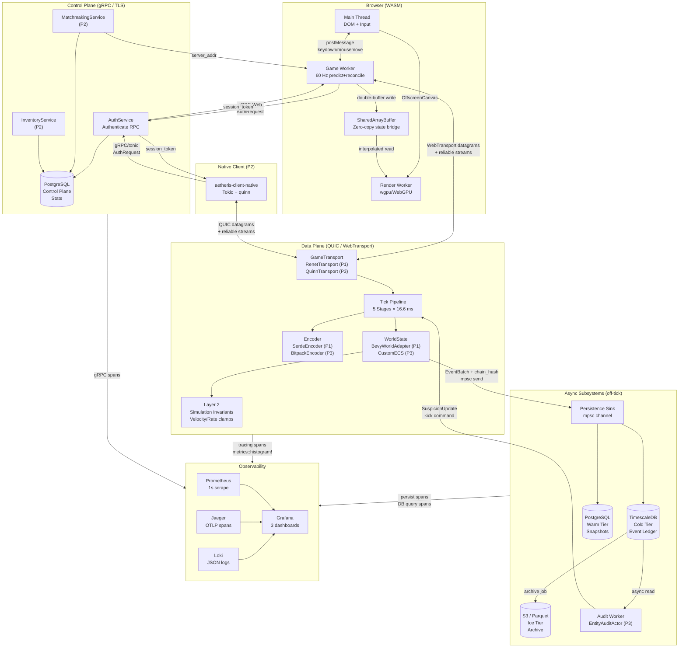
```mermaid
graph TB
    subgraph BROWSER["Browser (WASM)"]
        MT["Main Thread<br/>DOM + Input"]
        GW["Game Worker<br/>60 Hz predict+reconcile"]
        RW["Render Worker<br/>wgpu/WebGPU"]
        SAB["SharedArrayBuffer<br/>Zero-copy state bridge"]
        MT -->|"OffscreenCanvas"| RW
        MT <-->|"postMessage<br/>keydown/mousemove"| GW
        GW -->|"double-buffer write"| SAB
        SAB -->|"interpolated read"| RW
    end

    subgraph NATIVE["Native Client (P2)"]
        NC["aetheris-client-native<br/>Tokio + quinn"]
    end

    subgraph CONTROL["Control Plane (gRPC / TLS)"]
        AUTH["AuthService<br/>Authenticate RPC"]
        MM["MatchmakingService<br/>(P2)"]
        INV["InventoryService<br/>(P2)"]
        CPDB[("PostgreSQL<br/>Control Plane<br/>State")]
        AUTH --> CPDB
        MM --> CPDB
        INV --> CPDB
    end

    subgraph DATA["Data Plane (QUIC / WebTransport)"]
        direction TB
        TRANS["GameTransport<br/>RenetTransport (P1)<br/>QuinnTransport (P3)"]
        LOOP["Tick Pipeline<br/>5 Stages × 16.6 ms"]
        ECS["WorldState<br/>BevyWorldAdapter (P1)<br/>CustomECS (P3)"]
        ENC["Encoder<br/>SerdeEncoder (P1)<br/>BitpackEncoder (P3)"]
        SECL2["Layer 2<br/>Simulation Invariants<br/>Velocity/Rate clamps"]
        TRANS --> LOOP
        LOOP --> ECS
        LOOP --> ENC
        ECS --> SECL2
    end

    subgraph ASYNC["Async Subsystems (off-tick)"]
        PSINK["Persistence Sink<br/>mpsc channel"]
        DB_COLD[("TimescaleDB<br/>Cold Tier<br/>Event Ledger")]
        DB_WARM[("PostgreSQL<br/>Warm Tier<br/>Snapshots")]
        DB_ICE[("S3 / Parquet<br/>Ice Tier<br/>Archive")]
        AUDIT["Audit Worker<br/>EntityAuditActor (P3)"]
        PSINK --> DB_COLD
        PSINK --> DB_WARM
        DB_COLD -->|"archive job"| DB_ICE
        DB_COLD -->|"async read"| AUDIT
    end

    subgraph OBS["Observability"]
        PROM["Prometheus<br/>1s scrape"]
        JAEGER["Jaeger<br/>OTLP spans"]
        LOKI["Loki<br/>JSON logs"]
        GRAFANA["Grafana<br/>3 dashboards"]
        PROM --> GRAFANA
        JAEGER --> GRAFANA
        LOKI --> GRAFANA
    end

    GW <-->|"WebTransport datagrams<br/>+ reliable streams"| TRANS
    NC <-->|"QUIC datagrams<br/>+ reliable streams"| TRANS
    GW -->|"gRPC-Web<br/>AuthRequest"| AUTH
    NC -->|"gRPC/tonic<br/>AuthRequest"| AUTH
    AUTH -->|"session_token"| GW
    AUTH -->|"session_token"| NC
    MM -->|"server_addr"| GW

    ECS -->|"EventBatch + chain_hash<br/>mpsc send"| PSINK
    AUDIT -->|"SuspicionUpdate<br/>kick command"| LOOP

    DATA -->|"tracing spans<br/>metrics::histogram!"| OBS
    CONTROL -->|"gRPC spans"| OBS
    ASYNC -->|"persist spans<br/>DB query spans"| OBS
```

---

## 2. The Two Planes: Data Plane and Control Plane

Before any flow, the fundamental distinction:


```mermaid
graph LR
    subgraph CP["Control Plane — Transactional"]
        direction TB
        CP1["gRPC / TLS 1.3<br/>HTTP/2"]
        CP2["Auth, Matchmaking,<br/>Inventory, Economy"]
        CP3["Latency: 50–500ms<br/>acceptable"]
        CP4["Durable state<br/>PostgreSQL"]
    end

    subgraph DP["Data Plane — Real-Time"]
        direction TB
        DP1["QUIC / WebTransport<br/>UDP"]
        DP2["State replication<br/>Client inputs"]
        DP3["Latency: ≤ 16.6ms<br/>non-negotiable"]
        DP4["Ephemeral state<br/>ECS memory"]
    end

    CLIENT --> |"1st: authenticate"| CP
    CP -->|"session_token + server_addr"| CLIENT
    CLIENT -->|"2nd: connect + token"| DP
    DP -->|"real-time game"| CLIENT
```

**Why two planes?**

The Control Plane can have 500ms latency — nobody complains about a slow login. The Data Plane
has a 16.6ms budget per tick — any IO operation inside it is catastrophic. If both used the
same protocol (e.g. TCP/gRPC for everything), the metagame latency overhead would contaminate
the game loop.

Corresponding docs:

- Control Plane → [CONTROL_PLANE_DESIGN.md](https://github.com/garnizeh-labs/aetheris-protocol/blob/main/docs/CONTROL_PLANE_DESIGN.md)
- Data Plane → [TRANSPORT_DESIGN.md](https://github.com/garnizeh-labs/aetheris-protocol/blob/main/docs/TRANSPORT_DESIGN.md) + [ENGINE_DESIGN.md](ENGINE_DESIGN.md)

---

## 3. The Trait Trio — The Real Glue

All 12 docs exist because the system is governed by **3 traits**. They are the only
interfaces between the engine core and any external implementation:

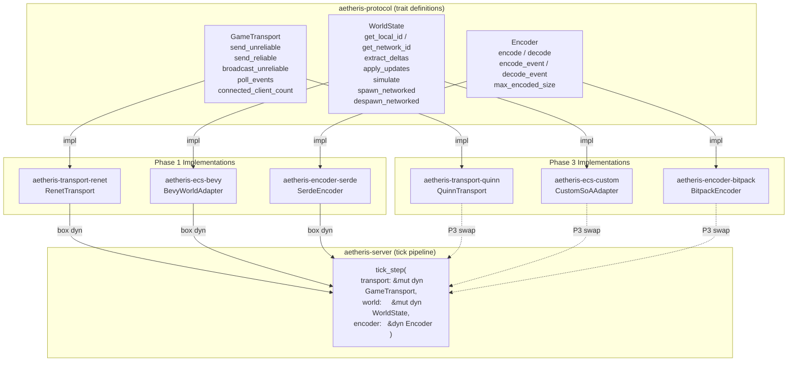
```mermaid
graph TB
    subgraph CORE["aetheris-protocol (trait definitions)"]
        GT["GameTransport<br/>send_unreliable<br/>send_reliable<br/>broadcast_unreliable<br/>poll_events<br/>connected_client_count"]
        WS["WorldState<br/>get_local_id / get_network_id<br/>extract_deltas<br/>apply_updates<br/>simulate<br/>spawn_networked<br/>despawn_networked"]
        ENC["Encoder<br/>encode / decode<br/>encode_event / decode_event<br/>max_encoded_size"]
    end

    subgraph P1["Phase 1 Implementations"]
        T1["aetheris-transport-renet<br/>RenetTransport"]
        W1["aetheris-ecs-bevy<br/>BevyWorldAdapter"]
        E1["aetheris-encoder-serde<br/>SerdeEncoder"]
    end

    subgraph P3["Phase 3 Implementations"]
        T3["aetheris-transport-quinn<br/>QuinnTransport"]
        W3["aetheris-ecs-custom<br/>CustomSoAAdapter"]
        E3["aetheris-encoder-bitpack<br/>BitpackEncoder"]
    end

    subgraph LOOP["aetheris-server (tick pipeline)"]
        TICK["tick_step(<br/>  transport: &mut dyn GameTransport,<br/>  world:     &mut dyn WorldState,<br/>  encoder:   &dyn Encoder<br/>)"]
    end

    GT -->|"impl"| T1
    GT -->|"impl"| T3
    WS -->|"impl"| W1
    WS -->|"impl"| W3
    ENC -->|"impl"| E1
    ENC -->|"impl"| E3

    T1 -->|"box dyn"| TICK
    W1 -->|"box dyn"| TICK
    E1 -->|"box dyn"| TICK

    T3 -.->|"P3 swap"| TICK
    W3 -.->|"P3 swap"| TICK
    E3 -.->|"P3 swap"| TICK
```

`tick_step` never imports `renet`, never imports `bevy_ecs`, never imports `serde`. It only
speaks to the traits. That is why the P1→P3 swap is a startup change, not a code change.

---

## 4. The Tick Pipeline — 5 Stages

This is the loop that runs 60 times per second. **Everything** that happens in real time passes through here.

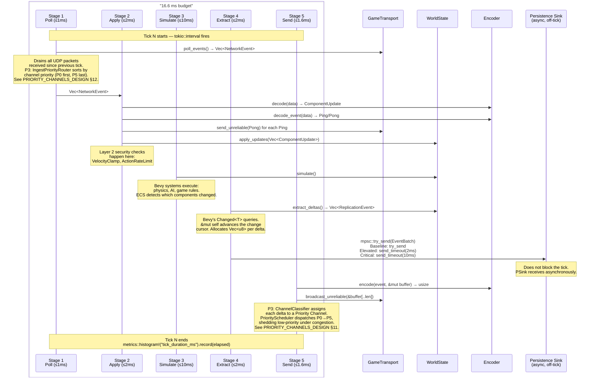
```mermaid
sequenceDiagram
    box "16.6 ms budget"
        participant S1 as Stage 1<br/>Poll (≤1ms)
        participant S2 as Stage 2<br/>Apply (≤2ms)
        participant S3 as Stage 3<br/>Simulate (≤10ms)
        participant S4 as Stage 4<br/>Extract (≤2ms)
        participant S5 as Stage 5<br/>Send (≤1.6ms)
    end
    participant TX as GameTransport
    participant WS as WorldState
    participant ENC as Encoder
    participant PSINK as Persistence Sink<br/>(async, off-tick)

    Note over S1,S5: Tick N starts — tokio::interval fires

    S1->>TX: poll_events() → Vec<NetworkEvent>
    Note over S1: Drains all UDP packets<br/>received since previous tick.<br/>P3: IngestPriorityRouter sorts by<br/>channel priority (P0 first, P5 last).<br/>See PRIORITY_CHANNELS_DESIGN §12.

    S1->>S2: Vec<NetworkEvent>

    S2->>ENC: decode(data) → ComponentUpdate
    S2->>ENC: decode_event(data) → Ping/Pong
    S2->>TX: send_unreliable(Pong) for each Ping
    S2->>WS: apply_updates(Vec<ComponentUpdate>)
    Note over S2: Layer 2 security checks<br/>happen here:<br/>VelocityClamp, ActionRateLimit

    S3->>WS: simulate()
    Note over S3: Bevy systems execute:<br/>physics, AI, game rules.<br/>ECS detects which components changed.

    S4->>WS: extract_deltas() → Vec<ReplicationEvent>
    Note over S4: Bevy's Changed<T> queries.<br/>&mut self advances the change<br/>cursor. Allocates Vec<u8> per delta.

    S4->>PSINK: mpsc::try_send(EventBatch)<br/>Baseline: try_send<br/>Elevated: send_timeout(2ms)<br/>Critical: send_timeout(10ms)
    Note over PSINK: Does not block the tick.<br/>PSink receives asynchronously.

    S5->>ENC: encode(event, &mut buffer) → usize
    S5->>TX: broadcast_unreliable(&buffer[..len])
    Note over S5: P3: ChannelClassifier assigns<br/>each delta to a Priority Channel.<br/>PriorityScheduler dispatches P0→P5,<br/>shedding low-priority under congestion.<br/>See PRIORITY_CHANNELS_DESIGN §11.

    Note over S1,S5: Tick N ends<br/>metrics::histogram!("tick_duration_ms").record(elapsed)
```

### Time Budget per Stage

| Stage | Budget | P1 Bottleneck | P3 Resolution |
|---|---|---|---|
| **1 — Poll** | ≤ 1 ms | UDP receive syscall | `io_uring` async I/O |
| **2 — Apply** | ≤ 2 ms | `HashMap` lookup by `ComponentKind` | Array-indexed dispatch table |
| **3 — Simulate** | ≤ 10 ms | Bevy change-detection scanning all archetypes | Custom SoA with per-field dirty-bits |
| **4 — Extract** | ≤ 2 ms | `Changed<T>` query + `Vec<u8>` alloc per delta | Borrowed slices from archetype storage |
| **5 — Send** | ≤ 1.6 ms | `rmp-serde` serialization overhead | Custom bit-packer |

---

## 5. Connection Flow: From Browser to Game

The path a player takes from typing `/connect` to receiving the first game tick.

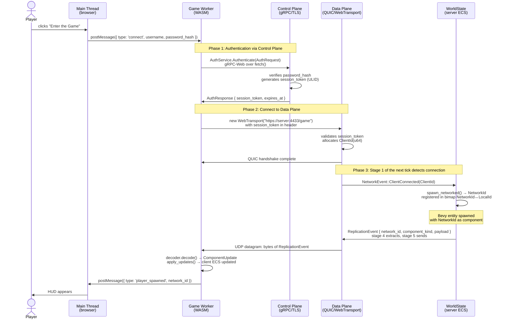
```mermaid
sequenceDiagram
    actor Player
    participant MT as Main Thread<br/>(browser)
    participant GW as Game Worker<br/>(WASM)
    participant CP as Control Plane<br/>(gRPC/TLS)
    participant DP as Data Plane<br/>(QUIC/WebTransport)
    participant ECS as WorldState<br/>(server ECS)

    Player->>MT: clicks "Enter the Game"
    MT->>GW: postMessage({ type: 'connect', username, password_hash })

    Note over GW,CP: Phase 1: Authentication via Control Plane

    GW->>CP: AuthService.Authenticate(AuthRequest)<br/>gRPC-Web over fetch()
    CP->>CP: verifies password_hash<br/>generates session_token (ULID)
    CP->>GW: AuthResponse { session_token, expires_at }

    Note over GW,DP: Phase 2: Connect to Data Plane

    GW->>DP: new WebTransport("https://server:4433/game")<br/>with session_token in header
    DP->>DP: validates session_token<br/>allocates ClientId(u64)
    DP->>GW: QUIC handshake complete

    Note over DP,ECS: Phase 3: Stage 1 of the next tick detects connection

    DP->>ECS: NetworkEvent::ClientConnected(ClientId)
    ECS->>ECS: spawn_networked() → NetworkId<br/>registered in bimap NetworkId↔LocalId
    Note over ECS: Bevy entity spawned<br/>with NetworkId as component

    ECS->>DP: ReplicationEvent { network_id, component_kind, payload }<br/>stage 4 extracts, stage 5 sends
    DP->>GW: UDP datagram: bytes of ReplicationEvent
    GW->>GW: decoder.decode() → ComponentUpdate<br/>apply_updates() → client ECS updated
    GW->>MT: postMessage({ type: 'player_spawned', network_id })
    MT->>Player: HUD appears
```

### Connection Security Details

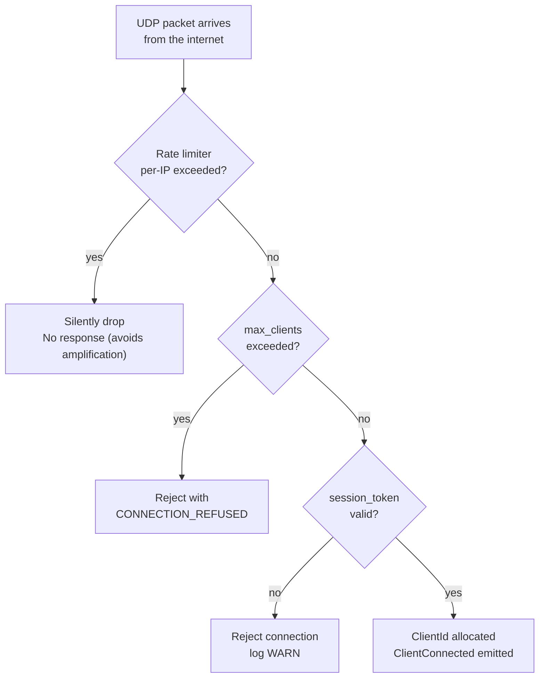
```mermaid
flowchart TD
    A["UDP packet arrives<br/>from the internet"] --> B{"Rate limiter<br/>per-IP exceeded?"}
    B -->|"yes"| C["Silently drop<br/>No response (avoids amplification)"]
    B -->|"no"| D{"max_clients<br/>exceeded?"}
    D -->|"yes"| E["Reject with<br/>CONNECTION_REFUSED"]
    D -->|"no"| F{"session_token<br/>valid?"}
    F -->|"no"| G["Reject connection<br/>log WARN"]
    F -->|"yes"| H["ClientId allocated<br/>ClientConnected emitted"]
```

---

## 6. Replication Flow: From Simulation to Client

The path of a component that changes on the server until it is rendered in the browser.

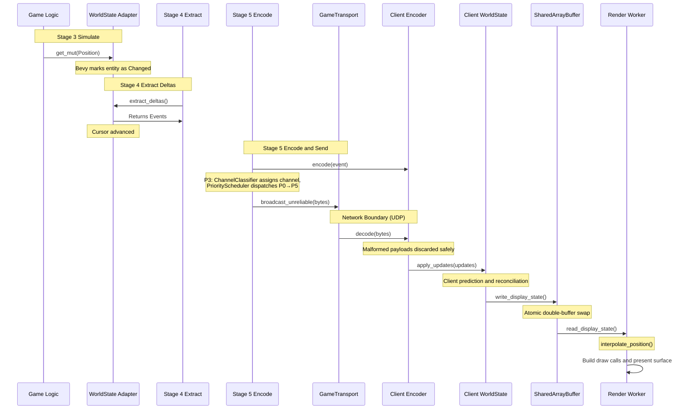
```mermaid
sequenceDiagram
    participant GAME as Game Logic
    participant ECS as WorldState Adapter
    participant STAGE4 as Stage 4 Extract
    participant STAGE5 as Stage 5 Encode
    participant NET as GameTransport
    participant CLIENT_ENC as Client Encoder
    participant CLIENT_ECS as Client WorldState
    participant SAB as SharedArrayBuffer
    participant RW as Render Worker
    Note over GAME, ECS: Stage 3 Simulate
    GAME->>ECS: get_mut(Position)
    Note over ECS: Bevy marks entity as Changed
    Note over STAGE4, ECS: Stage 4 Extract Deltas
    STAGE4->>ECS: extract_deltas()
    ECS->>STAGE4: Returns Events
    Note over ECS: Cursor advanced
    Note over STAGE5, NET: Stage 5 Encode and Send
    STAGE5->>CLIENT_ENC: encode(event)
    Note over STAGE5: P3: ChannelClassifier assigns channel,<br/>PriorityScheduler dispatches P0→P5
    STAGE5->>NET: broadcast_unreliable(bytes)
    Note over NET, CLIENT_ENC: Network Boundary (UDP)
    NET->>CLIENT_ENC: decode(bytes)
    Note over CLIENT_ENC: Malformed payloads discarded safely
    CLIENT_ENC->>CLIENT_ECS: apply_updates(updates)
    Note over CLIENT_ECS: Client prediction and reconciliation
    CLIENT_ECS->>SAB: write_display_state()
    Note over SAB: Atomic double-buffer swap
    SAB->>RW: read_display_state()
    Note over RW: interpolate_position()
    RW->>RW: Build draw calls and present surface
```

### Why `payload: Vec<u8>` and not a typed field?

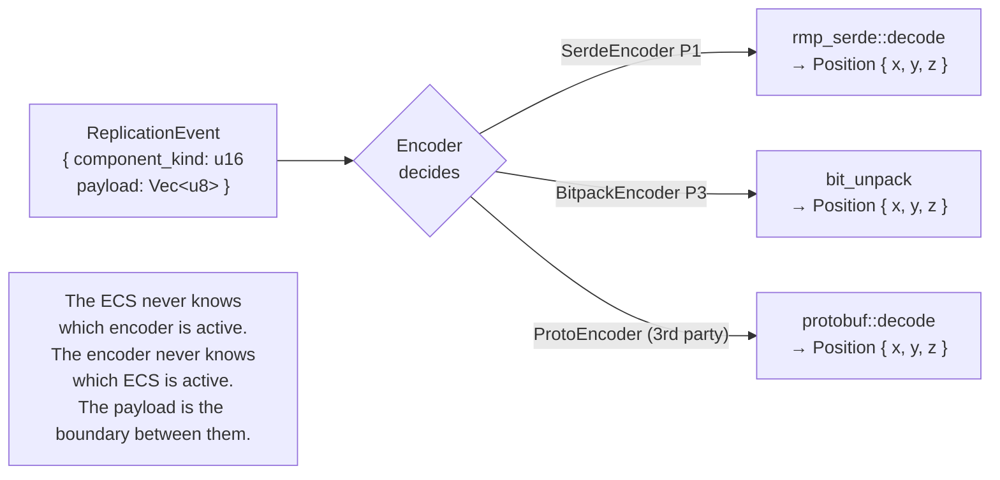
```mermaid
flowchart LR
    A["ReplicationEvent<br/>{ component_kind: u16<br/>  payload: Vec&lt;u8&gt; }"] --> B{"Encoder<br/>decides"}
    B -->|"SerdeEncoder P1"| C["rmp_serde::decode<br/>→ Position { x, y, z }"]
    B -->|"BitpackEncoder P3"| D["bit_unpack<br/>→ Position { x, y, z }"]
    B -->|"ProtoEncoder (3rd party)"| E["protobuf::decode<br/>→ Position { x, y, z }"]
    Note3["The ECS never knows<br/>which encoder is active.<br/>The encoder never knows<br/>which ECS is active.<br/>The payload is the boundary between them."]
```

---

## 7. Input Flow: From Client to ECS

The reverse path — how player input becomes state in the server ECS.

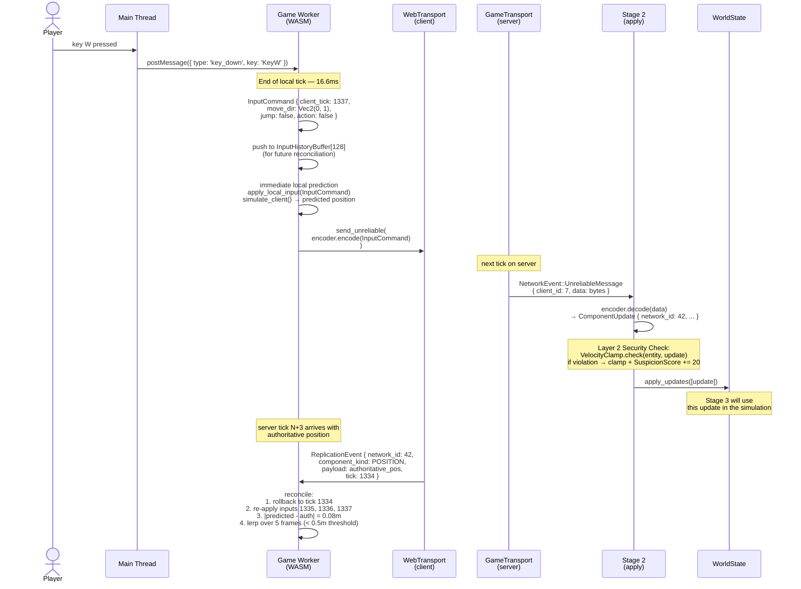
```mermaid
sequenceDiagram
    actor Player
    participant MT as Main Thread
    participant GW as Game Worker<br/>(WASM)
    participant NET_CLIENT as WebTransport<br/>(client)
    participant NET_SERVER as GameTransport<br/>(server)
    participant S2 as Stage 2<br/>(apply)
    participant ECS as WorldState

    Player->>MT: key W pressed
    MT->>GW: postMessage({ type: 'key_down', key: 'KeyW' })

    Note over GW: End of local tick — 16.6ms
    GW->>GW: InputCommand { client_tick: 1337,<br/>  move_dir: Vec2(0, 1),<br/>  jump: false, action: false }
    GW->>GW: push to InputHistoryBuffer[128]<br/>(for future reconciliation)

    GW->>GW: immediate local prediction<br/>apply_local_input(InputCommand)<br/>simulate_client() → predicted position

    GW->>NET_CLIENT: send_unreliable(<br/>  encoder.encode(InputCommand)<br/>)

    Note over NET_SERVER: next tick on server
    NET_SERVER->>S2: NetworkEvent::UnreliableMessage<br/>{ client_id: 7, data: bytes }

    S2->>S2: encoder.decode(data)<br/>→ ComponentUpdate { network_id: 42, ... }
    Note over S2: Layer 2 Security Check:<br/>VelocityClamp.check(entity, update)<br/>if violation → clamp + SuspicionScore += 20

    S2->>ECS: apply_updates([update])
    Note over ECS: Stage 3 will use<br/>this update in the simulation

    Note over GW: server tick N+3 arrives with<br/>authoritative position
    NET_CLIENT->>GW: ReplicationEvent { network_id: 42,<br/>  component_kind: POSITION,<br/>  payload: authoritative_pos,<br/>  tick: 1334 }

    GW->>GW: reconcile:<br/>1. rollback to tick 1334<br/>2. re-apply inputs 1335, 1336, 1337<br/>3. |predicted - auth| = 0.08m<br/>4. lerp over 5 frames (< 0.5m threshold)
```

> **Canonical Source:** See [INPUT_PIPELINE_DESIGN.md](https://github.com/garnizeh-labs/aetheris-client/blob/main/docs/INPUT_PIPELINE_DESIGN.md) for the extensible `InputSchema` trait, `InputMapper`, validation layers, rate limiting, and the `InputSchemaRegistry` that generalizes this flow to non-game inputs (text edits, trade orders, etc.).

---

## 8. Security Flow: Detection Without Blocking the Tick

Security has **4 layers**. None of them block the main tick loop.

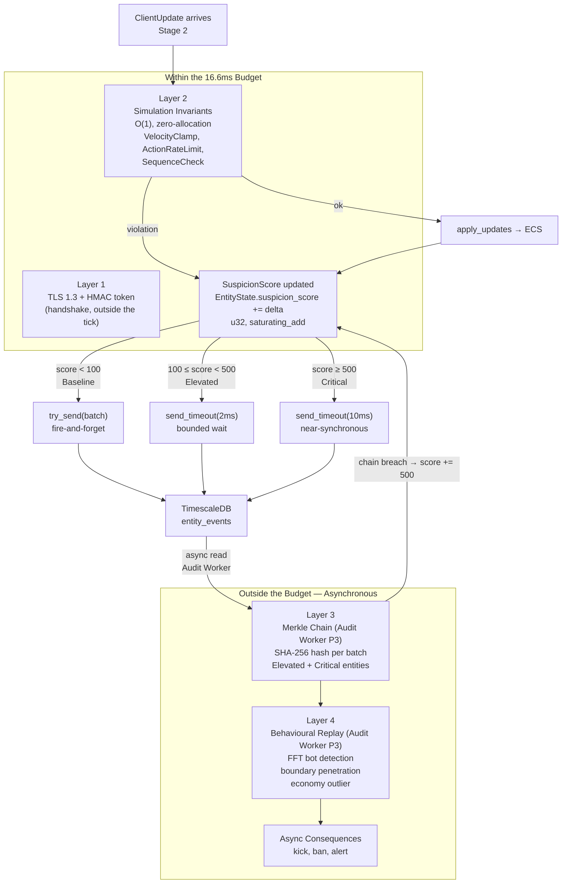
```mermaid
flowchart TD
    subgraph TICK["Within the 16.6ms Budget"]
        L1["Layer 1<br/>TLS 1.3 + HMAC token<br/>(handshake, outside the tick)"]
        L2["Layer 2<br/>Simulation Invariants<br/>O(1), zero-allocation<br/>VelocityClamp, ActionRateLimit,<br/>SequenceCheck"]
        S_UPDATE["SuspicionScore updated<br/>EntityState.suspicion_score += delta<br/>u32, saturating_add"]
    end

    subgraph ASYNC["Outside the Budget — Asynchronous"]
        L3["Layer 3<br/>Merkle Chain (Audit Worker P3)<br/>SHA-256 hash per batch<br/>Elevated + Critical entities"]
        L4["Layer 4<br/>Behavioural Replay (Audit Worker P3)<br/>FFT bot detection<br/>boundary penetration<br/>economy outlier"]
        CONSEQUENCE["Async Consequences<br/>kick, ban, alert"]
    end

    INPUT["ClientUpdate arrives<br/>Stage 2"] --> L2
    L2 -->|"violation"| S_UPDATE
    L2 -->|"ok"| ECS["apply_updates → ECS"]
    ECS --> S_UPDATE

    S_UPDATE -->|"score < 100<br/>Baseline"| PSINK_B["try_send(batch)<br/>fire-and-forget"]
    S_UPDATE -->|"100 ≤ score < 500<br/>Elevated"| PSINK_E["send_timeout(2ms)<br/>bounded wait"]
    S_UPDATE -->|"score ≥ 500<br/>Critical"| PSINK_C["send_timeout(10ms)<br/>near-synchronous"]

    PSINK_B --> DB["TimescaleDB<br/>entity_events"]
    PSINK_E --> DB
    PSINK_C --> DB

    DB -->|"async read<br/>Audit Worker"| L3
    L3 -->|"chain breach → score += 500"| S_UPDATE
    L3 --> L4
    L4 --> CONSEQUENCE
```

### SuspicionScore — How It Flows Across Docs

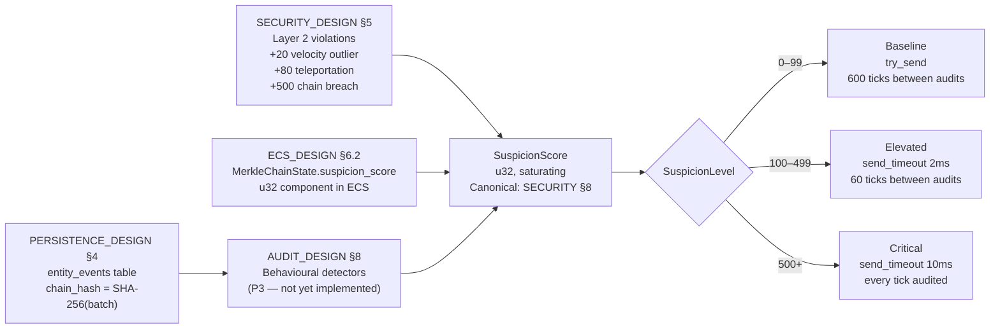
```mermaid
flowchart LR
    SECL2["SECURITY_DESIGN §5<br/>Layer 2 violations<br/>+20 velocity outlier<br/>+80 teleportation<br/>+500 chain breach"] --> SCORE

    ECS_SIM["ECS_DESIGN §6.2<br/>MerkleChainState.suspicion_score<br/>u32 component in ECS"] --> SCORE

    SCORE["SuspicionScore<br/>u32, saturating<br/>Canonical: SECURITY §8"]
    SCORE --> TIER{"SuspicionLevel"}

    TIER -->|"0–99"| BASE["Baseline<br/>try_send<br/>600 ticks between audits"]
    TIER -->|"100–499"| ELEV["Elevated<br/>send_timeout 2ms<br/>60 ticks between audits"]
    TIER -->|"500+"| CRIT["Critical<br/>send_timeout 10ms<br/>every tick audited"]

    AUDIT["AUDIT_DESIGN §8<br/>Behavioural detectors<br/>(P3 — not yet implemented)"] --> SCORE
    PERSIST["PERSISTENCE_DESIGN §4<br/>entity_events table<br/>chain_hash = SHA-256(batch)"] --> AUDIT
```

---

## 9. Persistence Flow: From ECS to Cold Storage

The ECS never writes to the database directly. The boundary is an `mpsc` channel.

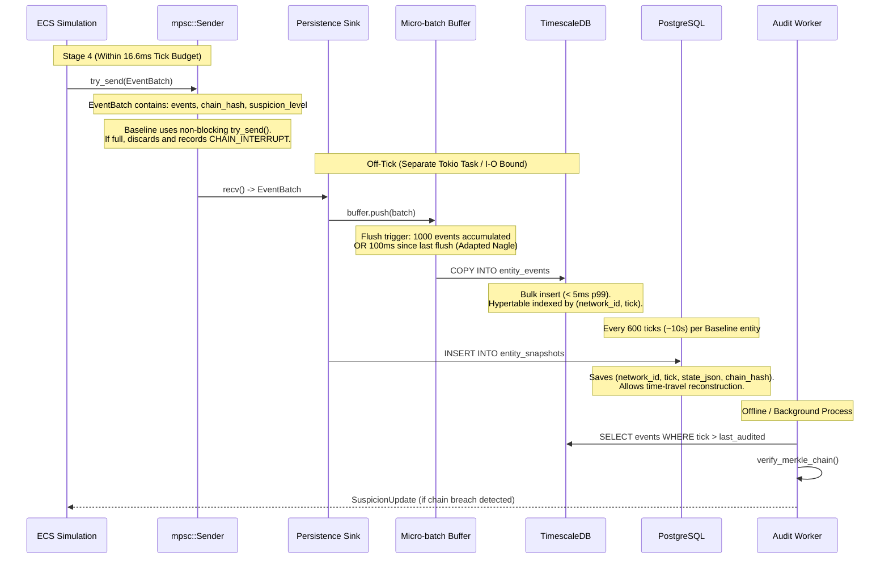
```mermaid
sequenceDiagram
    participant ECS as ECS Simulation
    participant CHAN as mpsc::Sender
    participant SINK as Persistence Sink
    participant BATCH as Micro-batch Buffer
    participant COLD as TimescaleDB
    participant WARM as PostgreSQL
    participant AUDIT as Audit Worker

    Note over ECS, CHAN: Stage 4 (Within 16.6ms Tick Budget)
    ECS->>CHAN: try_send(EventBatch)
    Note over CHAN: EventBatch contains: events, chain_hash, suspicion_level
    Note over CHAN: Baseline uses non-blocking try_send().<br/>If full, discards and records CHAIN_INTERRUPT.

    Note over SINK, COLD: Off-Tick (Separate Tokio Task / I-O Bound)
    CHAN->>SINK: recv() -> EventBatch
    SINK->>BATCH: buffer.push(batch)
    Note over BATCH: Flush trigger: 1000 events accumulated<br/>OR 100ms since last flush (Adapted Nagle)

    BATCH->>COLD: COPY INTO entity_events
    Note over COLD: Bulk insert (< 5ms p99).<br/>Hypertable indexed by (network_id, tick).

    Note over WARM: Every 600 ticks (~10s) per Baseline entity
    SINK->>WARM: INSERT INTO entity_snapshots
    Note over WARM: Saves (network_id, tick, state_json, chain_hash).<br/>Allows time-travel reconstruction.

    Note over AUDIT: Offline / Background Process
    AUDIT->>COLD: SELECT events WHERE tick > last_audited
    AUDIT->>AUDIT: verify_merkle_chain()
    AUDIT-->>ECS: SuspicionUpdate (if chain breach detected)
```

### Data Temperature Topology

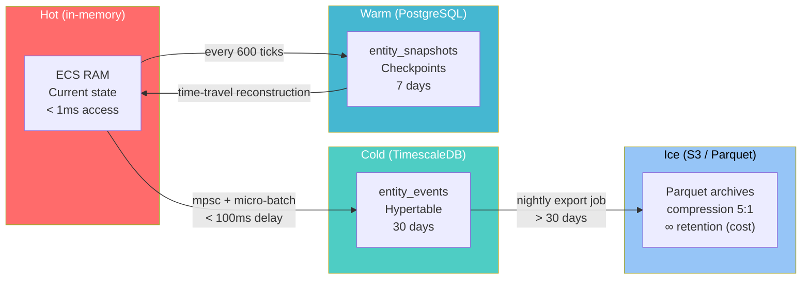
```mermaid
graph LR
    subgraph HOT["Hot (in-memory)"]
        ECS_MEM["ECS RAM<br/>Current state<br/>< 1ms access"]
    end

    subgraph COLD_T["Cold (TimescaleDB)"]
        EL["entity_events<br/>Hypertable<br/>30 days"]
    end

    subgraph WARM_T["Warm (PostgreSQL)"]
        ES["entity_snapshots<br/>Checkpoints<br/>7 days"]
    end

    subgraph ICE["Ice (S3 / Parquet)"]
        AR["Parquet archives<br/>compression 5:1<br/>∞ retention (cost)"]
    end

    ECS_MEM -->|"mpsc + micro-batch<br/>< 100ms delay"| EL
    ECS_MEM -->|"every 600 ticks"| ES
    EL -->|"nightly export job<br/>> 30 days"| AR
    ES -->|"time-travel reconstruction"| ECS_MEM

    style HOT fill:#ff6b6b,color:#fff
    style COLD_T fill:#4ecdc4,color:#fff
    style WARM_T fill:#45b7d1,color:#fff
    style ICE fill:#96c5f7,color:#000
```

---

## 10. Telemetry Flow: Instrumentation Across All Layers

Each subsystem emits observability data. All of it converges to Grafana.

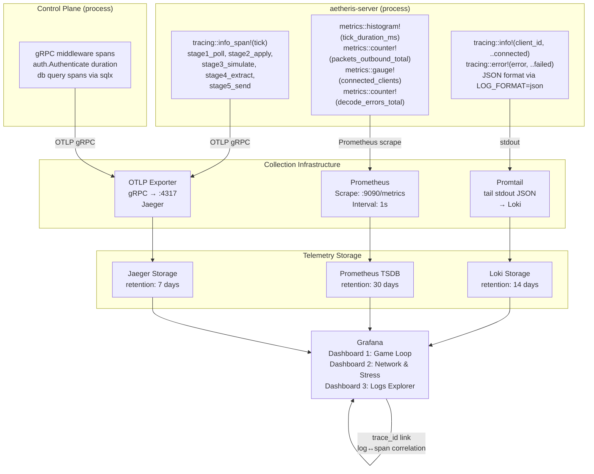
```mermaid
flowchart TB
    subgraph SERVER["aetheris-server (process)"]
        TICK_SPAN["tracing::info_span!(tick)<br/>stage1_poll, stage2_apply,<br/>stage3_simulate, stage4_extract,<br/>stage5_send"]
        METRICS["metrics::histogram!(tick_duration_ms)<br/>metrics::counter!(packets_outbound_total)<br/>metrics::gauge!(connected_clients)<br/>metrics::counter!(decode_errors_total)"]
        LOGS["tracing::info!(client_id, ..connected)<br/>tracing::error!(error, ..failed)<br/>JSON format via LOG_FORMAT=json"]
    end

    subgraph GRPC_PROC["Control Plane (process)"]
        GRPC_SPAN["gRPC middleware spans<br/>auth.Authenticate duration<br/>db query spans via sqlx"]
    end

    subgraph INFRA["Collection Infrastructure"]
        PROM["Prometheus<br/>Scrape: :9090/metrics<br/>Interval: 1s"]
        OTLP["OTLP Exporter<br/>gRPC → :4317<br/>Jaeger"]
        PROMTAIL["Promtail<br/>tail stdout JSON<br/>→ Loki"]
    end

    subgraph STORAGE["Telemetry Storage"]
        PROM_TSDB["Prometheus TSDB<br/>retention: 30 days"]
        JAEGER_DB["Jaeger Storage<br/>retention: 7 days"]
        LOKI_DB["Loki Storage<br/>retention: 14 days"]
    end

    GRAFANA["Grafana<br/>Dashboard 1: Game Loop<br/>Dashboard 2: Network & Stress<br/>Dashboard 3: Logs Explorer"]

    TICK_SPAN -->|"OTLP gRPC"| OTLP
    GRPC_SPAN -->|"OTLP gRPC"| OTLP
    METRICS -->|"Prometheus scrape"| PROM
    LOGS -->|"stdout"| PROMTAIL

    OTLP --> JAEGER_DB
    PROM --> PROM_TSDB
    PROMTAIL --> LOKI_DB

    PROM_TSDB --> GRAFANA
    JAEGER_DB --> GRAFANA
    LOKI_DB --> GRAFANA

    GRAFANA -->|"trace_id link<br/>log↔span correlation"| GRAFANA
```

### How to Correlate a Slow Tick

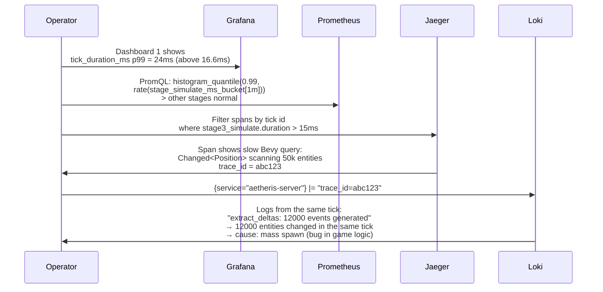
```mermaid
sequenceDiagram
    participant OPS as Operator
    participant GRAF as Grafana
    participant PROM2 as Prometheus
    participant JAEG as Jaeger
    participant LOKI as Loki

    OPS->>GRAF: Dashboard 1 shows<br/>tick_duration_ms p99 = 24ms (above 16.6ms)

    OPS->>PROM2: PromQL: histogram_quantile(0.99,<br/>  rate(stage_simulate_ms_bucket[1m]))<br/>> other stages normal

    OPS->>JAEG: Filter spans by tick id<br/>where stage3_simulate.duration > 15ms

    JAEG->>OPS: Span shows slow Bevy query:<br/>Changed<Position> scanning 50k entities<br/>trace_id = abc123

    OPS->>LOKI: {service="aetheris-server"} |= "trace_id=abc123"

    LOKI->>OPS: Logs from the same tick:<br/>"extract_deltas: 12000 events generated"<br/>→ 12000 entities changed in the same tick<br/>→ cause: mass spawn (bug in game logic)
```

---

## 11. Complete Entity Lifecycle

A player entity from connection to despawn.

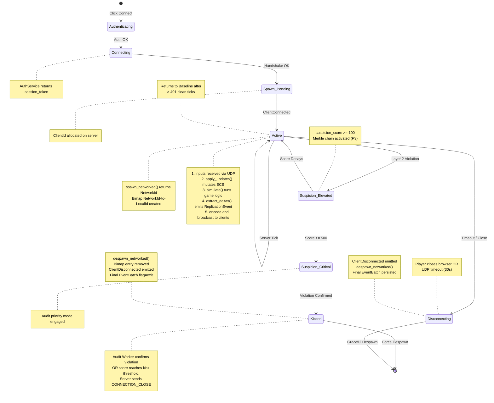
```mermaid
stateDiagram-v2
    [*] --> Authenticating : Click Connect

    Authenticating --> Connecting : Auth OK
    note right of Connecting
        AuthService returns session_token
    end note

    Connecting --> Spawn_Pending : Handshake OK
    note right of Spawn_Pending
        ClientId allocated on server
    end note

    Spawn_Pending --> Active : ClientConnected
    note right of Active
        spawn_networked() returns NetworkId
        Bimap NetworkId-to-LocalId created
    end note

    Active --> Active : Server Tick
    note right of Active
        1. inputs received via UDP
        2. apply_updates() mutates ECS
        3. simulate() runs game logic
        4. extract_deltas() emits ReplicationEvent
        5. encode and broadcast to clients
    end note

    Active --> Suspicion_Elevated : Layer 2 Violation
    note left of Suspicion_Elevated
        suspicion_score >= 100
        Merkle chain activated (P3)
    end note

    Suspicion_Elevated --> Active : Score Decays
    note left of Active
        Returns to Baseline after
        > 401 clean ticks
    end note

    Suspicion_Elevated --> Suspicion_Critical : Score >= 500
    note right of Suspicion_Critical
        Audit priority mode engaged
    end note

    Suspicion_Critical --> Kicked : Violation Confirmed
    note right of Kicked
        Audit Worker confirms violation
        OR score reaches kick threshold.
        Server sends CONNECTION_CLOSE
    end note

    Kicked --> [*] : Force Despawn
    note left of Kicked
        despawn_networked()
        Bimap entry removed
        ClientDisconnected emitted
        Final EventBatch flag=exit
    end note

    Active --> Disconnecting : Timeout / Close
    note left of Disconnecting
        Player closes browser OR
        UDP timeout (30s)
    end note

    Disconnecting --> [*] : Graceful Despawn
    note left of Disconnecting
        ClientDisconnected emitted
        despawn_networked()
        Final EventBatch persisted
    end note
```

### What Happens to Data on Despawn

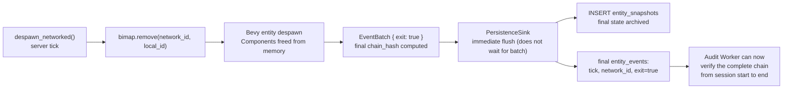
```mermaid
flowchart LR
    DESPAWN["despawn_networked()<br/>server tick"] --> BIMAP["bimap.remove(network_id, local_id)"]
    BIMAP --> ECS_DEL["Bevy entity despawn<br/>Components freed from memory"]
    ECS_DEL --> FINAL_BATCH["EventBatch { exit: true }<br/>final chain_hash computed"]
    FINAL_BATCH --> PSINK2["PersistenceSink<br/>immediate flush (does not wait for batch)"]
    PSINK2 --> SNAPSHOT["INSERT entity_snapshots<br/>final state archived"]
    PSINK2 --> LEDGER["final entity_events:<br/>tick, network_id, exit=true"]
    LEDGER --> AUDIT2["Audit Worker can now<br/>verify the complete chain<br/>from session start to end"]
```

---

## 12. Phase-Transition Boundaries

The greatest value of the trait architecture is that the P1→P3 swap is surgical.


```mermaid
gantt
    title Evolution of Implementations by Phase
    dateFormat X
    axisFormat Phase %s

    section Transport
    RenetTransport (P1)            : done, 1, 2
    QuinnTransport (P3)            : 3, 4

    section ECS
    BevyWorldAdapter (P1)          : done, 1, 2
    CustomSoAAdapter (P3)          : 3, 4

    section Encoder
    SerdeEncoder (P1)              : done, 1, 2
    BitpackEncoder (P3)            : 3, 4

    section Control Plane
    Static token map (P1)          : done, 1, 2
    Full Auth + Matchmaking (P2)   : 2, 3
    Federation (P4)                : 4, 5

    section Persistence
    Basic mpsc + TimescaleDB (P1)  : done, 1, 2
    Snapshots + Ice tier (P2)      : 2, 3

    section Audit
    Layer 2 only (P1)              : done, 1, 2
    Merkle Chain + Behavioural (P3): 3, 4
```

### What Changes and What Doesn’t Across Phases

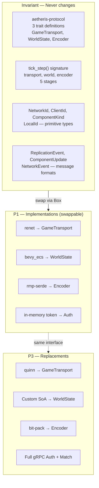
```mermaid
flowchart TB
    subgraph INVARIANTE["Invariant — Never changes"]
        T1["aetheris-protocol<br/>3 trait definitions<br/>GameTransport, WorldState, Encoder"]
        T2["tick_step() signature<br/>transport, world, encoder<br/>5 stages"]
        T3["NetworkId, ClientId, ComponentKind<br/>LocalId — primitive types"]
        T4["ReplicationEvent, ComponentUpdate<br/>NetworkEvent — message formats"]
    end

    subgraph P1_BOX["P1 — Implementations (swappable)"]
        I1["renet → GameTransport"]
        I2["bevy_ecs → WorldState"]
        I3["rmp-serde → Encoder"]
        I4["in-memory token → Auth"]
    end

    subgraph P3_BOX["P3 — Replacements"]
        I1b["quinn → GameTransport"]
        I2b["Custom SoA → WorldState"]
        I3b["bit-pack → Encoder"]
        I4b["Full gRPC Auth + Match"]
    end

    INVARIANTE -->|"swap via Box<dyn>"| P1_BOX
    P1_BOX -.->|"same interface"| P3_BOX
```

---

## 13. Crate Dependency Map

How crates relate at compile time.

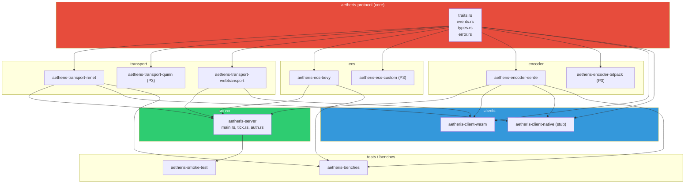
```mermaid
graph TB
    subgraph PROTO["aetheris-protocol (core)"]
        P["traits.rs<br/>events.rs<br/>types.rs<br/>error.rs"]
    end

    subgraph TRANSPORT["transport"]
        TR["aetheris-transport-renet"]
        TQ["aetheris-transport-quinn (P3)"]
        TW["aetheris-transport-webtransport"]
    end

    subgraph ECS["ecs"]
        EB["aetheris-ecs-bevy"]
        EC["aetheris-ecs-custom (P3)"]
    end

    subgraph ENCODER["encoder"]
        ES["aetheris-encoder-serde"]
        EBP["aetheris-encoder-bitpack (P3)"]
    end

    subgraph SERVER["server"]
        SRV["aetheris-server<br/>main.rs, tick.rs, auth.rs"]
    end

    subgraph CLIENT["clients"]
        CW["aetheris-client-wasm"]
        CN["aetheris-client-native (stub)"]
    end

    subgraph TEST["tests / benches"]
        SMK["aetheris-smoke-test"]
        BCH["aetheris-benches"]
    end

    P --> TR
    P --> TQ
    P --> TW
    P --> EB
    P --> EC
    P --> ES
    P --> EBP

    TR --> SRV
    EB --> SRV
    ES --> SRV
    TW --> SRV

    P --> CW
    TW --> CW
    ES --> CW

    P --> CN
    TR --> CN
    ES --> CN

    SRV --> SMK
    TR --> BCH
    EB --> BCH
    ES --> BCH

    style PROTO fill:#e74c3c,color:#fff
    style SERVER fill:#2ecc71,color:#fff
    style CLIENT fill:#3498db,color:#fff
```

### Dependency Rule

```
aetheris-protocol
    ↑ (depends on)
aetheris-transport-* / aetheris-ecs-* / aetheris-encoder-*
    ↑
aetheris-server / aetheris-client-*
    ↑
aetheris-smoke-test / aetheris-benches
```

No dependency ever goes "downward". `aetheris-protocol` does not know about `renet`.
`aetheris-ecs-bevy` does not know about `rmp-serde`. This is what makes each subsystem
testable and replaceable in isolation.

---

## 14. Why the Docs Are Separate

A reasonable developer might ask: **why 12 docs and not 1?**

The answer lies in responsibility boundaries and rates of change:

```mermaid
quadrantChart
    title "Docs by Rate of Change vs. Coupling"
    x-axis "Low coupling → high"
    y-axis "Changes rarely → often"

    quadrant-1 Critical for stability
    quadrant-2 Public contract
    quadrant-3 Reference documentation
    quadrant-4 Operational documentation

    ENGINE_DESIGN: [0.2, 0.3]
    PLATFORM_DESIGN: [0.15, 0.2]
    ECS_DESIGN: [0.4, 0.6]
    ENCODER_DESIGN: [0.3, 0.5]
    TRANSPORT_DESIGN: [0.35, 0.55]
    CLIENT_DESIGN: [0.6, 0.7]
    SECURITY_DESIGN: [0.5, 0.4]
    PERSISTENCE_DESIGN: [0.45, 0.5]
    CONTROL_PLANE_DESIGN: [0.55, 0.65]
    OBSERVABILITY_DESIGN: [0.7, 0.8]
    AUDIT_DESIGN: [0.25, 0.25]
    FEDERATION_DESIGN: [0.1, 0.15]
```

| Doc is separate because… | Examples |
|---|---|
| **Different rates of change** | `ENCODER_DESIGN` changes in P3 (new algorithm). `TRANSPORT_DESIGN` changes in P3 (quinn). `ENGINE_DESIGN` almost never changes — the 5 stages are stable. |
| **Different owners** | The infra team owns `OBSERVABILITY_DESIGN`. The security team owns `SECURITY_DESIGN`. Overlap = merge conflicts. |
| **Different audiences** | `PLATFORM_DESIGN` is for those *using* the engine as an SDK. `ECS_DESIGN` is for those *implementing* the ECS adapter. A single doc would force everyone to read everything. |
| **Different rollback boundaries** | If the encoding decision needs reverting (P3), revert `ENCODER_DESIGN` + `aetheris-encoder-bitpack`. No change to `TRANSPORT_DESIGN`. |
| **Incompatible depth** | `AUDIT_DESIGN` has 1033 lines on actor model, Merkle proofs, and FFT detection. Merging that into `ENGINE_DESIGN` would make the doc unreadable. |

### Cross-references — Como Navegar

```mermaid
flowchart TD
    THIS["INTEGRATION_DESIGN.md<br/>(you are here)<br/>Information flow<br/>Inter-subsystem interactions"]

    THIS -->|"how the tick works"| ENGINE["ENGINE_DESIGN.md<br/>§4-5: Trait Facade<br/>§5: CRP Pipeline"]
    THIS -->|"how the ECS extracts deltas"| ENGINE2["ENGINE_DESIGN.md<br/>§4-5: Trait Facade<br/>§5: CRP Pipeline"]
    THIS -->|"how bytes are serialized"| ENC2["https://github.com/garnizeh-labs/aetheris-protocol/blob/main/docs/ENCODER_DESIGN.md<br/>§2: Encoder trait<br/>§3: SerdeEncoder"]
    THIS -->|"how UDP packets arrive"| TRANS2["https://github.com/garnizeh-labs/aetheris-protocol/blob/main/docs/TRANSPORT_DESIGN.md<br/>§3: GameTransport trait<br/>§4: RenetTransport"]
    THIS -->|"how the browser client works"| CLIENT2["https://github.com/garnizeh-labs/aetheris-client/blob/main/docs/CLIENT_DESIGN.md<br/>§2: Multi-Worker Topology<br/>§7: Prediction"]
    THIS -->|"how auth works"| CTRL["CONTROL_PLANE_DESIGN.md<br/>§3.2: AuthService<br/>§4: Session Management"]
    THIS -->|"how cheating is detected"| SEC["SECURITY_DESIGN.md<br/>§5: Layer 2 Invariants<br/>§8: SuspicionScore"]
    THIS -->|"how events reach the database"| PERS["PERSISTENCE_DESIGN.md<br/>§3: Persistence Sink<br/>§4: Cold Tier schema"]
    THIS -->|"how spans reach Grafana"| OBS["OBSERVABILITY_DESIGN.md<br/>§Stack Overview<br/>§Trace→Log Correlation"]
    THIS -->|"public SDK contracts"| PLAT["REPOSITORY_ARCHITECTURE_DESIGN.md<br/>§3: Trait Triad<br/>§7: SDK Design"]
    THIS -->|"how entities migrate (P4)"| FED["FEDERATION_DESIGN.md<br/>§5: Hand-over Protocol"]
    THIS -->|"how auditing works (P3)"| AUD["AUDIT_DESIGN.md<br/>§5: RouterActor<br/>§6: EntityAuditActor"]
```

---

## 15. Open Questions

| Question | Context | Impact |
|---|---|---|
| **Inter-Subsystem Latency** | Do we need explicit gRPC-Web latency metrics for the Control Plane? | Frontend UX during high-load matchmaking. |
| **Error Propagation** | Should a persistence failure (mpsc full) ever trigger a player kick? | Security vs stability tradeoff. |
| **P3/P4 Migration** | How to handle the data migration from Bevy/Serde (P1) to Custom/Bitpack (P3) in a live world? | Operational complexity during engine swap. |

---

## Appendix A — Glossary

### Mini-Glossary (Quick Reference)

- **Trait Triad**: The interface boundary between the engine core and its implementations.
- **Micro-Batching**: The technique of buffering small events into larger database writes.
- **SuspicionScore**: The canonical security metric that flows across all design documents.
- **Dual-Plane Topology**: The physical separation of real-time and transactional traffic.
- **Persistence Sink**: The actor responsible for asynchronous database offloading.

[Full Integration Glossary Below]

| Term | Definition | Canonical doc |
|---|---|---|
| **Data Plane** | Real-time UDP pipeline running the game tick at 60 Hz | [TRANSPORT_DESIGN §2](https://github.com/garnizeh-labs/aetheris-protocol/blob/main/docs/TRANSPORT_DESIGN.md#2-dual-plane-topology) |
| **Control Plane** | gRPC services for auth, matchmaking, inventory — latency accepted | [CONTROL_PLANE_DESIGN §2](https://github.com/garnizeh-labs/aetheris-protocol/blob/main/docs/CONTROL_PLANE_DESIGN.md#2-control-plane-vs-data-plane) |
| **Tick** | One iteration of the game loop (16.6 ms at 60 Hz) | [ENGINE_DESIGN §4](ENGINE_DESIGN.md#4-the-trait-facade--core-abstraction-layer) |
| **Trait Triad** | `GameTransport`, `WorldState`, `Encoder` — 3 traits that isolate every external subsystem | [ARCHITECTURE_DESIGN §3](REPOSITORY_ARCHITECTURE_DESIGN.md#3-stable-api-surface--the-trait-triad) |
| **NetworkId** | Globally unique `u64` assigned by the server to each replicated entity | [ENGINE_DESIGN §6](ENGINE_DESIGN.md#6-entity-identity-system) |
| **ClientId** | `u64` assigned by the transport to each connected client session | [TRANSPORT_DESIGN §3](https://github.com/garnizeh-labs/aetheris-protocol/blob/main/docs/TRANSPORT_DESIGN.md#3-the-gametransport-trait) |
| **ReplicationEvent** | `{network_id, component_kind, payload, tick}` — delta of a component that changed | [ENGINE_DESIGN §4.3](ENGINE_DESIGN.md#43-core-protocol-types) |
| **SuspicionScore** | `u32` per entity that governs audit intensity (0=Baseline, 500+=Critical) | [SECURITY_DESIGN §8](SECURITY_DESIGN.md#8-suspicionscore-system) |
| **Persistence Sink** | Separate Tokio task that receives `EventBatch` via `mpsc` and bulk-inserts to DB | [PERSISTENCE_DESIGN §3](PERSISTENCE_DESIGN.md#3-the-persistence-sink--cpuio-decoupling) |
| **SharedArrayBuffer** | Zero-copy shared buffer between Game Worker and Render Worker in the browser | [CLIENT_DESIGN §6](https://github.com/garnizeh-labs/aetheris-client/blob/main/docs/CLIENT_DESIGN.md#6-sharedarraybuffer--zero-copy-state-bridge) |
| **MerkleChainState** | ECS component with `previous_hash` + `suspicion_score` for cryptographic integrity | [ENGINE_DESIGN §6](ENGINE_DESIGN.md#6-entity-identity-system) |
| **Stage N** | One of 5 sequential tick stages: Poll, Apply, Simulate, Extract, Send | [ENGINE_DESIGN §5](ENGINE_DESIGN.md#5-data-oriented-state-replication-crp) |

---

## Appendix B — Decision Log

| # | Decision | Rationale | Revisit If... | Date |
|---|---|---|---|---|
| D1 | Create INTEGRATION_DESIGN | Necessary to bridge the 12 domain-specific design documents. | Subsystem count decreases significantly. | 2026-04-15 |
| D2 | Mermaid for Diagrams | Git-friendly, text-based, and prevents documentation drift. | A more powerful text-to-diagram tool is standard. | 2026-04-15 |
| D3 | No Implementation Duplication | Prevents "source of truth" divergence common in large docsets. | Direct code snippets are better for readability. | 2026-04-15 |
| D4 | Priority Channels as cross-cutting pipeline concern | IngestPriorityRouter modifies Stage 1 output, ChannelClassifier + PriorityScheduler modify Stage 5 dispatch. Both are transparent to the Trait Facade. See [PRIORITY_CHANNELS_DESIGN.md](PRIORITY_CHANNELS_DESIGN.md). | If channel overhead invalidates tick budget contracts. | 2026-04-15 |
