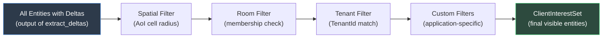
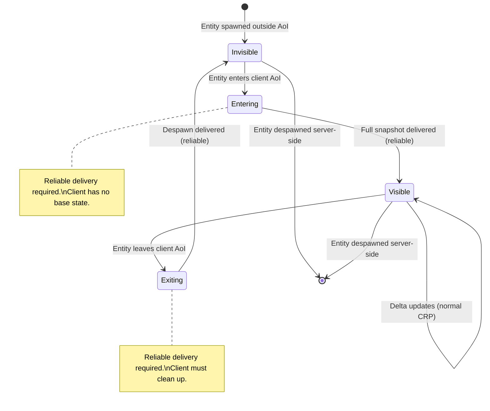

# Aetheris Engine — Interest Management & Replication Filtering Design Document

## Executive Summary

Interest Management answers a single question: **which entities should each client receive replication deltas for on each tick?**

The answer is determined by composing multiple **filter layers** — spatial proximity, room membership, tenant isolation, priority channel radius, and custom application filters — into a per-client **interest set**. This document defines the canonical model for computing, maintaining, and transitioning interest sets.

Previous Aetheris docs described spatial AoI filtering ([SPATIAL_PARTITIONING_DESIGN.md](SPATIAL_PARTITIONING_DESIGN.md)) and priority-based radius ([PRIORITY_CHANNELS_DESIGN.md](PRIORITY_CHANNELS_DESIGN.md) §9) as separate mechanisms. This document unifies them into a single composable pipeline that serves both games (Void Rush) and non-game platforms (Nexus) identically.

### The Interest Equation

A client $c$ receives a delta for entity $e$ on channel $ch$ at tick $t$ if and only if:

$$\text{Visible}(c, e, ch, t) = \text{Spatial}(c, e, ch) \land \text{Room}(c, e) \land \text{Tenant}(c, e) \land \text{Custom}(c, e)$$

Each predicate is a composable filter. Filters are AND-composed: an entity must pass **all** filters to be visible. This ensures that tenant isolation is never accidentally bypassed by a permissive spatial filter.

## Table of Contents

1. [Executive Summary](#1-executive-summary)
2. [Motivation — Why a Unified Subscription Model](#2-motivation--why-a-unified-subscription-model)
3. [The Interest Filter Pipeline](#3-the-interest-filter-pipeline)
4. [Filter Layers — Composable Visibility Rules](#4-filter-layers--composable-visibility-rules)
5. [Dynamic AoI — Adaptive Interest](#5-dynamic-aoi--adaptive-interest)
6. [Subscription Lifecycle](#6-subscription-lifecycle)
7. [Integration with Extract Stage](#7-integration-with-extract-stage)
8. [InterestFilter Trait — Extensibility](#8-interestfilter-trait--extensibility)
9. [Bandwidth Budget & Shedding Interaction](#9-bandwidth-budget--shedding-interaction)
10. [Performance Contracts](#10-performance-contracts)
11. [Open Questions](#11-open-questions)
12. [Appendix A — Glossary](#appendix-a--glossary)
13. [Appendix B — Decision Log](#appendix-b--decision-log)

---

## 1. Executive Summary

Interest Management answers a single question: **which entities should each client receive replication deltas for on each tick?**

The answer is determined by composing multiple **filter layers** — spatial proximity, room membership, tenant isolation, priority channel radius, and custom application filters — into a per-client **interest set**. This document defines the canonical model for computing, maintaining, and transitioning interest sets.

Previous Aetheris docs described spatial AoI filtering ([SPATIAL_PARTITIONING_DESIGN.md](SPATIAL_PARTITIONING_DESIGN.md)) and priority-based radius ([PRIORITY_CHANNELS_DESIGN.md](PRIORITY_CHANNELS_DESIGN.md) §9) as separate mechanisms. This document unifies them into a single composable pipeline that serves both games (Void Rush) and non-game platforms (Nexus) identically.

### The Interest Equation

A client $c$ receives a delta for entity $e$ on channel $ch$ at tick $t$ if and only if:

$$\text{Visible}(c, e, ch, t) = \text{Spatial}(c, e, ch) \land \text{Room}(c, e) \land \text{Tenant}(c, e) \land \text{Custom}(c, e)$$

Each predicate is a composable filter. Filters are AND-composed: an entity must pass **all** filters to be visible. This ensures that tenant isolation is never accidentally bypassed by a permissive spatial filter.

---

## 2. Motivation — Why a Unified Subscription Model

### 2.1 The Problem with Ad-Hoc Filtering

Without a unified model, filtering logic scatters across the codebase:

- `extract_deltas()` checks spatial distance (hardcoded in ECS adapter)
- Priority channel shedding reduces update frequency (hardcoded in transport)
- Room membership adds/removes entities (hardcoded in game logic)
- Tenant isolation filters by `TenantId` (hardcoded in Nexus platform layer)

Each filter makes independent decisions. Interactions between filters are undefined. Bugs arise when:

- A tenant filter allows an entity, but the spatial filter blocks it → correct.
- A spatial filter allows an entity, but the room filter blocks it → correct.
- A room filter allows an entity that crossed tenant boundaries → **security violation**.

### 2.2 The Unified Model

All filters compose through a single pipeline. The pipeline runs once per client per tick in Stage 4 (Extract). The output is a `ClientInterestSet` that Stage 5 (Send) uses to filter outbound packets.



---

## 3. The Interest Filter Pipeline

### 3.1 Pipeline Architecture

```rust
/// The Interest Filter Pipeline.
/// Runs once per client per tick during Stage 4 (Extract).
/// Produces a ClientInterestSet that Stage 5 consumes.
pub struct InterestPipeline {
    /// Ordered list of filter layers. Evaluated left-to-right.
    /// An entity must pass ALL filters to be included.
    filters: Vec<Box<dyn InterestFilter>>,
}

impl InterestPipeline {
    /// Evaluate all filters for a single client.
    /// Returns the set of NetworkIds visible to this client.
    pub fn compute_interest(
        &self,
        client: &ClientState,
        candidates: &[NetworkId],
        world: &dyn WorldState,
        spatial: &dyn SpatialIndex,
    ) -> ClientInterestSet {
        let mut visible = FxHashSet::from_iter(candidates.iter().copied());

        for filter in &self.filters {
            filter.apply(client, &mut visible, world, spatial);
        }

        // Diff against previous tick's interest set to detect enter/exit
        let entered = visible.difference(&client.previous_interest)
            .copied().collect();
        let exited = client.previous_interest.difference(&visible)
            .copied().collect();

        ClientInterestSet {
            visible_entities: visible,
            entered_this_tick: entered,
            exited_this_tick: exited,
        }
    }
}
```

### 3.2 Pipeline Construction

The pipeline is built at server startup. Games and platforms compose their filter stack:

```rust
// Void Rush — game server
let interest_pipeline = InterestPipeline::builder()
    .add_filter(SpatialAoiFilter::new(spatial_config))
    .add_filter(PriorityRadiusFilter::new(channel_registry.clone()))
    .build();

// Nexus Corporate Campus — platform server
let interest_pipeline = InterestPipeline::builder()
    .add_filter(TenantIsolationFilter::new())   // MUST be first for security
    .add_filter(SpatialAoiFilter::new(spatial_config))
    .add_filter(RoomMembershipFilter::new())
    .add_filter(PriorityRadiusFilter::new(channel_registry.clone()))
    .build();

// Nexus Trading Floor — platform server
let interest_pipeline = InterestPipeline::builder()
    .add_filter(TenantIsolationFilter::new())
    .add_filter(SpatialAoiFilter::new(spatial_config))
    .add_filter(RoomMembershipFilter::new())
    .add_filter(TickerSubscriptionFilter::new()) // Custom: only subscribed tickers
    .add_filter(PriorityRadiusFilter::new(channel_registry.clone()))
    .build();
```

---

## 4. Filter Layers — Composable Visibility Rules

### 4.1 Spatial AoI Filter

The baseline filter. Removes entities outside the client's spatial Area of Interest.

```rust
pub struct SpatialAoiFilter {
    config: SpatialConfig,
}

impl InterestFilter for SpatialAoiFilter {
    fn apply(
        &self,
        client: &ClientState,
        visible: &mut FxHashSet<NetworkId>,
        _world: &dyn WorldState,
        spatial: &dyn SpatialIndex,
    ) {
        let aoi_entities = spatial.query_aoi(
            client.current_cell,
            self.config.default_aoi_radius,
        );
        visible.retain(|nid| aoi_entities.contains(nid));
    }

    fn name(&self) -> &'static str { "spatial-aoi" }
}
```

See [SPATIAL_PARTITIONING_DESIGN.md](SPATIAL_PARTITIONING_DESIGN.md) for the full spatial system design.

### 4.2 Room Membership Filter

Adds or restricts visibility based on room occupancy. An entity inside a room is visible only to room members (unless the entity is also in the client's spatial AoI and the room is "open").

```rust
pub struct RoomMembershipFilter;

impl InterestFilter for RoomMembershipFilter {
    fn apply(
        &self,
        client: &ClientState,
        visible: &mut FxHashSet<NetworkId>,
        world: &dyn WorldState,
        _spatial: &dyn SpatialIndex,
    ) {
        // For each entity in the candidate set:
        // - If the entity belongs to a room, client must be a member of that room.
        // - If the entity belongs to no room, pass through (spatial filter handles it).
        // - Entities in the client's room(s) are ALWAYS visible (override AoI).
        visible.retain(|nid| {
            match world.get_room_membership(*nid) {
                Some(room_id) => client.room_memberships.contains(&room_id),
                None => true, // Not in a room — let other filters decide
            }
        });

        // Add all entities in the client's rooms (even if outside spatial AoI)
        for room_id in &client.room_memberships {
            if let Some(room_entities) = world.get_room_entities(*room_id) {
                visible.extend(room_entities.iter());
            }
        }
    }

    fn name(&self) -> &'static str { "room-membership" }
}
```

See [ROOM_AND_INSTANCE_DESIGN.md](ROOM_AND_INSTANCE_DESIGN.md) for the full room system design.

### 4.3 Tenant Isolation Filter

**Security-critical.** Removes all entities that do not belong to the client's tenant. This filter MUST run before all others in multi-tenant deployments to prevent information leakage.

```rust
pub struct TenantIsolationFilter;

impl InterestFilter for TenantIsolationFilter {
    fn apply(
        &self,
        client: &ClientState,
        visible: &mut FxHashSet<NetworkId>,
        world: &dyn WorldState,
        _spatial: &dyn SpatialIndex,
    ) {
        // Strict isolation: only entities belonging to the client's tenant.
        // O(1) per entity — TenantId is stored on the entity.
        visible.retain(|nid| {
            world.get_tenant_id(*nid)
                .map_or(false, |tid| tid == client.tenant_id)
        });
    }

    fn name(&self) -> &'static str { "tenant-isolation" }
}
```

**Invariant:** The `TenantIsolationFilter` is **always the first filter** in multi-tenant pipelines. This is enforced by the builder:

```rust
impl InterestPipelineBuilder {
    pub fn add_filter(mut self, filter: Box<dyn InterestFilter>) -> Self {
        // Enforce: TenantIsolationFilter must be first if present
        if filter.name() == "tenant-isolation" && !self.filters.is_empty() {
            panic!("TenantIsolationFilter must be the first filter in the pipeline");
        }
        self.filters.push(filter);
        self
    }
}
```

### 4.4 Priority Radius Filter

Adjusts visibility per Priority Channel. Lower-priority channels have smaller effective AoI radii (see [PRIORITY_CHANNELS_DESIGN.md](PRIORITY_CHANNELS_DESIGN.md) §9):

```rust
pub struct PriorityRadiusFilter {
    channel_registry: Arc<ChannelRegistry>,
}

impl InterestFilter for PriorityRadiusFilter {
    fn apply(
        &self,
        client: &ClientState,
        visible: &mut FxHashSet<NetworkId>,
        world: &dyn WorldState,
        spatial: &dyn SpatialIndex,
    ) {
        // This filter does NOT remove entities from the visible set.
        // Instead, it annotates the ClientInterestSet with per-channel visibility.
        // Stage 5 (Send) uses this annotation to decide which channels
        // to include for each entity.
        //
        // Entities within P5 radius: receive all channels P0–P5.
        // Entities within P2 radius but outside P5: receive P0–P2 only.
        // This effectively "thins" the update stream for distant entities.
        //
        // Implementation: store a per-entity channel mask in ClientInterestSet.
    }

    fn name(&self) -> &'static str { "priority-radius" }
}
```

### 4.5 Custom Application Filters

Games and platforms can register custom filters via the `InterestFilter` trait:

```rust
/// Example: Nexus trading platform — clients only see tickers they've subscribed to.
pub struct TickerSubscriptionFilter;

impl InterestFilter for TickerSubscriptionFilter {
    fn apply(
        &self,
        client: &ClientState,
        visible: &mut FxHashSet<NetworkId>,
        world: &dyn WorldState,
        _spatial: &dyn SpatialIndex,
    ) {
        visible.retain(|nid| {
            // If entity is a Ticker, check subscription list
            if world.get_component_kind(*nid) == Some(ComponentKind::TICKER) {
                client.ticker_subscriptions.contains(nid)
            } else {
                true // Non-ticker entities pass through
            }
        });
    }

    fn name(&self) -> &'static str { "ticker-subscription" }
}
```

---

## 5. Dynamic AoI — Adaptive Interest

### 5.1 Motivation

Clients with poor network conditions (high RTT, packet loss) should receive fewer entity updates to avoid overwhelming their connection. Dynamic AoI adjusts the spatial radius per client based on measured network quality.

### 5.2 Adaptive AoI Algorithm

```rust
/// Per-client AoI adaptation.
/// Runs after congestion detection, before the interest pipeline.
pub fn adapt_aoi(client: &mut ClientState, transport_stats: &ClientTransportStats) {
    let base_radius = client.config.default_aoi_radius;

    // Reduce AoI under congestion
    let adjusted_radius = if transport_stats.shedding_level >= SheddingLevel::Severe {
        (base_radius / 2).max(1)  // Minimum 1 cell radius
    } else if transport_stats.shedding_level >= SheddingLevel::Moderate {
        base_radius - 1
    } else {
        base_radius
    };

    // Expand AoI if connection is excellent (future: P3)
    // let expanded = if transport_stats.rtt_ms < 20 && transport_stats.loss_pct < 0.1 {
    //     base_radius + 1
    // } else { adjusted_radius };

    client.effective_aoi_radius = adjusted_radius;
}
```

### 5.3 AoI Transition Smoothing

When AoI shrinks, entities at the edge transition out gracefully:

1. Entities newly outside the AoI receive one final **low-priority delta** (P5) with a "fade-out" flag.
2. The client renderer lerps the entity's opacity to zero over 500ms before removing it.
3. This prevents hard pop-out at AoI boundaries.

When AoI expands, entities entering the AoI receive a full snapshot (same protocol as cell transitions in [SPATIAL_PARTITIONING_DESIGN.md](SPATIAL_PARTITIONING_DESIGN.md) §4.3).

---

## 6. Subscription Lifecycle

### 6.1 Entity Enter

When an entity enters a client's interest set (new in `visible_entities`, not present last tick):

1. Server sends a **reliable** `ReplicationEvent::Spawn` with the full component snapshot.
2. Client creates the entity in its local ECS with all replicated components.
3. Client renders the entity (potentially with a fade-in effect).

### 6.2 Entity Exit

When an entity leaves a client's interest set:

1. Server sends a **reliable** `ReplicationEvent::Despawn` for that `NetworkId`.
2. Client removes the entity from its local ECS.
3. Client renderer fades out or immediately removes the visual.

### 6.3 Steady State

For entities that remain in the interest set across ticks:

1. Server sends only **changed component deltas** (the normal CRP flow).
2. No spawn/despawn overhead.

### 6.4 State Diagram



---

## 7. Integration with Extract Stage

### 7.1 Modified Extract Pipeline

Stage 4 (Extract) in the tick pipeline is modified to run the interest pipeline:

```rust
/// Stage 4: Extract — with interest management.
/// Replaces the naive "broadcast all deltas to all clients" approach.
#[instrument(skip_all)]
fn extract_stage(
    world: &dyn WorldState,
    spatial: &dyn SpatialIndex,
    interest_pipeline: &InterestPipeline,
    clients: &mut FxHashMap<ClientId, ClientState>,
    encoder: &dyn Encoder,
) -> Vec<(ClientId, Vec<u8>)> {
    // 1. Extract all dirty deltas from the ECS (unchanged from before)
    let all_deltas = world.extract_deltas();

    // 2. Collect all NetworkIds that have deltas this tick
    let delta_entities: FxHashSet<NetworkId> = all_deltas.iter()
        .map(|d| d.network_id)
        .collect();

    // 3. For each client, compute interest and filter deltas
    let mut outbound = Vec::with_capacity(clients.len());

    for (client_id, client_state) in clients.iter_mut() {
        // Adapt AoI based on network conditions
        adapt_aoi(client_state, &client_state.transport_stats);

        // Run the interest pipeline
        let interest = interest_pipeline.compute_interest(
            client_state,
            &delta_entities.iter().copied().collect::<Vec<_>>(),
            world,
            spatial,
        );

        // Handle enter/exit events
        for nid in &interest.entered_this_tick {
            // Queue full snapshot (reliable delivery)
            let snapshot = world.snapshot_entity(*nid);
            let packet = encoder.encode_event(&ReplicationEvent::Spawn {
                network_id: *nid,
                components: snapshot,
            })?;
            outbound.push((*client_id, packet));
        }

        for nid in &interest.exited_this_tick {
            let packet = encoder.encode_event(&ReplicationEvent::Despawn {
                network_id: *nid,
            })?;
            outbound.push((*client_id, packet));
        }

        // Filter deltas to visible entities only
        let client_deltas: Vec<_> = all_deltas.iter()
            .filter(|d| interest.visible_entities.contains(&d.network_id))
            .cloned()
            .collect();

        if !client_deltas.is_empty() {
            let packet = encoder.encode_batch(&client_deltas)?;
            outbound.push((*client_id, packet));
        }

        // Save interest set for next tick's diff
        client_state.previous_interest = interest.visible_entities;
    }

    Ok(outbound)
}
```,oldString:

### 7.2 Performance Note

The interest pipeline runs once per client. At 500 clients with 4 filters each, this is 2,000 filter evaluations per tick. Each filter is O(V) where V is the current visible set size (typically ~50 entities). Total: ~100K set operations per tick ≈ 0.5–1ms. Acceptable within the 2.5ms Extract budget.

If this becomes a bottleneck:

1. Parallelize across clients with `rayon::par_iter_mut()`.
2. Cache spatial query results (many clients in the same cell share the same AoI result).

---

## 8. InterestFilter Trait — Extensibility

### 8.1 Trait Definition

```rust
/// A composable filter that reduces the set of entities visible to a client.
///
/// Filters are AND-composed: an entity must pass ALL filters to be visible.
/// Filters may also ADD entities to the visible set (e.g., room membership
/// adds all room-interior entities regardless of spatial distance).
///
/// # Invariants
/// - Filters MUST NOT allocate on the heap in the hot path.
/// - Filters MUST complete in O(V) where V is the current visible set size.
/// - Filters MUST be deterministic (same inputs → same output).
///
/// # Thread Safety
/// Filters are called from the tick thread. They must be `Send + Sync`.
pub trait InterestFilter: Send + Sync {
    /// Apply this filter to the visible set.
    /// May remove entities (restriction) or add entities (expansion).
    fn apply(
        &self,
        client: &ClientState,
        visible: &mut FxHashSet<NetworkId>,
        world: &dyn WorldState,
        spatial: &dyn SpatialIndex,
    );

    /// Human-readable name for logging and metrics.
    fn name(&self) -> &'static str;
}
```

### 8.2 Dependency Rule

```
aetheris-protocol (InterestFilter trait, ClientInterestSet, InterestPipeline)
    ▲
    │
    ├── aetheris-server (composes pipeline, runs in extract stage)
    ├── aetheris-ecs-bevy (SpatialAoiFilter, RoomMembershipFilter)
    └── aetheris-nexus-sdk [P3] (TenantIsolationFilter, TickerSubscriptionFilter)
```

The `InterestFilter` trait and `InterestPipeline` live in `aetheris-protocol` alongside the other core traits. Filter implementations live in the crate that owns the domain knowledge (ECS crate for spatial, Nexus SDK for tenant, server for composition).

---

## 9. Bandwidth Budget & Shedding Interaction

Interest management and Priority Channel shedding (see [PRIORITY_CHANNELS_DESIGN.md](PRIORITY_CHANNELS_DESIGN.md)) are **complementary but independent** mechanisms:

| Mechanism | What It Controls | When It Acts |
|---|---|---|
| **Interest Management** | *Which entities* a client sees | Stage 4 (Extract) — filters the entity set |
| **Priority Shedding** | *Which channels/components* are sent for visible entities | Stage 5 (Send) — drops low-priority channels under congestion |
| **Dynamic AoI** | *How many entities* fit in the interest set | Pre-Stage 4 — adjusts AoI radius based on congestion |

Under severe congestion, all three act together:

1. Dynamic AoI shrinks the client's spatial radius → fewer entities.
2. Interest pipeline filters to the reduced set → smaller delta batch.
3. Priority shedding drops P4/P5 channels for remaining entities → smaller packets per entity.

The cumulative effect is aggressive bandwidth reduction while preserving P0/P1 data for nearby entities — the information that matters most to the client.

```
Normal:      Moderate:    Severe:
100 entities  60 entities  30 entities    ← Interest Management (AoI shrink)
× 6 channels  × 4 channels × 2 channels  ← Priority Shedding (channel drop)
= 600 updates = 240 updates = 60 updates  ← Total per tick
```

---

## 10. Performance Contracts

### 10.1 Metrics

| Metric | Source | Threshold | Action |
|---|---|---|---|
| `aetheris_interest_compute_seconds` | Span around `compute_interest()` per client | > 0.1ms per client | Profile filters; cache spatial queries |
| `aetheris_interest_visible_entities` | `ClientInterestSet.visible_entities.len()` | > 200 per client | AoI radius too large; reduce or enable dynamic AoI |
| `aetheris_interest_enter_count` | `entered_this_tick.len()` per client | > 50 per tick | Client moving very fast or AoI expanding — check for teleport abuse |
| `aetheris_interest_exit_count` | `exited_this_tick.len()` per client | > 50 per tick | Same as above |
| `aetheris_interest_filter_time_{name}` | Per-filter span | Any single filter > 0.05ms | Optimize that filter |

### 10.2 Budget Allocation

| Stage 4 Sub-Task | Budget | Notes |
|---|---|---|
| `extract_deltas()` (ECS) | 1.5ms | Unchanged from [ENGINE_DESIGN.md](ENGINE_DESIGN.md) |
| Interest pipeline (all clients) | 1.0ms | 500 clients × 4 filters × ~50 entities |
| Enter/exit snapshot encoding | 0.5ms | Only for transitioning entities |
| **Total Stage 4** | **3.0ms** | Extended from 2.5ms to accommodate interest pipeline |

---

## 11. Open Questions

| # | Question | Context | Status |
|---|---|---|---|
| Q1 | **Filter ordering optimization** | Should the pipeline auto-sort filters by restrictiveness (most restrictive first) to minimize set operations? | Open — manual ordering is sufficient for P1. |
| Q2 | **Shared spatial query cache** | Many clients in the same cell produce identical AoI queries. Should results be cached per cell? | Open — P3 optimization. Measure first. |
| Q3 | **Interest set compression** | Can we send interest set diffs (entered/exited) instead of per-entity spawn/despawn events? | Open — P3 protocol optimization. |
| Q4 | **Cross-shard interest** | In federated deployments, how does interest span shard boundaries? | Addressed by [FEDERATION_DESIGN.md](https://github.com/garnizeh-labs/nexus/blob/main/docs/FEDERATION_DESIGN.md) — entities are transferred, not cross-shard visible. |

---

## Appendix A — Glossary

| Term | Definition |
|---|---|
| **Interest Set** | The set of `NetworkId`s that a specific client should receive replication deltas for on a given tick. |
| **Interest Pipeline** | Ordered sequence of `InterestFilter` instances that compute the interest set by composable filtering. |
| **InterestFilter** | A trait representing a single composable filter layer (spatial, room, tenant, custom). |
| **Enter Event** | An entity transitioning from invisible to visible for a specific client. Requires a full snapshot delivery. |
| **Exit Event** | An entity transitioning from visible to invisible. Requires a despawn notification. |
| **Dynamic AoI** | Runtime adjustment of a client's AoI radius based on network conditions (RTT, loss, congestion). |
| **Filter Composition** | AND-composition of multiple filters: an entity must pass all filters to be visible. |
| **Candidate Set** | The initial set of all entities with dirty deltas this tick, before any filtering. |

---

## Appendix B — Decision Log

| # | Decision | Rationale | Revisit If... | Date |
|---|---|---|---|---|
| IM1 | AND-composition of all filters (not OR) | Security: tenant filter must never be bypassed by a permissive spatial filter. AND ensures strictest policy wins. | Application needs OR-semantics (e.g., "visible if in room OR within spatial range"). Add explicit `UnionFilter` wrapper. | 2026-04-16 |
| IM2 | `TenantIsolationFilter` must be first in multi-tenant pipelines | Ensures no subsequent filter can accidentally add cross-tenant entities. Enforced at build time. | Single-tenant deployments are the norm — remove enforcement. | 2026-04-16 |
| IM3 | Interest pipeline runs per-client, not per-entity | Per-client is natural (compute what this client sees). Per-entity (compute who sees this entity) scales worse with entity count. | Server has very few clients but very many entities — per-entity might be cheaper. Unlikely. | 2026-04-16 |
| IM4 | Enter events use reliable delivery + full snapshot | Client cannot render an entity without base state. Delta-only would require the client to track what it's missing — too complex. | Bandwidth cost of full snapshots at cell transitions is excessive. Add progressive snapshot streaming. | 2026-04-16 |
| IM5 | Stage 4 budget extended to 3.0ms (from 2.5ms) | Interest pipeline adds ~1ms for 500 clients. Acceptable trade-off for the bandwidth savings it provides (96–99% reduction). | 3.0ms exceeds budget at 2500 clients. Parallelize with rayon or cache spatial queries. | 2026-04-16 |
| IM6 | `InterestFilter` trait in `aetheris-protocol` | Follows Trait Facade pattern. Custom filters can be implemented in any crate without depending on engine internals. | Trait surface area too narrow for specialized use cases. | 2026-04-16 |
