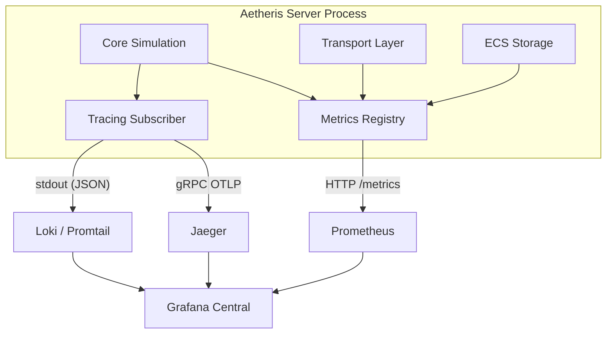

---Version: 1.0.0
Status: Phase 1 — MVP
Phase: P1
Last Updated: 2026-04-15
Authors: Team (Antigravity)
Spec References: [IC-0400, LC-0100]
Tier: 2
---

# Aetheris Engine — Observability Architecture & Design

## Executive Summary

Observability in Aetheris is not a sidecar feature; it is a **core engine requirement**. To maintain a stable 60Hz tick rate at massive concurrency, the engine must provide high-fidelity, real-time insights into its internal execution.

Aetheris implements the **Three Pillars of Observability** (Metrics, Traces, and Logs) using a vendor-neutral OpenTelemetry (OTLP) backbone. This allows the system to remain decoupled from specific backends while providing unified correlation between performance spikes and application events.

| Pillar | Backend | Purpose | Target Grain |
|---|---|---|---|
| **Metrics** | Prometheus | Real-time dashboards, alerting, SLAs | Aggregate (p99 latency, RPS) |
| **Traces** | Jaeger / OTLP | Request/Tick lifecycle, bottleneck discovery | High-fidelity (per-stage spans) |
| **Logs** | Loki / Promtail| Error diagnostics, security audits | Event-level (structured JSON) |

---

## 2. Goals & Strategic Alignment

### 2.1 The 16.6ms Contract
The primary goal is to enforce the 16.6ms tick budget. Observability must identify exactly which stage (Poll, Apply, Simulate, Extract, Send) is drifting toward the deadline before it causes a frame slip.

### 2.2 Measuring the "Artisanal Shift"
As per `ENGINE_DESIGN.md`, the transition from Phase 1 (Bevy/Renet) to Phase 3 (Custom/Bitpack) is driven purely by observed metrics. The observability system provides the data required to trigger these architectural swaps.

---

## 3. Architecture Overview

### 3.1 Data Flow
Every engine crate instruments itself using the `tracing` and `metrics` crates. Telemetry is collected in-process and exported via OTLP or a scrapable Prometheus endpoint.



### 3.2 Standard Stack (Local Dev)
The local observability stack is containerized for zero-config startup:
- **Prometheus**: Scrapes every 1 second.
- **Grafana**: Auto-provisioned dashboards.
- **Jaeger**: OTLP ingest on port 4317.
- **Loki**: Log aggregation with trace correlation.

---

## 4. Metrics (The Dashboard Layer)

### 4.1 Core Performance Metrics
Managed via the `metrics` crate and exported via `aetheris-server::metrics_server`.

| Metric | Type | Description |
|---|---|---|
| `aetheris_tick_duration_seconds` | Histogram | Full wall-clock duration of a game tick. |
| `aetheris_stage_duration_seconds{stage}`| Histogram | Duration per pipeline stage. |
| `aetheris_connected_clients` | Gauge | Active authenticated Data Plane sessions. |
| `aetheris_memory_allocated_bytes` | Gauge | RSS memory usage from `jemalloc-stats`. |

### 4.2 Aggregation & Quantiles
Aetheris prioritizes **p99 latency (Tail Latency)**. A stable 16ms p50 is irrelevant if p99 spikes to 50ms, causing random stutter.

---

## 5. Distributed Tracing (The Deep Dive)

### 5.1 Tick Spans
Every tick is a root span. Child spans are automatically created for each of the five stages.

```text
tick (tick_id=5024)
├── stage_poll
├── stage_apply
├── stage_simulate
│   ├── system_physics
│   └── system_ai
├── stage_extract
└── stage_send
```

### 5.2 Context Propagation
Trace IDs are injected into outgoing network headers for cross-process tracing between Server and Control Plane (and eventually Client in P3).

---

## 6. Structured Logging

### 6.1 JSON Format
Logs are strictly JSON-formatted in production to enable Loki indexing.
- `timestamp`: ISO-8601
- `level`: INFO, WARN, ERROR
- `trace_id`: Correlates with Jaeger (clickable in Grafana)
- `span_id`: Local execution context

### 6.2 Audit Logs
Security-critical events (e.g., `SuspicionLevel` escalation) use a specific `audit=true` field for long-term immutable storage.


> **Pro:** This section is continued in the private companion document available to Nexus Plus customers.
---

## 7. Performance Contracts

| Operation | Budget | Target |
|---|---|---|
| Telemetry Export Overhead| < 0.5% CPU | Negligible impact on simulation. |
| Scrape Interval | 1s | Fast feedback for stress tests. |
| Log Retention | 14 days | Sufficient for RCA. |
| Metrics Retention | 30 days | Milestone comparison. |

---

## 8. Open Questions

| Question | Context | Impact |
|---|---|---|
| **EBPF Integration** | Can we use eBPF to monitor kernel-level context switching during high-concurrency? | Identifying OS-level performance bottlenecks. |
| **Adaptive Sampling** | Should we implement interest-based sampling for traces (e.g., 100% for Critical entities)? | Reducing telemetry volume while preserving signal. |
| **Real-time Replay** | How to integrate the Audit Worker's behavioral replay findings into Grafana? | Unified security and performance dashboards. |

---

## 9. Appendix A — Glossary

### Mini-Glossary (Quick Reference)

- **OTLP (OpenTelemetry Protocol)**: A vendor-neutral protocol for transmitting metrics, traces, and logs.
- **P99 Latency**: The maximum latency experienced by the fastest 99% of requests (tail latency).
- **Span**: A single unit of work within a trace, representing a specific engine stage or function.
- **Prometheus**: A monitoring system that scrapes metrics from the engine at regular intervals.
- **Loki**: A log aggregation system optimized for high-volume, structured engine logs.

[Full Glossary Document](../GLOSSARY.md)

See [GLOSSARY.md](../GLOSSARY.md) for terms like OTLP, p99, and BDP.

---

## Appendix B — Decision Log

| # | Decision | Rationale | Revisit If... | Date |
|---|---|---|---|---|
| D1 | OTLP Everywhere | Vendor neutrality and easy migration to any modern backend. | OTLP overhead exceeds 1.0% core usage. | 2026-04-15 |
| D2 | No In-Tick DB Reads | Prevents blocking I/O from stalling the 16.6ms tick loop. | A guaranteed zero-wait persistence layer is built. | 2026-04-15 |
| D3 | JSON Logs | Enables indexing, powerful querying, and trace correlation in Loki. | Log volume makes JSON overhead too expensive. | 2026-04-15 |

## Appendix A — Glossary

Refer to the master [Glossary](../GLOSSARY.md) for project-wide technical terms.
