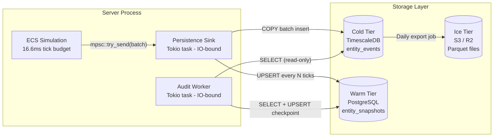
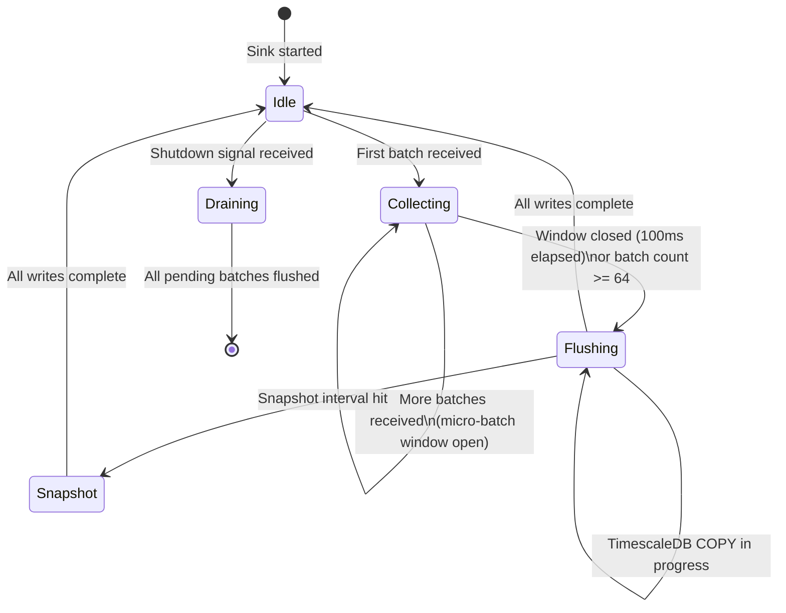
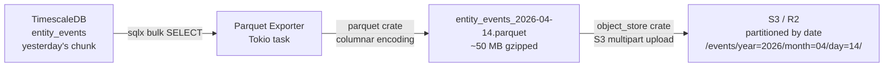

---Version: 0.2.0-draft
Status: Phase 1 — MVP / Phase 2 — Specified
Phase: P1 | P2 | P3
Last Updated: 2026-04-15
Authors: Team (Antigravity)
Spec References: [LC-0100]
Tier: 2
---

# Aetheris Engine — Persistence Architecture & Design Document

## Table of Contents

1. [Executive Summary](#executive-summary)
2. [Architecture Overview — Tiered Storage](#2-architecture-overview--tiered-storage)
3. [The Persistence Sink — CPU/IO Decoupling](#3-the-persistence-sink--cpuio-decoupling)
4. [Cold Tier — Event Ledger (TimescaleDB)](#4-cold-tier--event-ledger-timescaledb)
5. [Warm Tier — State Snapshots (PostgreSQL)](#5-warm-tier--state-snapshots-postgresql)
6. [Ice Tier — Long-Term Archive (Parquet / S3)](#6-ice-tier--long-term-archive-parquet--s3)
7. [Backpressure Handling & Drop Policy](#7-backpressure-handling--drop-policy)
8. [Event Sourcing & World Reconstruction](#8-event-sourcing--world-reconstruction)
9. [Snapshot Schedule & Anchoring](#9-snapshot-schedule--anchoring)
10. [Schema Definitions](#10-schema-definitions)
11. [Migration Strategy](#11-migration-strategy)
12. [Performance Contracts](#12-performance-contracts)
13. [Open Questions](#13-open-questions)
14. [Appendix A — Glossary](#appendix-a--glossary)
15. [Appendix B — Decision Log](#appendix-b--decision-log)

---

## Executive Summary

The Aetheris persistence layer is designed for **extreme write throughput** and **strict IO isolation from the simulation**. Its only immutable rule:

> **Zero database calls are permitted from the simulation thread during the 16.6 ms tick budget.**

The ECS simulation is CPU-bound and latency-sensitive. Databases are IO-bound and latency-variable. Any synchronous intersection between them stalls ticks and breaks the 60 Hz contract. Aetheris solves this permanently by routing all write operations through a bounded `tokio::sync::mpsc` channel, decoupling the simulation thread from any IO-bound operation.

The persistence model is **Event Sourcing**: the source of truth is not a current state table but an append-only ledger of every `ReplicationEvent` emitted by the ECS. Current state is a derived view, computable from the ledger at any tick. Snapshots accelerate reconstruction but are never the source of truth.

See [PROTOCOL_DESIGN.md](PROTOCOL_DESIGN.md) for the canonical definition of `ReplicationEvent` and associated types.

### Storage Tier Summary

| Tier | Substrate | Contents | Retention | Write Pattern |
|---|---|---|---|---|
| **Cold** | TimescaleDB hypertable | Raw `ReplicationEvent` payloads | 90 days rolling | BLIND INSERT, no validation |
| **Warm** | PostgreSQL table | Entity state snapshots | Latest + last 10 | Upsert every 1,000–5,000 ticks |
| **Ice** | Parquet files on S3/R2 | Compressed column-store exports | Indefinite | Batch export from Cold Tier, daily |

---

## 2. Architecture Overview — Tiered Storage



**Key architectural invariants:**

- The ECS thread **never blocks** on persistence. It fires the mpsc channel and returns.
- The Persistence Sink **never writes game state** to the Warm Tier without also having written to the Cold Tier first (ordering invariant for the Audit Worker).
- The Audit Worker has **read-only access** to Cold and Warm Tiers. It writes only its own cursor table (`audit_checkpoints`).

---

## 3. The Persistence Sink — CPU/IO Decoupling

The Persistence Sink is a dedicated Tokio task (spawned at server startup) that runs exclusively in the IO-bound executor pool. It is the only component that calls the databases.

### 3.1 Channel Design

```rust
/// Each element in the channel is a micro-batch of events for one tick.
/// The producing side (ECS, Stage 4) uses try_send() — it never blocks.
/// The consuming side (Persistence Sink) drains and flushes to the DB.
type PersistenceChannel = mpsc::Sender<EventBatch>;

pub struct EventBatch {
    pub tick: u64,
    /// Events emitted this tick. Pre-serialized to bytes by the ECS.
    pub events: Vec<PersistedEvent>,
    /// Monotonically increasing. Used for micro-batch ordering on the sink side.
    pub sequence: u64,
}

pub struct PersistedEvent {
    pub network_id: NetworkId,
    pub component_kind: ComponentKind,
    pub payload: Vec<u8>,    // Raw encoded bytes (same as wire format)
    pub chain_hash: Option<[u8; 32]>,  // Some only for Elevated/Critical entities
}
```

**Channel capacity:** 1,024 batches. At 60 Hz with typical flush rates of 5 batches/100ms, the channel is virtually never full under normal operation. If it fills, events are dropped according to the suspicion-tier policy (see §7).

### 3.2 Sink Lifecycle



### 3.3 Micro-Batch Flush Mechanism

The Sink aggregates up to **64 tick batches** or **100 ms of wall time** before flushing — whichever comes first. This is the classic "Nagle's algorithm" adapted for database writes:

```rust
async fn run_sink(
    mut rx: mpsc::Receiver<EventBatch>,
    pool: sqlx::PgPool,
    mut shutdown: tokio::sync::watch::Receiver<bool>,
) {
    let mut pending: Vec<EventBatch> = Vec::with_capacity(64);
    let mut flush_deadline = Instant::now() + Duration::from_millis(100);

    loop {
        tokio::select! {
            Some(batch) = rx.recv() => {
                pending.push(batch);
                if pending.len() >= 64 {
                    flush_to_cold_tier(&pool, &mut pending).await;
                    flush_deadline = Instant::now() + Duration::from_millis(100);
                }
            }
            _ = tokio::time::sleep_until(flush_deadline) => {
                if !pending.is_empty() {
                    flush_to_cold_tier(&pool, &mut pending).await;
                }
                flush_deadline = Instant::now() + Duration::from_millis(100);
            }
            _ = shutdown.changed() => {
                // Graceful shutdown: flush all remaining batches
                flush_to_cold_tier(&pool, &mut pending).await;
                break;
            }
        }
    }
}
```

---

## 4. Cold Tier — Event Ledger (TimescaleDB)

### 4.1 Why TimescaleDB

TimescaleDB is a PostgreSQL extension that adds **hypertable partitioning** — automatic time-based sharding that keeps recent data hot in memory and avoids full-table scans on time-range queries. The game event ledger is inherently time-series data (tick × entity × component → payload). TimescaleDB's `COPY` ingestion path handles > 100K rows/second on modest hardware.

### 4.2 Schema

```sql
-- The primary event ledger: every replication event emitted by the ECS.
-- This is append-only. No UPDATE, no DELETE (except automated chunk expiry).
CREATE TABLE entity_events (
    tick             BIGINT       NOT NULL,
    network_id       BIGINT       NOT NULL,
    component_kind   SMALLINT     NOT NULL,
    server_time      TIMESTAMPTZ  NOT NULL DEFAULT NOW(),
    payload          BYTEA        NOT NULL,
    chain_hash       BYTEA,        -- NULL for Baseline entities
    sequence         BIGINT       NOT NULL  -- Monotonic offset within tick
) PARTITION BY RANGE (server_time);  -- TimescaleDB hypertable partitioning

-- TimescaleDB converts this table into a hypertable with 1-day chunks.
SELECT create_hypertable('entity_events', 'server_time', chunk_time_interval => INTERVAL '1 day');

-- Retain only 90 days of event history. Older chunks are auto-dropped.
SELECT add_retention_policy('entity_events', INTERVAL '90 days');

-- Composite index for the Audit Worker's sequential scan pattern.
-- Covers: "give me all events for entity X between tick A and tick B"
CREATE INDEX ON entity_events (network_id, tick ASC, sequence ASC);

-- Covering index for per-tick bulk reads (server restart bootstrap).
CREATE INDEX ON entity_events (tick ASC, server_time DESC);
```

### 4.3 COPY-Based Bulk Insert

Standard SQL `INSERT` has per-row overhead (query parsing, plan caching, WAL). For high-throughput append-only writes, PostgreSQL's `COPY` protocol is 5–10× faster:

```rust
async fn flush_to_cold_tier(
    pool: &sqlx::PgPool,
    batches: &mut Vec<EventBatch>,
) {
    let mut conn = pool.acquire().await.expect("pool should be healthy");
    let mut copy_writer = conn
        .copy_in("COPY entity_events (tick, network_id, component_kind, payload, chain_hash, sequence) FROM STDIN BINARY")
        .await
        .expect("COPY command should succeed");

    for batch in batches.drain(..) {
        for event in batch.events {
            copy_writer.send_row(&[
                &(batch.tick as i64),
                &(event.network_id as i64),
                &(event.component_kind as i16),
                &event.payload,
                &event.chain_hash.map(|h| h.to_vec()),
                &(batch.sequence as i64),
            ]).await.expect("COPY row write should succeed");
        }
    }

    copy_writer.finish().await.expect("COPY should commit");

    metrics::counter!("aetheris_persistence_cold_tier_rows_written_total")
        .increment(total_rows as u64);
}
```

### 4.4 Estimated Write Volume

At 60 Hz with 2,500 entities and 10% churn rate:

- Events per tick: **250**
- Events per second: **15,000**
- Events per minute: **900,000**
- Events per hour: **54 million**
- Row size (avg): ~60 bytes (network_id + component + payload + metadata)
- Write throughput: **~860 KB/s** (~7 MB/min) to the Cold Tier

A single TimescaleDB instance handles > 100K rows/second; 15K rows/second is well within budget.

---

## 5. Warm Tier — State Snapshots (PostgreSQL)

### 5.1 Purpose

Snapshots are the **bootstrap acceleration** layer. On server restart, reconstructing 10,000 ticks of events from the Cold Tier would take seconds. A 5-minute-old snapshot reduces this to seconds × 6 ticks.

Snapshots also serve as **anchor points** for the Audit Worker: instead of reading from tick 1 of the ledger, an actor can start from the nearest snapshot.

### 5.2 Schema

```sql
CREATE TABLE entity_snapshots (
    network_id       BIGINT       NOT NULL,
    snapshot_tick    BIGINT       NOT NULL,
    captured_at      TIMESTAMPTZ  NOT NULL DEFAULT NOW(),
    state_payload    BYTEA        NOT NULL,  -- Full component state at snapshot_tick
    chain_hash       BYTEA,                   -- Most recent known chain hash
    suspicion_score  SMALLINT     NOT NULL DEFAULT 0,

    PRIMARY KEY (network_id, snapshot_tick)
);

-- Retain only the 10 most recent snapshots per entity.
-- Older rows are deleted by the Snapshot Cleanup job.
CREATE INDEX ON entity_snapshots (network_id, snapshot_tick DESC);
```

### 5.3 Snapshot Trigger Conditions

A snapshot is written for entity E when:

1. **Interval trigger:** `(current_tick - last_snapshot_tick) >= SNAPSHOT_INTERVAL_TICKS` (default: every 5,000 ticks ≈ 83 seconds).
2. **Suspicion trigger:** When an entity's suspicion level rises to Elevated or Critical, an immediate snapshot is taken to anchor the Audit Worker.
3. **Shutdown trigger:** On graceful server shutdown, snapshots all replicated entities.
4. **Explicit request:** The Audit Worker can request a snapshot via the `PersistenceChannel`.

---

## 6. Ice Tier — Long-Term Archive (Parquet / S3)

### 6.1 Purpose

The Ice Tier stores the entire event ledger beyond 90 days for:

- **Legal & compliance:** Game economy audit trails, anti-cheat evidence.
- **Analytics & ML:** Movement pattern datasets, economic optimization.
- **Historical replay:** Reconstructing any game moment from any date.

### 6.2 Export Pipeline

A daily batch job (Tokio cron task or Kubernetes CronJob) exports yesterday's events from TimescaleDB to Apache Parquet files on S3-compatible object storage (AWS S3 or Cloudflare R2):



### 6.3 Parquet Schema

Parquet's columnar format allows analytics engines (DuckDB, Spark, BigQuery) to scan only the columns they need. An analyst querying "all position events for entity 9942" reads only the `network_id` and `payload` columns — not the `chain_hash` column.

```
entity_events.parquet:
  network_id:     INT64           (sorted, enables predicate pushdown)
  component_kind: INT16
  tick:           INT64
  server_time:    INT64 (unix_ms)
  payload:        BYTE_ARRAY
  chain_hash:     BYTE_ARRAY (nullable)
  sequence:       INT64
```

---

## 7. Backpressure Handling & Drop Policy

When the Persistence Sink cannot keep up with event production (slow DB, network partition), the mpsc channel fills. The ECS must not block — it must decide: **drop or wait**.

The drop strategy is tiered by entity suspicion level:

```rust
// Called immediately after extract_deltas() in Stage 4.
match entity.suspicion_level() {
    SuspicionLevel::Baseline => {
        // Fire-and-forget: acceptable to lose events.
        // Financial entities are never Baseline.
        if let Err(_dropped) = persistence_tx.try_send(batch) {
            metrics::counter!("aetheris_persistence_drops_baseline_total")
                .increment(1);
            tracing::warn!(
                network_id = %entity.network_id,
                "Persistence sink full — dropping Baseline event batch"
            );
        }
    }
    SuspicionLevel::Elevated => {
        // Short wait: we care about audit continuity.
        match persistence_tx.send_timeout(batch, Duration::from_millis(2)).await {
            Ok(_) => {}
            Err(_) => {
                metrics::counter!("aetheris_persistence_drops_elevated_total")
                    .increment(1);
                tracing::warn!("Timeout sending Elevated entity to persistence sink");
            }
        }
    }
    SuspicionLevel::Critical => {
        // Longer wait: this entity is under active investigation.
        // 10ms out of 16.6ms budget — only justified for confirmed suspects.
        match persistence_tx.send_timeout(batch, Duration::from_millis(10)).await {
            Ok(_) => {}
            Err(_) => {
                metrics::counter!("aetheris_persistence_drops_critical_total")
                    .increment(1);
                tracing::error!(
                    network_id = %entity.network_id,
                    "CRITICAL: Failed to persist event for Critical-tier entity"
                );
            }
        }
    }
}
```

The Audit Worker's Track 1 (integrity) detects `ChainInterrupt` gaps caused by drops and distinguishes them from adversarial deletions (see AUDIT_DESIGN.md §4).

---

## 8. Event Sourcing & World Reconstruction

### 8.1 Reconstruction Algorithm

Given any target tick T, the world state can be reconstructed:

```
1. Fetch the latest entity_snapshot WHERE snapshot_tick <= T for all entities.
2. Load the state_payload from each snapshot into the ECS.
3. Fetch all entity_events WHERE tick > snapshot_tick AND tick <= T,
   ordered by (tick ASC, sequence ASC).
4. Apply each event to the ECS via apply_updates().
5. The ECS now represents the authoritative world state at exactly tick T.
```

> **Pro:** Behavioral replay details are documented in the private companion document. It also powers:

- Server crash recovery: restart from latest snapshot + replay recent events.
- Debugging: reproduce any historical game state for bug analysis.
- Time-travel: "show me where entity 9942 was at 14:23:07 on April 10th".

### 8.2 Server Crash Recovery Time

With snapshots every 5,000 ticks (83 seconds) and 15,000 events/second:

- Max events to replay on crash recovery: `83s × 15,000/s = 1,245,000 events`
- Replay speed (sequential DB reads): ~500,000 events/second (estimated)
- Recovery time: **~2.5 seconds** for worst case (just-missed snapshot)

This is acceptable for an initial crash recovery. P3 will reduce the snapshot interval to 1,000 ticks (16.7 seconds) for a 5× faster recovery target.

---

## 9. Snapshot Schedule & Anchoring

### 9.1 Snapshot Writer

The snapshot writer runs inside the Persistence Sink task — not in the ECS simulation thread. It reads the latest state from its own internal buffer (a copy of the most recent `EventBatch` per entity) and writes to the Warm Tier:

```rust
async fn write_snapshot(
    pool: &sqlx::PgPool,
    network_id: u64,
    tick: u64,
    state: &EntityState,
    chain_hash: Option<[u8; 32]>,
) {
    sqlx::query!(
        r#"
        INSERT INTO entity_snapshots (network_id, snapshot_tick, state_payload, chain_hash)
        VALUES ($1, $2, $3, $4)
        ON CONFLICT (network_id, snapshot_tick) DO NOTHING
        "#,
        network_id as i64,
        tick as i64,
        state.encode(),
        chain_hash.map(|h| h.to_vec()),
    )
    .execute(pool)
    .await
    .expect("Snapshot insert should succeed");
}
```

### 9.2 Snapshot Retention Cleanup

A background Tokio task runs every 60 seconds and deletes old snapshots beyond the retention count:

```sql
DELETE FROM entity_snapshots
WHERE (network_id, snapshot_tick) NOT IN (
    SELECT network_id, snapshot_tick
    FROM entity_snapshots
    ORDER BY snapshot_tick DESC
    LIMIT 10  -- Keep only 10 most recent per entity
    -- Note: actual implementation uses window functions for efficiency
);
```

---

## 10. Schema Definitions

### 10.1 Migrations

Schema migrations are managed by `sqlx migrate` with numbered SQL files:

```
crates/aetheris-server/migrations/
  0001_create_entity_events.sql
  0002_create_entity_snapshots.sql
  0003_create_audit_checkpoints.sql
  0004_timescaledb_hypertable.sql
  0005_create_server_instances.sql
```

Migrations run automatically at server startup:

```rust
// In server main()
sqlx::migrate!("./migrations").run(&pool).await?;
```

### 10.2 Audit Checkpoints (for Audit Worker)

```sql
CREATE TABLE audit_checkpoints (
    network_id         BIGINT      NOT NULL,
    last_verified_tick BIGINT      NOT NULL DEFAULT 0,
    last_verified_hash BYTEA,
    last_behavioral_tick BIGINT    NOT NULL DEFAULT 0,
    updated_at         TIMESTAMPTZ NOT NULL DEFAULT NOW(),

    PRIMARY KEY (network_id)
);
```


> **Pro:** This section is continued in the private companion document available to Nexus Plus customers.
---

## 11. Migration Strategy

### 11.1 TimescaleDB Setup

```bash
# Docker Compose includes TimescaleDB automatically:
# docker/docker-compose.yml → image: timescale/timescaledb:latest-pg16
#
# For production, TimescaleDB Cloud or a managed PostgreSQL with the
# TimescaleDB extension is recommended.

# Verify the extension is loaded:
psql -c "SELECT default_version FROM pg_available_extensions WHERE name = 'timescaledb';"
```

### 11.2 S3 / R2 Configuration

```bash
# Environment variables for Ice Tier
AETHERIS_S3_ENDPOINT=https://xxx.r2.cloudflarestorage.com
AETHERIS_S3_BUCKET=aetheris-events-archive
AETHERIS_S3_ACCESS_KEY=...
AETHERIS_S3_SECRET_KEY=...
AETHERIS_ICE_EXPORT_ENABLED=true
```

---

## 12. Performance Contracts

| Metric | Target | How Measured |
|---|---|---|
| Persistence Sink: write latency (p99) | ≤ 50 ms per flush | Prometheus histogram |
| Cold Tier: insert throughput | ≥ 50,000 rows/sec | TimescaleDB `EXPLAIN ANALYZE` |
| Warm Tier: snapshot write latency (p99) | ≤ 200 ms | Prometheus histogram |
| mpsc channel: fill rate under normal load | ≤ 10% | `aetheris_persistence_channel_depth` gauge |
| Crash recovery: replay time (worst case) | ≤ 10 seconds | Integration/chaos test |
| Baseline drop rate under normal load | 0% | `aetheris_persistence_drops_baseline_total` |

### 12.1 Telemetry Counters

| Metric | Type | Description |
|---|---|---|
| `aetheris_persistence_cold_tier_rows_written_total` | Counter | Events written to TimescaleDB |
| `aetheris_persistence_warm_tier_snapshots_written_total` | Counter | Snapshots written to PostgreSQL |
| `aetheris_persistence_drops_baseline_total` | Counter | Dropped Baseline-tier batches |
| `aetheris_persistence_drops_elevated_total` | Counter | Dropped Elevated-tier batches (WARN) |
| `aetheris_persistence_drops_critical_total` | Counter | Dropped Critical-tier batches (ERROR) |
| `aetheris_persistence_sink_flush_duration` | Histogram | Time per Cold Tier flush operation |
| `aetheris_persistence_channel_depth` | Gauge | Current mpsc channel fill level |
| `aetheris_persistence_ice_tier_exports_total` | Counter | Parquet files exported to S3/R2 |

---

## 13. Open Questions

| Question | Context | Impact |
|---|---|---|
| **Cold Tier Compression** | Should we use Zstd compression for `payload` BYTEA columns in TimescaleDB? | Storage cost reduction vs CPU cost. |
| **Partial Snapshots** | Can we snapshot only "dirty" components to reduce Warm Tier write volume? | Performance optimization for large entities. |
| **Ice Tier Partitioning** | Should we partition Parquet exports by `region_id` to speed up area-specific analytics? | Query latency for data scientists. |

---

---

## Appendix A — Glossary


### Mini-Glossary (Quick Reference)

- **Event Sourcing**: Storing every state change as an immutable event rather than just the current state.
- **Micro-Batching**: Aggregating small updates into a larger batch before writing to a database.
- **Hypertables**: TimescaleDB's mechanism for automatic time-based partitioning.
- **Persistence Sink**: The asynchronous actor responsible for writing data to persistent storage.
- **Snapshot**: A point-in-time capture of an entity's full state discarded periodically.

[Full Glossary Document](../GLOSSARY.md)

---

## Appendix B — Decision Log

| # | Decision | Rationale | Revisit If... | Date |
|---|---|---|---|---|
| D1 | Zero DB calls from simulation | Guarantees the 16.6ms tick budget by decoupling I/O to a background task. | A new zero-latency DB engine is integrated. | 2026-04-15 |
| D2 | Event Sourcing over state-sync | Full audit trail and faster appends compared to state updates. | Storage volume exceeds cost budget significantly. | 2026-04-15 |
| D3 | TimescaleDB for Cold Tier | Best-in-class time-series performance and automatic partitioning. | Write throughput exceeds 500K events/s. | 2026-04-15 |
| D4 | Tiered drop policy | Prioritizes security and financial data during database backpressure. | Dropping any event becomes unacceptable for gameplay. | 2026-04-15 |
| D5 | Parquet for Ice Tier | Industry-standard columnar format for efficient long-term analytics. | A more compact or faster columnar format emerges. | 2026-04-15 |
