## Executive Summary

The Aetheris Priority Channel system partitions the Data Plane into **logically independent, priority-ranked channels** that carry distinct categories of replicated state. Under normal conditions, all channels transmit at full fidelity. Under congestion, packet loss, or frame overrun, the server performs **priority shedding** — selectively dropping or reducing frequency on lower-priority channels while preserving the channels critical to gameplay.

This is the same pattern used by Apache Kafka (topics + partitions + consumer groups with priority-based retention) applied to a real-time QUIC/WebTransport transport with sub-16ms latency requirements. The key difference: Kafka operates at ms–seconds latency with disk durability, while Aetheris channels operate at sub-frame latency in memory with fire-and-forget semantics for volatile data.

## Table of Contents

1. [Executive Summary](#1-executive-summary)
2. [Motivation — Why Priority Channels](#2-motivation--why-priority-channels)
3. [Channel Registry — Developer-Configurable Channels](#3-channel-registry--developer-configurable-channels)
4. [Channel Taxonomy](#4-channel-taxonomy)
5. [Architecture Overview](#5-architecture-overview)
6. [QUIC Stream Mapping](#6-quic-stream-mapping)
7. [Priority Shedding — Graceful Degradation](#7-priority-shedding--graceful-degradation)
8. [Bidirectional Priority Processing](#8-bidirectional-priority-processing)
9. [Interest Management Integration](#9-interest-management-integration)
10. [Bandwidth Budgeting](#10-bandwidth-budgeting)
11. [Stage 5 (Send) — Prioritized Dispatch](#11-stage-5-send--prioritized-dispatch)
12. [Stage 1 (Poll) — Prioritized Ingest](#12-stage-1-poll--prioritized-ingest)
13. [Phase 1 Implementation (Renet Channels)](#13-phase-1-implementation-renet-channels)
14. [Phase 3 Implementation (Quinn QUIC Streams)](#14-phase-3-implementation-quinn-quic-streams)
15. [Observability & Metrics](#15-observability--metrics)
16. [Performance Contracts](#16-performance-contracts)
17. [Open Questions](#17-open-questions)
18. [Appendix A — Glossary](#appendix-a--glossary)
19. [Appendix B — Decision Log](#appendix-b--decision-log)

---

## 1. Executive Summary

The Aetheris Priority Channel system partitions the Data Plane into **logically independent, priority-ranked channels** that carry distinct categories of replicated state. Under normal conditions, all channels transmit at full fidelity. Under congestion, packet loss, or frame overrun, the server performs **priority shedding** — selectively dropping or reducing frequency on lower-priority channels while preserving the channels critical to gameplay.

This is the same pattern used by Apache Kafka (topics + partitions + consumer groups with priority-based retention) applied to a real-time QUIC/WebTransport transport with sub-16ms latency requirements. The key difference: Kafka operates at ms–seconds latency with disk durability, while Aetheris channels operate at sub-frame latency in memory with fire-and-forget semantics for volatile data.

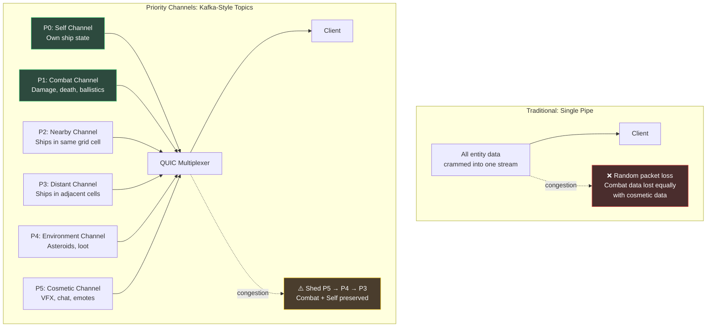

### Kafka Analogy

| Kafka Concept | Aetheris Equivalent | Mapping |
|---|---|---|
| **Topic** | Priority Channel | Logical stream by data category |
| **Partition** | Spatial Grid Cell | Entities grouped by proximity |
| **Consumer Group** | Per-Client Interest Set | Each client subscribes to relevant cells |
| **Retention Policy** | Reliability Tier | Volatile (no retention) vs. Critical (guaranteed) |
| **Priority/Tiering** | Shedding Order | P0 never shed, P5 shed first |
| **Broker** | Server (Stage 5 Send) | Server is the broker — no intermediary |

The critical advantage over Kafka: **QUIC streams are natively multiplexed** on a single UDP port with independent flow control per stream. No broker overhead, no disk I/O, no serialization roundtrip. The server **is** the broker.

**Differentiating Feature:** Unlike competing engines (Unreal, Mirror, Photon) which offer a fixed set of 2–3 hardcoded channels, Aetheris Priority Channels are:

1. **Developer-configurable** — Games define N channels via the `ChannelRegistry` builder API at startup. A space shooter defines different channels than a survival game.
2. **Bidirectional** — Priority processing applies to both server→client (Stage 5 Send) **and** client→server (Stage 1 Poll). Under server load, combat inputs are processed before chat messages.
3. **Dynamically shedable** — Per-client congestion state drives selective dropping with graceful degradation.

No other game engine provides a Kafka-grade message multiplexer as a first-class transport primitive.

---

## 2. Motivation — Why Priority Channels

### 2.1 Competitive Landscape

No mainstream game engine offers developer-configurable priority channels as a transport primitive:

| Engine/Library | Channel Model | Priority Scheduling | Dynamic Channels | Bidirectional Priority |
|---|---|---|---|---|
| **Unreal Engine** | 3 fixed (reliable/unreliable/ordered) | No | No | No |
| **Unity Mirror** | Reliable / Unreliable | No | No | No |
| **Photon** | Numeric channels, no priority | No | Limited (compile-time) | No |
| **renet** | 3 fixed | No | No | No |
| **Aetheris** | **N configurable via ChannelRegistry** | **Yes (P0→P5 shedding)** | **Yes (runtime builder)** | **Yes (Stage 1 + Stage 5)** |

This makes Priority Channels a **differentiating engine feature**, not a game-specific hack.

### 2.2 The Problem

A single sector with 1,000 players generates a heterogeneous mix of outbound data per tick:

| Data Type | Per-Client Volume (P1 Encoder) | Gameplay Criticality |
|---|---|---|
| Own ship state | ~33 bytes | **Absolute** — client prediction depends on it |
| Combat events | ~24 bytes (burst) | **High** — missed hit = desync |
| Nearby ship transforms | ~33 × 50 = 1,650 bytes | **High** — must see enemies to fight |
| Distant ship transforms | ~33 × 200 = 6,600 bytes | **Medium** — awareness, not targeting |
| Asteroid/loot state | ~20 × 100 = 2,000 bytes | **Low** — cosmetic until interacted |
| VFX/chat/emotes | Variable | **Lowest** — purely cosmetic |

Without prioritization, a WiFi micro-outage (50ms, ~3 ticks) drops packets **uniformly at random**. There is equal probability of losing the "you were hit for 80 damage" event as losing a distant asteroid's HP update. This is unacceptable.

### 2.3 Real-World Degradation Scenarios

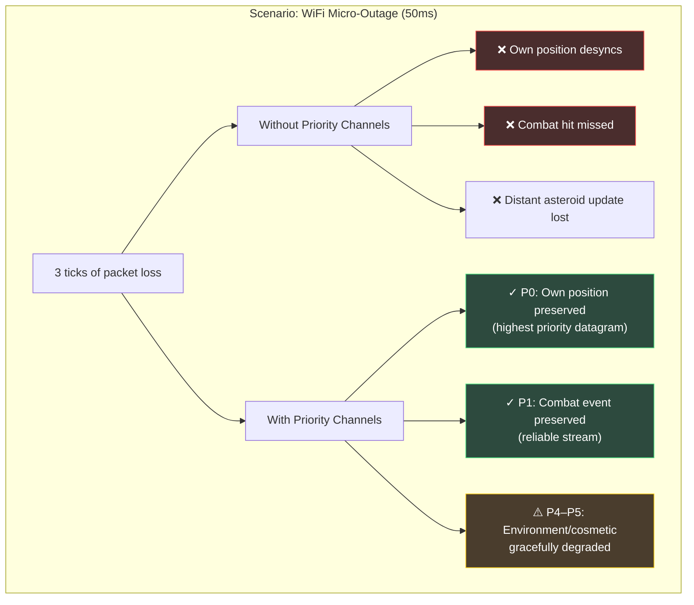

### 2.4 The Insight

QUIC already provides the primitives: multiplexed streams with independent flow control and unreliable datagrams. Priority Channels are the **application-level scheduling policy** that leverages these primitives to guarantee gameplay-critical data survives network degradation.

---

## 3. Channel Registry — Developer-Configurable Channels

Priority Channels are not hardcoded — they are declared by the game developer at startup via the **`ChannelRegistry`** builder API. The engine provides sensible defaults (the 6-channel taxonomy below), but any game can define its own channel layout.

### 3.1 Why Configurable

Different game genres need different channel topologies:

| Genre | Channels Needed | Why Different from Defaults |
|---|---|---|
| **Space shooter** (Void Rush) | P0–P5 (default) | Combat events, spatial proximity tiers |
| **Survival sandbox** | Self, Building, NPC, Weather, Chat | Building state is high-priority; no "combat" channel |
| **Racing game** | Self, Rivals (top 3), Pack, Spectator, Telemetry | Rivals at 60Hz, rest of pack at 15Hz |
| **MMO** | Self, Party, Raid, Zone, Guild, Global | Party members always full-fidelity |
| **Simulation / non-game** | Control, Telemetry, Bulk, Debug | No combat/spatial concepts at all |

### 3.2 ChannelRegistry Builder API

```rust
use aetheris_protocol::channels::*;

/// Define channels at server startup. Each channel has:
/// - A unique name (used in logs, metrics, and debug).
/// - A priority level (lower = higher priority, 0 is highest).
/// - A reliability tier (Volatile, Critical, or Ordered).
/// - A shedding policy (Never, or a SheddingLevel threshold).
/// - An optional bandwidth budget percentage.
pub struct ChannelRegistry {
    channels: Vec<ChannelDefinition>,
}

impl ChannelRegistry {
    pub fn builder() -> ChannelRegistryBuilder {
        ChannelRegistryBuilder::new()
    }

    /// Returns the default 6-channel configuration used by Void Rush.
    pub fn default_game_channels() -> Self {
        Self::builder()
            .channel("self")
                .priority(0)
                .reliability(ReliabilityTier::Volatile)
                .shedding(SheddingPolicy::Never)
                .budget_pct(5)
                .direction(ChannelDirection::Bidirectional)
            .channel("combat")
                .priority(1)
                .reliability(ReliabilityTier::Critical)
                .shedding(SheddingPolicy::Never)
                .budget_pct(15)
                .direction(ChannelDirection::Bidirectional)
            .channel("nearby")
                .priority(2)
                .reliability(ReliabilityTier::Volatile)
                .shedding(SheddingPolicy::AtLevel(SheddingLevel::Level3))
                .budget_pct(40)
                .direction(ChannelDirection::ServerToClient)
            .channel("distant")
                .priority(3)
                .reliability(ReliabilityTier::Volatile)
                .shedding(SheddingPolicy::AtLevel(SheddingLevel::Level2))
                .budget_pct(25)
                .direction(ChannelDirection::ServerToClient)
            .channel("environment")
                .priority(4)
                .reliability(ReliabilityTier::Volatile)
                .shedding(SheddingPolicy::AtLevel(SheddingLevel::Level1))
                .budget_pct(10)
                .direction(ChannelDirection::ServerToClient)
            .channel("cosmetic")
                .priority(5)
                .reliability(ReliabilityTier::Volatile)
                .shedding(SheddingPolicy::AtLevel(SheddingLevel::Level1))
                .budget_pct(5)
                .direction(ChannelDirection::Bidirectional)
            .build()
    }
}
```

### 3.3 ChannelDefinition

```rust
pub struct ChannelDefinition {
    /// Human-readable channel name (used in metrics labels and logs).
    pub name: &'static str,
    /// Priority level. Lower = higher priority. 0 is absolute highest.
    pub priority: u8,
    /// How data is delivered on the wire.
    pub reliability: ReliabilityTier,
    /// When this channel is shed under congestion.
    pub shedding: SheddingPolicy,
    /// Percentage of per-client bandwidth budget allocated to this channel.
    pub budget_pct: u8,
    /// Whether this channel carries data in one or both directions.
    pub direction: ChannelDirection,
}

#[derive(Clone, Copy, PartialEq, Eq)]
pub enum SheddingPolicy {
    /// Channel is never shed (P0, P1 equivalent).
    Never,
    /// Channel is shed when the client reaches this SheddingLevel or higher.
    AtLevel(SheddingLevel),
}

#[derive(Clone, Copy, PartialEq, Eq)]
pub enum ChannelDirection {
    /// Server sends to client only (e.g., nearby entity replication).
    ServerToClient,
    /// Client sends to server only (e.g., dedicated input channel).
    ClientToServer,
    /// Both directions (e.g., self-state, combat events, chat).
    Bidirectional,
}
```

### 3.4 Builder Pattern — Racing Game Example

```rust
// A racing game with very different priorities than a space shooter:
let channels = ChannelRegistry::builder()
    .channel("self")
        .priority(0)
        .reliability(ReliabilityTier::Volatile)
        .shedding(SheddingPolicy::Never)
        .budget_pct(10)
        .direction(ChannelDirection::Bidirectional)
    .channel("rivals")
        .priority(1)
        .reliability(ReliabilityTier::Volatile)
        .shedding(SheddingPolicy::Never)
        .budget_pct(30)   // top-3 rivals at full 60Hz
        .direction(ChannelDirection::ServerToClient)
    .channel("pack")
        .priority(2)
        .reliability(ReliabilityTier::Volatile)
        .shedding(SheddingPolicy::AtLevel(SheddingLevel::Level2))
        .budget_pct(25)
        .direction(ChannelDirection::ServerToClient)
    .channel("race_events")
        .priority(1)      // same priority as rivals — never shed
        .reliability(ReliabilityTier::Critical)
        .shedding(SheddingPolicy::Never)
        .budget_pct(15)
        .direction(ChannelDirection::ServerToClient)
    .channel("telemetry")
        .priority(4)
        .reliability(ReliabilityTier::Volatile)
        .shedding(SheddingPolicy::AtLevel(SheddingLevel::Level1))
        .budget_pct(10)
        .direction(ChannelDirection::ServerToClient)
    .channel("spectator")
        .priority(5)
        .reliability(ReliabilityTier::Volatile)
        .shedding(SheddingPolicy::AtLevel(SheddingLevel::Level1))
        .budget_pct(10)
        .direction(ChannelDirection::ServerToClient)
    .build();
```

### 3.5 Integration with AetherisServer Builder (P3 SDK)

```rust
// How it plugs into the server builder:
let server = AetherisServer::builder()
    .transport(QuinnTransport::new(config))
    .world(MyWorldState::new())
    .encoder(BitpackEncoder::new())
    .channels(ChannelRegistry::default_game_channels())  // ← new
    .build()
    .run()
    .await;
```

The `ChannelRegistry` is immutable after `.build()` — channels cannot be added or removed at runtime. This enables compile-time-like optimizations: the `PriorityScheduler` allocates fixed-size arrays indexed by channel priority, with zero dynamic dispatch.

### 3.6 Channel Registry Architecture

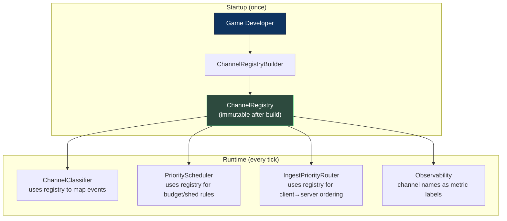

---

## 4. Channel Taxonomy

### 4.1 Channel Definitions

The **default** channel configuration (used by Void Rush and provided via `ChannelRegistry::default_game_channels()`) defines 6 channels. Games may override this entirely via the `ChannelRegistry` builder.

| Priority | Channel Name | Content | Reliability | Shed Order | Rationale |
|---|---|---|---|---|---|
| **P0** | `self` | Own entity Transform, Velocity, ShipStats | Unreliable (60Hz) | **Never** | Client prediction anchor; loss = visible desync of own ship |
| **P1** | `combat` | BallisticEvents, DamageEvents, DeathEvents | Reliable | **Never** | Loss = permanent gameplay desync (enemy never dies) |
| **P2** | `nearby` | Transform + Velocity of entities in same Spatial Grid cell | Unreliable (60Hz) | Last resort | Entities player can currently interact with / target |
| **P3** | `distant` | Transform of entities in adjacent Grid cells | Unreliable (30Hz → 15Hz under pressure) | Third | Situational awareness, not direct interaction |
| **P4** | `environment` | Asteroid HP, loot drop state, station broadcasts | Unreliable (on-change) | Second | Cosmetic until player approaches |
| **P5** | `cosmetic` | VFX confirmations, chat messages, emote broadcasts | Unreliable / Reliable (chat) | **First** | Zero gameplay impact on loss |

### 4.2 Channel Priority Pyramid


### 4.3 Relationship to Existing Reliability Tiers

Priority Channels are **orthogonal** to the existing [Reliability Tier System](TRANSPORT_DESIGN.md#7-reliability-tier-system). A channel's reliability tier determines **how** data is delivered (datagram vs. stream). The priority level determines **whether** data is sent at all under congestion.

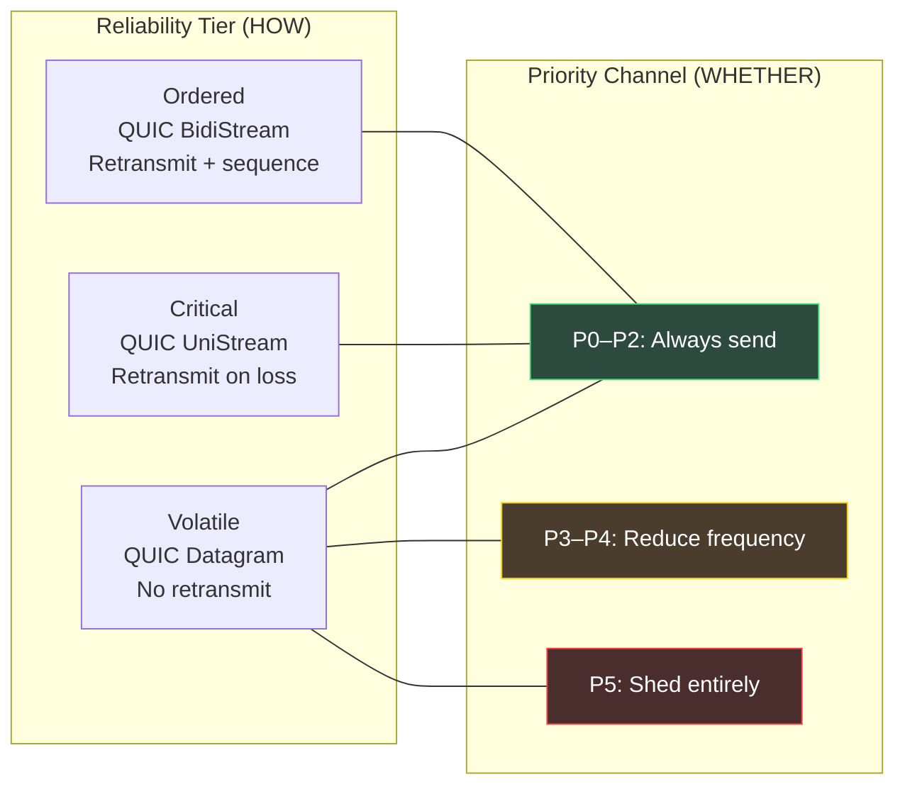

---

## 5. Architecture Overview

### 5.1 End-to-End Data Flow

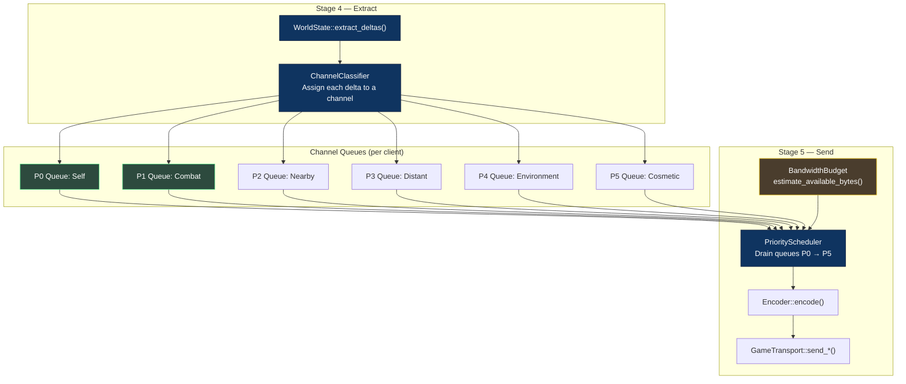

### 5.2 Channel Classifier

The `ChannelClassifier` runs after `extract_deltas()` and assigns each `ReplicationEvent` to a priority channel based on:

1. **Recipient relationship:** Is this event about the recipient's own entity? → P0
2. **Event type:** Is it a `BallisticEvent` or `DamageEvent`? → P1
3. **Spatial proximity:** Is the source entity in the recipient's Grid cell? → P2. Adjacent? → P3
4. **Entity type:** Asteroid, loot drop? → P4
5. **Default:** Everything else → P5

```rust
pub enum PriorityChannel {
    /// P0 — Own entity state. Never shed.
    Self_ = 0,
    /// P1 — Combat events. Never shed (reliable delivery).
    Combat = 1,
    /// P2 — Nearby entities (same Spatial Grid cell). 60Hz.
    Nearby = 2,
    /// P3 — Distant entities (adjacent cells). 30Hz, reducible to 15Hz.
    Distant = 3,
    /// P4 — Environment (asteroids, loot, stations). On-change, sheddable.
    Environment = 4,
    /// P5 — Cosmetic (VFX, chat, emotes). First to shed.
    Cosmetic = 5,
}

pub struct ChannelClassifier {
    spatial_grid: Arc<SpatialHashGrid>,
}

impl ChannelClassifier {
    /// Classify a ReplicationEvent for a specific recipient.
    pub fn classify(
        &self,
        event: &ReplicationEvent,
        recipient_id: ClientId,
        recipient_cell: GridCell,
    ) -> PriorityChannel {
        // P0: Is this about the recipient's own entity?
        if event.network_id == recipient_id.entity_network_id() {
            return PriorityChannel::Self_;
        }

        // P1: Combat events always highest priority
        if event.is_combat_event() {
            return PriorityChannel::Combat;
        }

        // P2/P3: Spatial proximity
        let source_cell = self.spatial_grid.cell_for(event.network_id);
        if source_cell == recipient_cell {
            return PriorityChannel::Nearby;
        }
        if source_cell.is_adjacent_to(recipient_cell) {
            return PriorityChannel::Distant;
        }

        // P4: Environment entities
        if event.is_environment_entity() {
            return PriorityChannel::Environment;
        }

        // P5: Everything else
        PriorityChannel::Cosmetic
    }
}
```

---

## 6. QUIC Stream Mapping

### 6.1 Channel → QUIC Primitive Mapping

Each priority channel maps to a specific QUIC delivery mechanism:

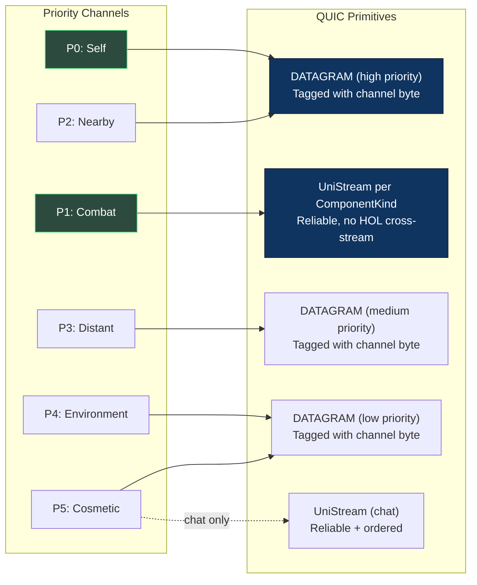

### 6.2 Datagram Tagging

Every unreliable datagram includes a **1-byte channel header** so the client can prioritize processing:

```
┌────────────┬────────────┬───────────────────────────────┐
│ Channel(1B)│ NetworkId  │  Encoded Component Payload    │
│ 0x00..0x05 │ (8B / 20b) │  (variable)                   │
└────────────┴────────────┴───────────────────────────────┘
```

The client processes datagrams in priority order: P0 first, P5 last. If the Game Worker is behind schedule, it can skip P5 datagrams entirely.

### 6.3 Phase 3: Per-Channel QUIC Streams

In Phase 3 with `quinn`, each priority channel that requires reliability opens a **dedicated QUIC unidirectional stream**:

```
QUIC Connection (ClientId 9942):
  DATAGRAM [ch=0]:    P0 Self     — own Transform, Velocity
  DATAGRAM [ch=2]:    P2 Nearby   — same-cell entities
  DATAGRAM [ch=3]:    P3 Distant  — adjacent-cell entities
  DATAGRAM [ch=4]:    P4 Env      — asteroids, loot
  DATAGRAM [ch=5]:    P5 Cosmetic — VFX hints
  UniStream #100:     P1 Combat   — BallisticEvents (reliable)
  UniStream #101:     P1 Combat   — DamageEvents (reliable)
  UniStream #102:     P1 Combat   — DeathEvents (reliable)
  UniStream #200:     P5 Chat     — ChatMessages (reliable + ordered)
```

Each stream has independent flow control. A retransmission stall on the Chat stream does not block Combat event delivery.

---

## 7. Priority Shedding — Graceful Degradation

### 7.1 Shedding Triggers

The `PriorityScheduler` monitors three signals to decide when to shed:

| Signal | Source | Threshold | Action |
|---|---|---|---|
| **Tick overrun** | `TickScheduler` | Stage 5 budget > 2.0ms | Shed P5, reduce P3 to 15Hz |
| **Outbound queue depth** | Per-client send buffer | > 3 ticks buffered | Shed P5 → P4 progressively |
| **QUIC congestion window** | `quinn::Connection` stats | cwnd < estimated_need | Shed from P5 upward |
| **Client RTT spike** | QUIC RTT estimator | RTT > 200ms | Reduce P3 to 15Hz, shed P5 |

### 7.2 Shedding Cascade

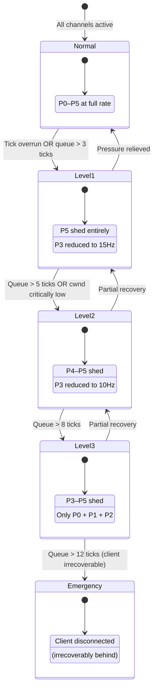

### 7.3 Shedding Algorithm (Pseudocode)

```rust
pub struct PriorityScheduler {
    /// Per-client outbound queue depth (in ticks buffered).
    queue_depths: HashMap<ClientId, u32>,
    /// Current shedding level per client.
    shed_levels: HashMap<ClientId, SheddingLevel>,
}

#[derive(Clone, Copy, PartialEq, Eq, PartialOrd, Ord)]
pub enum SheddingLevel {
    Normal,     // All channels active
    Level1,     // P5 shed, P3 at 15Hz
    Level2,     // P4–P5 shed, P3 at 10Hz
    Level3,     // P3–P5 shed, only P0+P1+P2
    Emergency,  // Disconnect client
}

impl PriorityScheduler {
    /// Determine if a channel should be sent for this client this tick.
    pub fn should_send(
        &self,
        client_id: ClientId,
        channel: PriorityChannel,
        current_tick: u64,
    ) -> bool {
        let level = self.shed_levels.get(&client_id)
            .copied()
            .unwrap_or(SheddingLevel::Normal);

        match (level, channel) {
            // P0 and P1 always send
            (_, PriorityChannel::Self_ | PriorityChannel::Combat) => true,

            // P2 always sends unless Emergency
            (SheddingLevel::Emergency, _) => false,
            (_, PriorityChannel::Nearby) => true,

            // P3: frequency reduction based on level
            (SheddingLevel::Normal, PriorityChannel::Distant) => true, // 60Hz
            (SheddingLevel::Level1, PriorityChannel::Distant) =>
                current_tick % 4 == 0, // 15Hz
            (SheddingLevel::Level2, PriorityChannel::Distant) =>
                current_tick % 6 == 0, // 10Hz
            (SheddingLevel::Level3, PriorityChannel::Distant) => false, // Shed

            // P4: shed at Level2+
            (SheddingLevel::Normal | SheddingLevel::Level1,
             PriorityChannel::Environment) => true,
            (_, PriorityChannel::Environment) => false,

            // P5: shed at Level1+
            (SheddingLevel::Normal, PriorityChannel::Cosmetic) => true,
            (_, PriorityChannel::Cosmetic) => false,
        }
    }
}
```

---

## 8. Bidirectional Priority Processing

Priority Channels are not server→client only. The same priority model applies to **client→server** traffic in Stage 1 (Poll). Under server load, the server processes high-priority inbound messages before low-priority ones, ensuring that combat inputs are never starved by a flood of chat messages.

### 8.1 The Inbound Priority Problem

Without inbound prioritization, the server processes messages in **arrival order** (FIFO). Consider a scenario with 1,000 connected clients:

| Inbound Message Type | Volume Per Tick | Gameplay Impact |
|---|---|---|
| Movement inputs | ~1,000 (1 per client) | **Critical** — late processing = prediction mismatch |
| Combat actions (fire, ability) | ~200 (burst) | **Critical** — late processing = missed hit-registration window |
| Chat messages | ~50 | **None** — can be delayed 100ms with no visible effect |
| Emote/cosmetic triggers | ~30 | **None** — purely visual |
| Telemetry/ping | ~100 | **Low** — informational only |

If the server processes FIFO and a chat flood arrives first, 50 chat messages consume ~0.1ms of the 1ms Stage 1 budget before any combat input is touched. Under extreme load (DDoS via chat spam), this can delay combat processing by multiple ticks.

### 8.2 Inbound Channel Classification

The client tags every outbound message with a **1-byte channel header** — the same tagging scheme used for server→client datagrams (§6.2). The server's `IngestPriorityRouter` in Stage 1 sorts inbound messages by channel priority before dispatching to Stage 2.

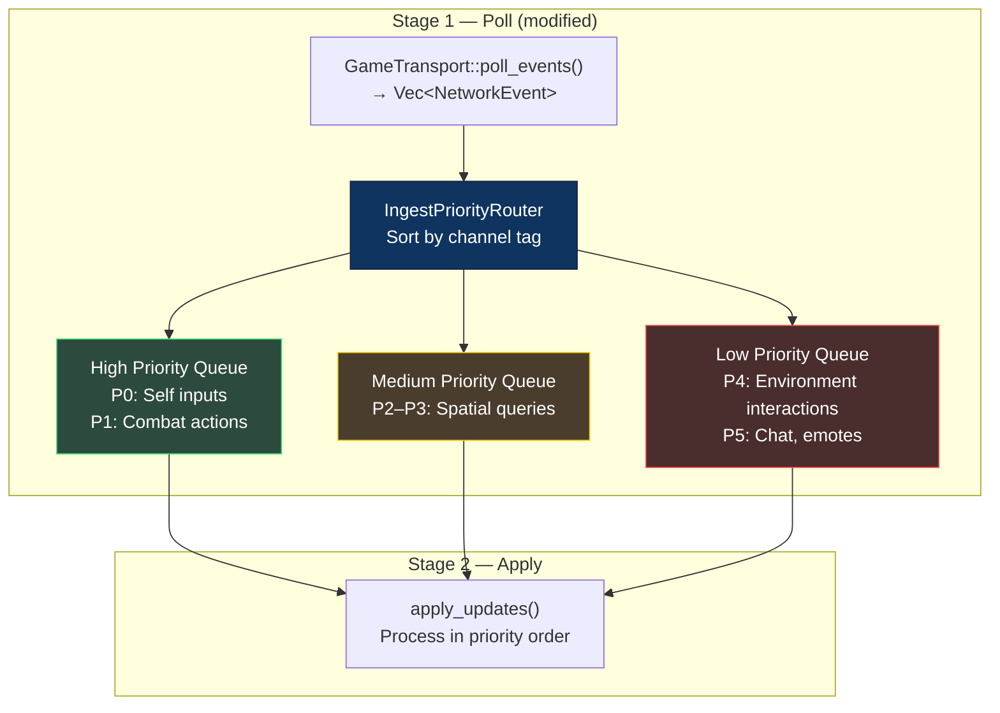

### 8.3 Client-Side Outbound Tagging

The client uses the same `ChannelRegistry` to tag outbound messages:

```rust
// Client-side: tag outbound messages with channel priority
impl ClientTransport {
    pub fn send_input(&self, input: &InputCommand) -> Result<(), TransportError> {
        // Movement inputs are always P0 (self channel)
        let mut buf = Vec::with_capacity(1 + input.encoded_size());
        buf.push(self.registry.channel_id("self")); // 0x00
        input.encode_into(&mut buf);
        self.transport.send_unreliable(&buf)
    }

    pub fn send_combat_action(&self, action: &CombatAction) -> Result<(), TransportError> {
        let mut buf = Vec::with_capacity(1 + action.encoded_size());
        buf.push(self.registry.channel_id("combat")); // 0x01
        action.encode_into(&mut buf);
        self.transport.send_reliable(&buf)
    }

    pub fn send_chat(&self, msg: &ChatMessage) -> Result<(), TransportError> {
        let mut buf = Vec::with_capacity(1 + msg.encoded_size());
        buf.push(self.registry.channel_id("cosmetic")); // 0x05
        msg.encode_into(&mut buf);
        self.transport.send_reliable(&buf)
    }
}
```

### 8.4 Server-Side Inbound Shedding

Under extreme server load (Stage 1 budget exceeded), the server can **shed inbound low-priority messages** — the mirror of outbound shedding:

| Server Load State | Inbound Behavior |
|---|---|
| **Normal** | All inbound channels processed |
| **Overloaded (Stage 1 > 1.5ms)** | P5 (chat/emotes) deferred to next tick |
| **Critical (Stage 1 > 2.0ms)** | P4–P5 deferred; only P0–P3 processed this tick |

Deferred messages are not dropped — they are queued and processed in the next tick's Stage 1 with highest priority (to prevent starvation). This is a **delay**, not a loss.

### 8.5 Bidirectional Flow Diagram

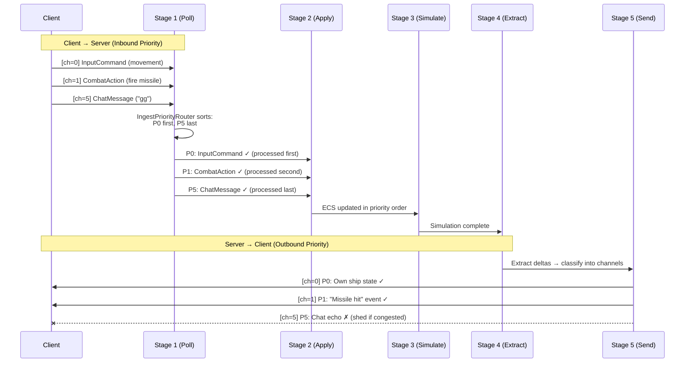

---

## 9. Interest Management Integration

Priority Channels work in tandem with **Spatial Interest Management** — the system that decides *which entities* a client receives updates about at all.

> **Canonical Sources:** See [SPATIAL_PARTITIONING_DESIGN.md](SPATIAL_PARTITIONING_DESIGN.md) for the spatial hash grid and AoI model, and [INTEREST_MANAGEMENT_DESIGN.md](INTEREST_MANAGEMENT_DESIGN.md) for the unified interest pipeline that composes spatial, room, tenant, and custom filters.

### 9.1 Interest Radius by Channel

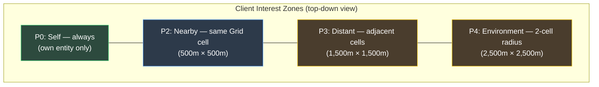

### 9.2 Spatial Grid Cell as Kafka Partition

Each Spatial Grid cell acts as a **Kafka partition**: entities within it produce events, and clients "subscribe" to cells based on proximity. When a client moves to a new cell, it:

1. **Unsubscribes** from old distant cells (stops receiving P3 updates)
2. **Subscribes** to new adjacent cells
3. Receives a **full snapshot** of the new nearby cell (P2 catch-up)

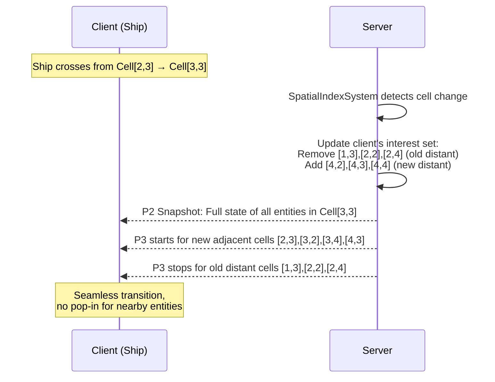

---

## 10. Bandwidth Budgeting

### 10.1 Per-Client Bandwidth Allocation

The total outbound bandwidth budget per client is distributed across channels:

| Channel | Budget Allocation | Max Bytes/Tick | Rationale |
|---|---|---|---|
| **P0: Self** | 5% | ~420 bytes | Single entity, always fits |
| **P1: Combat** | 15% | ~1,260 bytes | Burst-capable for multi-hit scenarios |
| **P2: Nearby** | 40% | ~3,360 bytes | ~100 entities × 33 bytes |
| **P3: Distant** | 25% | ~2,100 bytes | ~60 entities × 33 bytes (at 60Hz) |
| **P4: Environment** | 10% | ~840 bytes | On-change only, usually sparse |
| **P5: Cosmetic** | 5% | ~420 bytes | First to be sacrificed |
| **Total** | 100% | **~8,400 bytes/tick** | ≈ **500 KB/s at 60Hz** |

### 10.2 Bandwidth Budget Under Shedding

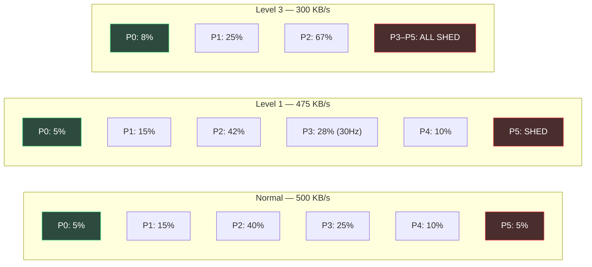

When lower-priority channels are shed, their budget is **reallocated upward** — P2 (nearby entities) gets more bytes per tick, enabling higher fidelity for the entities that matter most.

---

## 11. Stage 5 (Send) — Prioritized Dispatch

### 11.1 Modified Send Pipeline

The existing Stage 5 pipeline is extended with channel classification and priority scheduling:

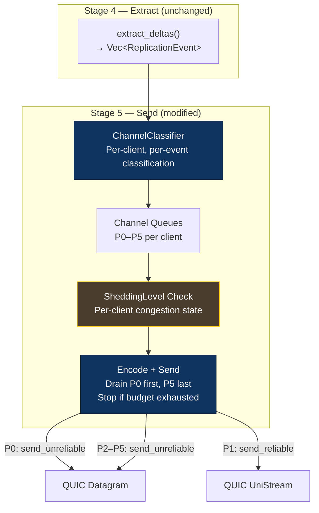

### 11.2 Dispatch Order Within a Tick

```
for each connected client:
    level = shed_levels[client_id]
    budget_remaining = per_client_budget

    for priority in [P0, P1, P2, P3, P4, P5]:
        if !should_send(client_id, priority, current_tick):
            continue  // Channel is shed

        for event in channel_queues[client_id][priority]:
            encoded = encoder.encode(event)
            if encoded.len() > budget_remaining:
                break  // Budget exhausted, lower priorities implicitly shed
            transport.send(client_id, encoded, priority.reliability_tier())
            budget_remaining -= encoded.len()
```

**Key invariant:** P0 and P1 are always dispatched first. The budget can only run out during P2+ processing, ensuring self-state and combat events are never shed by budget exhaustion.

---

## 12. Stage 1 (Poll) — Prioritized Ingest

### 12.1 IngestPriorityRouter

The `IngestPriorityRouter` wraps the raw `Vec<NetworkEvent>` from `GameTransport::poll_events()` and re-orders events by their channel tag before passing to Stage 2:

```rust
pub struct IngestPriorityRouter {
    registry: Arc<ChannelRegistry>,
    /// Deferred messages from previous tick (processed first).
    deferred: Vec<NetworkEvent>,
}

impl IngestPriorityRouter {
    /// Sort and optionally defer low-priority inbound messages.
    pub fn prioritize(
        &mut self,
        mut events: Vec<NetworkEvent>,
        stage1_budget_remaining_us: u64,
    ) -> Vec<NetworkEvent> {
        // 1. Prepend deferred messages from previous tick (priority debt).
        let mut prioritized = std::mem::take(&mut self.deferred);

        // 2. Sort new events by channel tag (P0 first, P5 last).
        events.sort_by_key(|e| match e {
            NetworkEvent::UnreliableMessage { data, .. } => data.first().copied().unwrap_or(255),
            NetworkEvent::ReliableMessage { data, .. } => data.first().copied().unwrap_or(255),
            NetworkEvent::ClientConnected(_) => 0,       // Always first
            NetworkEvent::ClientDisconnected { .. } => 0, // Always first
        });

        // 3. If budget is tight, defer P4–P5 to next tick.
        if stage1_budget_remaining_us < 500 {
            let (keep, defer): (Vec<_>, Vec<_>) = events.into_iter().partition(|e| {
                match e {
                    NetworkEvent::UnreliableMessage { data, .. }
                    | NetworkEvent::ReliableMessage { data, .. } => {
                        data.first().copied().unwrap_or(255) <= 3 // P0–P3
                    }
                    _ => true,
                }
            });
            prioritized.extend(keep);
            self.deferred = defer;
        } else {
            prioritized.extend(events);
        }

        prioritized
    }
}
```

### 12.2 Stage 1 Integration

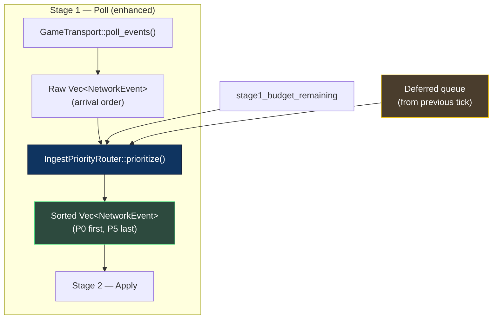

### 12.3 Anti-Starvation Guarantee

Deferred messages are never dropped — only delayed by at most 1 tick (16.6ms). The `IngestPriorityRouter` always drains the deferred queue **first** in the next tick, ensuring bounded latency even for low-priority messages. The invariant:

> **No inbound message is deferred more than once.** If it was deferred last tick, it is processed this tick regardless of budget pressure.

This prevents chat messages from being starved indefinitely under sustained server load.

---

## 13. Phase 1 Implementation (Renet Channels)

### 13.1 Mapping to Renet's 3-Channel Model

P1 uses `renet`, which provides only 3 channels. Priority Channels are implemented as **logical channels multiplexed over renet's physical channels**:

| Renet Channel | Physical Delivery | Logical Channels Multiplexed |
|---|---|---|
| Channel 0 (Unreliable) | No retransmit | P0 (Self), P2 (Nearby), P3 (Distant), P4 (Environment), P5 (Cosmetic) |
| Channel 1 (Reliable) | Guaranteed delivery | P1 (Combat — BallisticEvents, DamageEvents) |
| Channel 2 (Reliable Ordered) | Guaranteed + ordered | P5 (Chat only) |

### 13.2 P1 Prioritization Strategy

Since renet's Channel 0 is a single unreliable pipe, the server implements priority via **ordering within the tick's send buffer**:

1. Encode P0 events first → placed at front of Channel 0 buffer
2. Encode P2 events next → right after P0
3. Encode P3–P5 at the end → tail of buffer

If the per-client renet send buffer fills, the tail (P4–P5) is naturally truncated.

```rust
/// P1 implementation: priority via insertion order in renet's unreliable channel.
fn send_prioritized_unreliable(
    server: &mut RenetServer,
    client_id: u64,
    channel_queues: &ChannelQueues,
    encoder: &dyn Encoder,
    tick: u64,
    shed_level: SheddingLevel,
) {
    let priorities = [
        PriorityChannel::Self_,
        PriorityChannel::Nearby,
        PriorityChannel::Distant,
        PriorityChannel::Environment,
        PriorityChannel::Cosmetic,
    ];

    for priority in priorities {
        if !should_send_for_level(shed_level, priority, tick) {
            continue;
        }
        for event in &channel_queues[priority] {
            let bytes = encoder.encode(event);
            server.send_message(client_id, Channel::Unreliable as u8, bytes);
        }
    }
}
```

### 13.3 P1 Limitations

| Limitation | Impact | P3 Resolution |
|---|---|---|
| Single unreliable channel | No per-channel flow control | Per-channel QUIC datagrams with tagged header |
| Ordering-based priority only | Truncation is buffer-dependent, not deterministic | Explicit budget enforcement in PriorityScheduler |
| No per-channel metrics | Cannot observe P3 vs. P4 shed rates independently | Per-stream counters in quinn |

---

## 14. Phase 3 Implementation (Quinn QUIC Streams)

### 14.1 Full QUIC Stream Topology

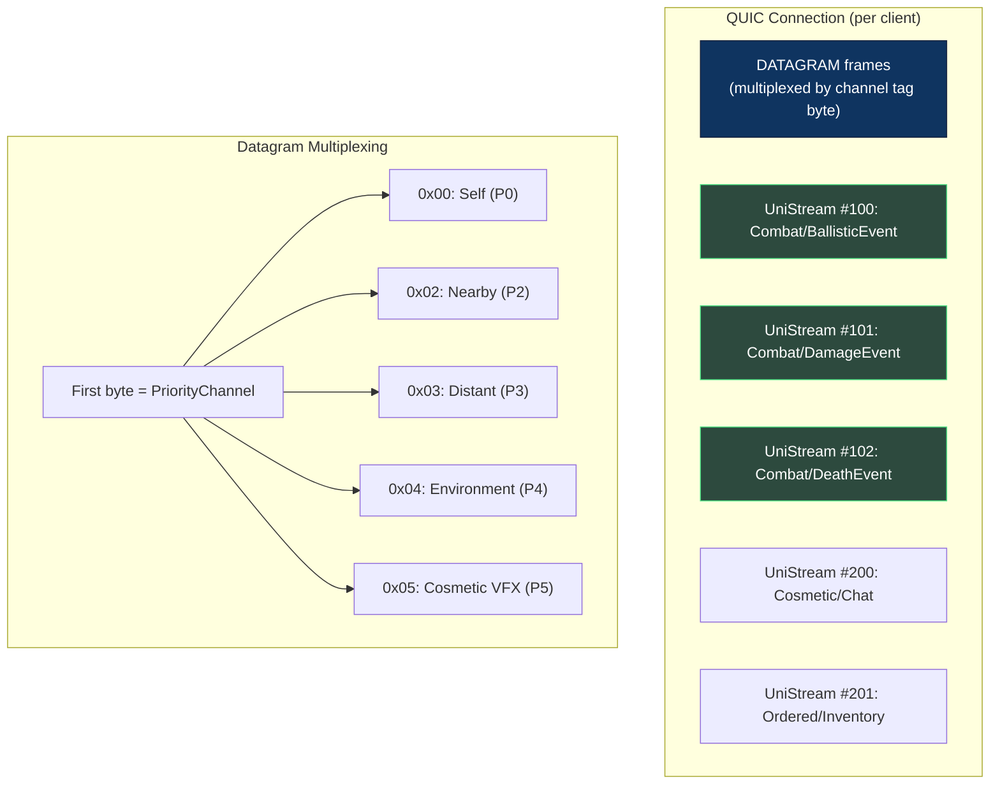

### 14.2 Per-Stream Flow Control

Quinn exposes per-stream backpressure via `SendStream::write()` returning `Poll::Pending` when the stream's flow control window is full. The `PriorityScheduler` uses this signal:

```rust
impl QuinnPriorityTransport {
    async fn send_channel(
        &self,
        client: &ClientConnection,
        channel: PriorityChannel,
        data: &[u8],
    ) -> Result<(), TransportError> {
        match channel.reliability_tier() {
            ReliabilityTier::Volatile => {
                // Tag datagram with channel byte
                let mut tagged = Vec::with_capacity(1 + data.len());
                tagged.push(channel as u8);
                tagged.extend_from_slice(data);
                client.connection.send_datagram(tagged.into())?;
            }
            ReliabilityTier::Critical => {
                let stream = client.get_or_open_stream(channel)?;
                stream.write_all(data).await?;
            }
            ReliabilityTier::Ordered => {
                let stream = client.get_or_open_ordered_stream(channel)?;
                stream.write_all(data).await?;
            }
        }
        Ok(())
    }
}
```

### 14.3 Client-Side Processing Order

The WASM Game Worker processes received datagrams in priority order:

```rust
// Client-side: process incoming datagrams by priority
fn process_incoming_datagrams(datagrams: &mut Vec<TaggedDatagram>) {
    // Sort by channel tag (P0 first)
    datagrams.sort_by_key(|d| d.channel_tag());

    for dg in datagrams {
        match PriorityChannel::from(dg.channel_tag()) {
            PriorityChannel::Self_ => apply_self_state(dg),
            PriorityChannel::Nearby => apply_entity_state(dg),
            PriorityChannel::Distant => apply_entity_state(dg),
            PriorityChannel::Environment => apply_environment_state(dg),
            PriorityChannel::Cosmetic => {
                // Skip if Game Worker is behind schedule
                if tick_budget_remaining() < COSMETIC_THRESHOLD {
                    break;
                }
                apply_cosmetic(dg);
            }
        }
    }
}
```

---

## 15. Observability & Metrics

### 15.1 Per-Channel Prometheus Metrics

| Metric | Type | Labels | Description |
|---|---|---|---|
| `aetheris_channel_bytes_sent_total` | Counter | `channel`, `client_id` | Total bytes sent per channel per client |
| `aetheris_channel_events_sent_total` | Counter | `channel` | Total events dispatched per channel |
| `aetheris_channel_events_shed_total` | Counter | `channel`, `shed_level` | Events dropped due to priority shedding |
| `aetheris_channel_shed_level` | Gauge | `client_id` | Current shedding level per client (0–4) |
| `aetheris_channel_queue_depth` | Histogram | `channel` | Events pending in each channel queue |
| `aetheris_send_budget_utilization` | Histogram | `client_id` | % of per-client budget used per tick |
| `aetheris_send_stage_duration_ms` | Histogram | — | Stage 5 total duration with priority dispatch |

### 15.2 Grafana Dashboard Panels

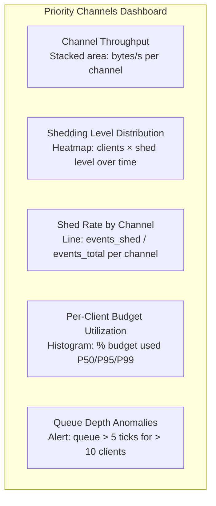

---

## 16. Performance Contracts

| Metric | Target | Measurement Method |
|---|---|---|
| **Channel classification overhead** | ≤ 0.3ms for 6,700 events | `classify_duration_ms` histogram |
| **Priority dispatch (Stage 5)** | ≤ 2.5ms (up from 2.0ms flat) | `send_stage_duration_ms` P99 |
| **P0 + P1 delivery latency** | ≤ 1 tick (16.6ms) under Level 2 shedding | End-to-end measurement |
| **Shedding transition latency** | ≤ 1 tick to activate/deactivate | State machine transition timing |
| **Bandwidth savings at Level 1** | ≥ 15% reduction per client | Bytes sent counter comparison |
| **Bandwidth savings at Level 3** | ≥ 50% reduction per client | Bytes sent counter comparison |
| **Zero P0/P1 loss under shedding** | 0 events shed from P0 or P1 | `channel_events_shed_total{channel="self\|combat"}` = 0 |

---

## 17. Open Questions

| # | Question | Impact | Status |
|---|---|---|---|
| OQ-1 | Should P3 (distant) use a lower update rate (30Hz) even under normal conditions? | Bandwidth savings vs. visual smoothness for distant ships | **Leaning: 30Hz default** |
| OQ-2 | Should the client be informed of its current shedding level? | UI can display "connection quality" indicator | **Leaning: Yes, via reliable control message** |
| OQ-3 | How should shedding interact with combat mode? (Player actively firing/being fired upon) | Auto-promote P3 to P2 for combat participants even if distant | **Open** |
| ~~OQ-4~~ | ~~Should Priority Channels be configurable per-game or hardcoded in the engine?~~ | ~~Reusability for non-Void-Rush titles~~ | **Resolved → §3 ChannelRegistry builder API. Configurable channels + configurable shedding policies** |
| OQ-5 | Can QUIC DATAGRAM priority hints (draft-ietf-quic-datagram-priority) be leveraged? | OS-level prioritization below application layer | **Open — spec still in draft** |
| OQ-6 | How does channel classification interact with the P3 BitpackEncoder delta compression? | Dirty-mask must be per-channel, not global | **Open** |
| OQ-7 | Should the `ChannelRegistry` support runtime hot-reload for live-ops tuning? | Operators could adjust channel budgets without server restart | **Leaning: No — immutable after build for performance. Use server restart for changes** |
| OQ-8 | Should inbound shedding (§12) defer or drop messages under extreme load? | Dropped chat = data loss; deferred chat = bounded latency increase | **Resolved → Defer only, never drop. Max 1-tick delay (§12.3)** |

---

## Appendix A — Glossary

| Term | Definition |
|---|---|
| **Channel Classifier** | Component that assigns each `ReplicationEvent` to a priority channel based on recipient, event type, and spatial proximity |
| **Channel Direction** | Whether a channel carries data server→client, client→server, or both |
| **Channel Registry** | Immutable, developer-configured set of channel definitions built at server startup via the builder API |
| **Ingest Priority Router** | Stage 1 component that sorts inbound client→server messages by channel priority before Stage 2 processing |
| **Interest Management** | System determining which entities a client receives updates about, driven by Spatial Grid cell proximity |
| **Priority Channel** | A logical grouping of replicated data with a fixed priority level and shedding policy |
| **Priority Pyramid** | The ordered hierarchy of channels from P0 (never shed) to P5 (first shed) |
| **Priority Scheduler** | Stage 5 component that drains channel queues in priority order, respecting budget and shedding level |
| **Priority Shedding** | Selective dropping or frequency reduction of lower-priority channels under congestion |
| **Shedding Level** | Per-client congestion state (Normal, Level 1–3, Emergency) driving channel availability |
| **Shedding Policy** | Per-channel configuration specifying when (at which SheddingLevel) a channel is shed |

See also: [GLOSSARY.md](../GLOSSARY.md) for engine-level terminology, [TRANSPORT_DESIGN.md](TRANSPORT_DESIGN.md) for reliability tiers.

---

## Appendix B — Decision Log

| # | Decision | Rationale | Revisit Condition | Date |
|---|---|---|---|---|
| D-1 | 6 priority channels (P0–P5) | Balances granularity with implementation complexity; maps cleanly to game data categories | If profiling shows < 3 or > 8 categories needed | 2026-04-15 |
| D-2 | P0 (Self) and P1 (Combat) are unshedable | Self-state drives prediction; combat events cause permanent desync on loss | Never — this is a correctness invariant | 2026-04-15 |
| D-3 | Spatial Grid cell = partition unit | Reuses existing SpatialHashGrid from collision system; no new spatial structure needed | If interest management requires finer granularity (e.g., per-quadrant) | 2026-04-15 |
| D-4 | 1-byte channel tag in datagrams | 256 possible channels is far more than needed; 1 byte is negligible overhead | If channel count exceeds 256 (highly unlikely) | 2026-04-15 |
| D-5 | P1 uses renet insertion-order priority | Only viable approach with renet's 3-channel model; P3 quinn provides real per-channel streams | When P3 transport is implemented | 2026-04-15 |
| D-6 | Budget reallocation on shedding | Freed bandwidth from shed channels increases fidelity for surviving channels; better than wasting budget | If reallocation causes bursts that trigger further congestion | 2026-04-15 |
| D-7 | Kafka-style architecture without Kafka broker | QUIC native multiplexing eliminates need for an external message broker; server is the broker | If cross-server event routing (Federation P4) requires a real broker | 2026-04-15 |
| D-8 | ChannelRegistry builder API for developer-configurable channels | Different game genres need fundamentally different channel topologies; hardcoded channels limit engine reusability | If the configuration surface is too complex for typical game developers | 2026-04-15 |
| D-9 | Bidirectional priority processing (Stage 1 + Stage 5) | Server-side inbound prioritization prevents chat floods from delaying combat input processing | If Stage 1 sorting overhead exceeds 0.2ms for 1,000+ events/tick | 2026-04-15 |
| D-10 | Inbound messages deferred, never dropped | Dropping client messages causes hard desync for reliable channels; deferral bounds latency to 1 tick | If deferred queue grows unbounded under sustained DDoS (add queue size cap) | 2026-04-15 |
| D-11 | ChannelRegistry is immutable after build | Enables fixed-size array indexing in PriorityScheduler — zero runtime dispatch or reallocation | If live-ops requires channel hot-reload without server restart | 2026-04-15 |

---

*This document is a living specification. Channel definitions and shedding thresholds will be tuned based on stress test telemetry and playtesting feedback.*
