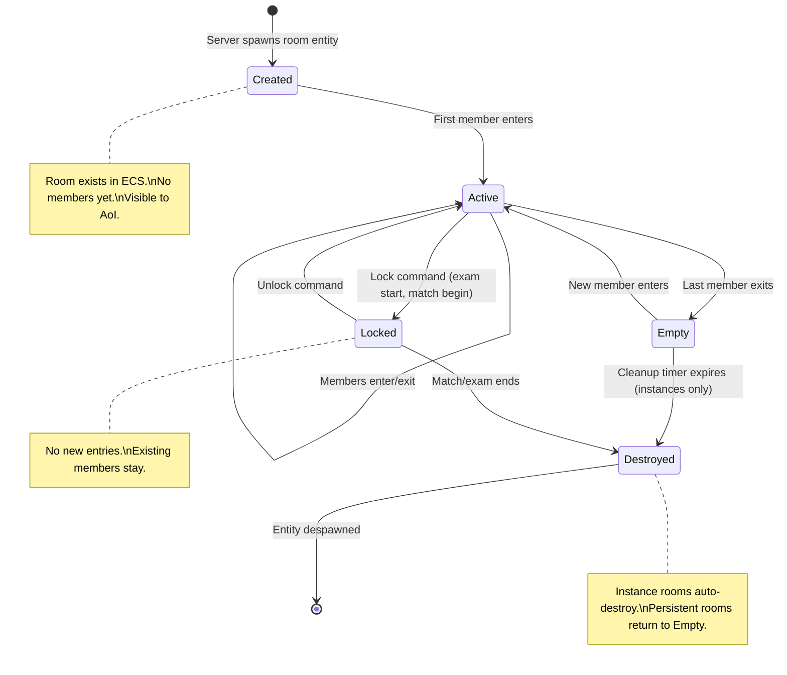
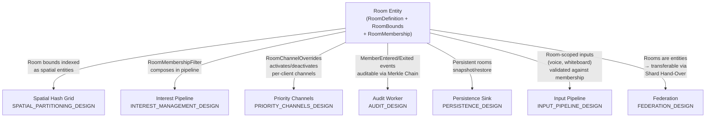
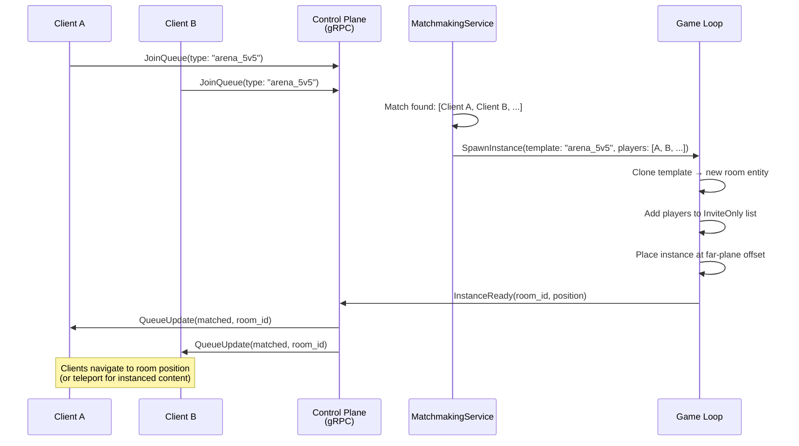

# Aetheris Engine — Room & Instance System Design Document

## Executive Summary

A **Room** is a bounded spatial region within the game world that carries additional semantics beyond simple AoI filtering: membership lists, access control, dedicated Priority Channel subscriptions, lifecycle events (created, locked, destroyed), and optional instancing.

This document defines the canonical Room abstraction used by both games and platforms:

- **Void Rush:** Sectors, safe zones, dungeon instances, arena lobbies.
- **Professional Corporate:** Meeting rooms, department floors, auditoriums.
- **Professional Education:** Classrooms, exam halls, libraries.
- **Professional Finance:** Trading floors, private deal rooms.

Rooms are **ECS entities** — they are not a separate system or data structure. A Room is simply an entity with `RoomDefinition` + `Position` + `RoomBounds` components. This means rooms benefit from the same replication, persistence, audit, and spatial indexing infrastructure as all other entities. No special-case code exists outside of the Room system's ECS systems.

### Key Design Principle

> **Rooms are entities. Room membership is a component. Room rules are systems.**
>
> The engine provides the membership lifecycle and interest integration. The application provides the rules (who can enter, what happens inside, when it closes).

## Table of Contents

1. [Executive Summary](#1-executive-summary)
2. [Motivation — Rooms as an Engine Primitive](#2-motivation--rooms-as-an-engine-primitive)
3. [Room Entity Model](#3-room-entity-model)
4. [Room Lifecycle](#4-room-lifecycle)
5. [Membership & Subscription](#5-membership--subscription)
6. [Instance Management](#6-instance-management)
7. [Integration with Other Subsystems](#7-integration-with-other-subsystems)
8. [Room Types & Templates](#8-room-types--templates)
9. [Performance Contracts](#9-performance-contracts)
10. [Open Questions](#10-open-questions)
11. [Appendix A — Glossary](#appendix-a--glossary)
12. [Appendix B — Decision Log](#appendix-b--decision-log)

---

## 1. Executive Summary

A **Room** is a bounded spatial region within the game world that carries additional semantics beyond simple AoI filtering: membership lists, access control, dedicated Priority Channel subscriptions, lifecycle events (created, locked, destroyed), and optional instancing.

This document defines the canonical Room abstraction used by both games and platforms:

- **Void Rush:** Sectors, safe zones, dungeon instances, arena lobbies.
- **Professional Corporate:** Meeting rooms, department floors, auditoriums.
- **Professional Education:** Classrooms, exam halls, libraries.
- **Professional Finance:** Trading floors, private deal rooms.

Rooms are **ECS entities** — they are not a separate system or data structure. A Room is simply an entity with `RoomDefinition` + `Position` + `RoomBounds` components. This means rooms benefit from the same replication, persistence, audit, and spatial indexing infrastructure as all other entities. No special-case code exists outside of the Room system's ECS systems.

### Key Design Principle

> **Rooms are entities. Room membership is a component. Room rules are systems.**
>
> The engine provides the membership lifecycle and interest integration. The application provides the rules (who can enter, what happens inside, when it closes).

---

## 2. Motivation — Rooms as an Engine Primitive

### 2.1 Problems Solved

| Problem | Without Rooms | With Rooms |
|---|---|---|
| **Meeting privacy** | All entities in AoI are visible — anyone walking past sees meeting participants | Room membership filter: only members receive room-interior deltas |
| **Dungeon instances** | All players share one world — instancing requires ad-hoc server logic | Rooms spawn as instances with isolated entity sets |
| **Voice scoping** | Voice broadcasts to entire AoI — everyone hears everyone | Voice channel bound to room — only room members hear each other |
| **Channel subscriptions** | Static channel config for all clients | Room entry can activate/deactivate channels per client (e.g., trading floor activates market-data P0) |
| **Access control** | No server-side gating on entity proximity | Room entry gated by permissions (RBAC, invite, password) |

### 2.2 Why Not a Separate System?

Alternative: a dedicated Room Manager outside the ECS.

| Approach | Pros | Cons |
|---|---|---|
| **Rooms as entities** (selected) | Reuse replication, persistence, audit. No new infrastructure. Composition via ECS components. | Room logic is expressed as ECS systems (less familiar to web devs). |
| Separate Room Manager | Familiar OOP patterns. Direct API. | Parallel data model. Must sync with ECS. Cannot benefit from spatial grid. Cannot be audited via Merkle Chain. |

The ECS approach wins because it adds zero new infrastructure and composes naturally with every existing subsystem.

---

## 3. Room Entity Model

### 3.1 Core Components

A Room entity is composed of standard engine components plus room-specific ones:

```rust
/// Defines a spatial region as a Room.
/// Registered as ComponentKind in the engine namespace (0x0080–0x00FF).
#[derive(Component, Replicate, Debug, Clone)]
pub struct RoomDefinition {
    /// Human-readable name ("Board Room", "Sector Alpha", "Classroom 101").
    pub name: String,
    /// Maximum concurrent members. 0 = unlimited.
    pub capacity: u32,
    /// Access control policy.
    pub access: RoomAccessPolicy,
    /// Whether the room is an instance template (see §6).
    pub is_template: bool,
    /// Optional tenant ID for multi-tenant isolation.
    pub tenant_id: Option<TenantId>,
}

/// Spatial bounds of the room in world coordinates.
#[derive(Component, Replicate, Debug, Clone)]
pub struct RoomBounds {
    /// Axis-Aligned Bounding Box defined by min and max corners.
    pub min: Vec3,
    pub max: Vec3,
    /// Toroidal wrapping: if true, entities crossing bounds wrap around.
    /// (Currently implicitly true in the Playground simulation).
    pub wrap_enabled: bool,
}

/// Current membership list. Updated by the Room system.
#[derive(Component, Replicate, Debug, Clone)]
pub struct RoomMembership {
    /// Clients currently inside the room.
    pub members: SmallVec<[ClientId; 32]>,
    /// The server tick when the room was last entered/exited.
    pub last_change_tick: u64,
}

/// Optional: per-room Priority Channel overrides.
/// When a client enters a room, these channels are activated/modified.
#[derive(Component, Debug, Clone)]
pub struct RoomChannelOverrides {
    /// Channels to activate for members (e.g., voice, market-data).
    pub activate: SmallVec<[ChannelActivation; 4]>,
    /// Channels to deactivate for members (e.g., global chat in exam hall).
    pub deactivate: SmallVec<[&'static str; 4]>,
}

/// Access control policy for the room.
#[derive(Debug, Clone, Serialize, Deserialize)]
pub enum RoomAccessPolicy {
    /// Anyone can enter.
    Open,
    /// Only clients with the specified permission can enter.
    Permission(String),
    /// Only explicitly invited clients can enter.
    InviteOnly { invited: SmallVec<[ClientId; 16]> },
    /// Password-protected (hashed, server-side comparison).
    Password { hash: [u8; 32] },
    /// Locked — no one can enter (e.g., exam in progress).
    Locked,
}
```

### 3.2 Component Composition Example

A Void Rush arena room:

```rust
// Server: spawn an arena room entity
let arena_id = world.spawn_networked(vec![
    Box::new(Position(Vec3::new(5000.0, 0.0, 5000.0))),
    Box::new(RoomDefinition {
        name: "Arena Alpha".into(),
        capacity: 20,
        access: RoomAccessPolicy::Open,
        is_template: false,
        tenant_id: None,
    }),
    Box::new(RoomBounds {
        min: Vec3::new(4500.0, -100.0, 4500.0),
        max: Vec3::new(5500.0, 100.0, 5500.0),
    }),
    Box::new(RoomMembership {
        members: SmallVec::new(),
        last_change_tick: 0,
    }),
]);
```

An enterprise meeting room:

```rust
let meeting_id = world.spawn_networked(vec![
    Box::new(Position(Vec3::new(150.0, 0.0, 300.0))),
    Box::new(RoomDefinition {
        name: "Board Room 3A".into(),
        capacity: 12,
        access: RoomAccessPolicy::Permission("meeting:join".into()),
        is_template: false,
        tenant_id: Some(TenantId(42)),
    }),
    Box::new(RoomBounds {
        min: Vec3::new(140.0, 0.0, 290.0),
        max: Vec3::new(160.0, 3.0, 310.0),
    }),
    Box::new(RoomMembership::default()),
    Box::new(RoomChannelOverrides {
        activate: smallvec![
            ChannelActivation { name: "voice", priority: 1 },
        ],
        deactivate: smallvec!["cosmetics"],
    }),
]);
```

---

## 4. Room Lifecycle

### 4.1 State Machine



### 4.2 Lifecycle Events

The Room system emits events via `postMessage` to the Main Thread (client) and via the Event Ledger (server) for observability:

| Event | Trigger | Data | Audit? |
|---|---|---|---|
| `RoomCreated` | Room entity spawned | `{room_id, name, capacity}` | Yes (persistent rooms) |
| `MemberEntered` | Avatar enters room bounds + access check passes | `{room_id, client_id, tick}` | Yes |
| `MemberExited` | Avatar exits room bounds or disconnects | `{room_id, client_id, tick, reason}` | Yes |
| `RoomLocked` | Application calls `lock_room()` | `{room_id, tick}` | Yes |
| `RoomUnlocked` | Application calls `unlock_room()` | `{room_id, tick}` | Yes |
| `RoomDestroyed` | Instance cleanup or explicit despawn | `{room_id, tick}` | Yes (instances) |

---

## 5. Membership & Subscription

### 5.1 Entry Detection System

The Room system runs as an ECS system in Stage 3 (Simulate). It detects avatar-room boundary crossings and manages the membership component:

```rust
/// Room membership system.
/// Runs in Stage 3 (Simulate) after physics/movement.
/// Budget: ~0.1ms for 100 rooms × 500 avatars.
#[instrument(skip_all)]
fn room_membership_system(
    world: &mut dyn WorldState,
    spatial: &dyn SpatialIndex,
) {
    // For each avatar entity with a Position:
    for (avatar_nid, avatar_pos, client_id) in world.query::<(NetworkId, Position, ClientId)>() {
        // For each room entity with RoomBounds:
        for (room_nid, room_def, room_bounds, room_membership) in
            world.query::<(NetworkId, RoomDefinition, RoomBounds, &mut RoomMembership)>()
        {
            let inside = aabb_contains(room_bounds, avatar_pos);
            let was_member = room_membership.members.contains(&client_id);

            match (inside, was_member) {
                (true, false) => {
                    // Entering: check access policy
                    if check_access(&room_def, client_id, world) {
                        if room_def.capacity == 0 || room_membership.members.len() < room_def.capacity as usize {
                            room_membership.members.push(client_id);
                            room_membership.last_change_tick = world.current_tick();
                            emit_event(RoomEvent::MemberEntered { room_nid, client_id });
                            // Update client's interest filters (see §5.2)
                            update_client_room_subscriptions(client_id, room_nid, true, world);
                        }
                    }
                }
                (false, true) => {
                    // Exiting
                    room_membership.members.retain(|&c| c != client_id);
                    room_membership.last_change_tick = world.current_tick();
                    emit_event(RoomEvent::MemberExited { room_nid, client_id });
                    update_client_room_subscriptions(client_id, room_nid, false, world);
                }
                _ => {} // No change
            }
        }
    }
}
```

### 5.2 Interest Filter Integration

Room membership directly affects the Interest Management pipeline (see [INTEREST_MANAGEMENT_DESIGN.md](INTEREST_MANAGEMENT_DESIGN.md)):

1. **On room entry:** The client's `ClientState.room_memberships` set gains the room's `NetworkId`.
2. The `RoomMembershipFilter` adds all entities within the room to the client's interest set — **regardless of spatial AoI distance**.
3. **On room exit:** The room's `NetworkId` is removed from `room_memberships`. Entities inside the room fall back to normal AoI rules.

This means a client can see inside a meeting room across the city if they're a member (e.g., remote participant). Conversely, a client standing outside a locked room sees nothing inside, even within AoI range.

### 5.3 Channel Activation on Entry

If the room has `RoomChannelOverrides`, the client's active channel set changes:

```rust
fn update_client_room_subscriptions(
    client_id: ClientId,
    room_nid: NetworkId,
    entering: bool,
    world: &dyn WorldState,
) {
    if let Some(overrides) = world.get_component::<RoomChannelOverrides>(room_nid) {
        let client_state = world.get_client_state_mut(client_id);

        if entering {
            for activation in &overrides.activate {
                client_state.active_channels.insert(activation.name.to_string());
            }
            for deactivation in &overrides.deactivate {
                client_state.active_channels.remove(*deactivation);
            }
        } else {
            // Reverse: deactivate what was activated, reactivate what was deactivated
            for activation in &overrides.activate {
                client_state.active_channels.remove(&activation.name.to_string());
            }
            for deactivation in &overrides.deactivate {
                client_state.active_channels.insert(deactivation.to_string());
            }
        }
    }
}
```

**Example:** Client enters "Trading Floor" room → `market-data` (P0) channel activated. Client leaves → `market-data` deactivated (they no longer receive 60Hz ticker updates while walking the street).

---

## 6. Instance Management

### 6.1 Instances vs. Persistent Rooms

| Property | Persistent Room | Instance |
|---|---|---|
| **Lifetime** | Exists in ECS from server start to shutdown | Created on demand, destroyed when empty (after grace period) |
| **Template** | No | Created by cloning a template room entity |
| **Example (game)** | Safe Zone, Trading Post | Dungeon run, Arena match |
| **Example (Professional)** | Board Room 3A, Classroom 101 | Ad-hoc meeting, Breakout room |
| **Persistence** | Stored in snapshot (PostgreSQL) | Not persisted — ephemeral |

### 6.2 Instance Spawning

Instances are spawned from **template rooms** — room entities with `is_template = true` that define the layout but are never directly entered:

```rust
/// Spawn an instance from a template.
/// Returns the NetworkId of the new instance room entity.
pub fn spawn_instance(
    world: &mut dyn WorldState,
    template_id: NetworkId,
    requesting_client: ClientId,
) -> Result<NetworkId, WorldError> {
    // 1. Clone the template's components
    let template_components = world.snapshot_entity(template_id);

    // 2. Override instance-specific fields
    let mut instance_def = template_components.get::<RoomDefinition>().clone();
    instance_def.is_template = false;
    instance_def.name = format!("{} (Instance #{})", instance_def.name, world.next_instance_seq());

    // 3. Assign a unique spatial offset (instances don't physically overlap)
    let instance_pos = allocate_instance_position(world);

    // 4. Spawn the instance entity
    let instance_id = world.spawn_networked(/* ... */);

    // 5. Start cleanup timer
    world.attach_timer(instance_id, InstanceCleanupTimer {
        empty_grace_ticks: 60 * 30, // 30 seconds at 60Hz
    });

    Ok(instance_id)
}
```

### 6.3 Instance Spatial Placement

Instances need world-space positions (for the spatial grid) even though they represent logically isolated spaces. Two strategies:

| Strategy | Description | Pros | Cons |
|---|---|---|---|
| **Far-plane offset** (P1) | Place instances at positions far from the main world (y=10000+) | Simple. AoI naturally excludes non-members. | Coordinate space pollution. |
| **Namespace prefix** (P3) | Prefix cell coordinates with instance ID. Spatial grid becomes instance-aware. | Clean isolation. No coordinate waste. | Requires `SpatialIndex` modification. |

P1 uses far-plane offset for simplicity. P3 transitions to namespace-prefixed cells if instance count exceeds ~100.

### 6.4 Instance Cleanup

```rust
/// System: auto-destroy empty instances after grace period.
fn instance_cleanup_system(world: &mut dyn WorldState) {
    for (room_nid, membership, timer) in
        world.query::<(NetworkId, &RoomMembership, &mut InstanceCleanupTimer)>()
    {
        if membership.members.is_empty() {
            timer.empty_ticks += 1;
            if timer.empty_ticks >= timer.empty_grace_ticks {
                // Despawn the room and all entities inside it
                despawn_room_and_contents(world, room_nid);
            }
        } else {
            timer.empty_ticks = 0; // Reset on any occupancy
        }
    }
}
```

---

## 7. Integration with Other Subsystems

### 7.1 Integration Map



### 7.2 Spatial Grid

Room entities are indexed in the spatial grid like any other entity with a `Position`. The `RoomBounds` component defines the AABB for membership detection. The room itself is visible to nearby clients (they can see the building), but its interior entities are only visible to members.

### 7.3 Audit

Room membership changes are audited via the Event Ledger:

- **Corporate compliance:** "Who was in the board room during the M&A discussion?"
- **Game fairness:** "Which players participated in the arena match?"
- **Education:** "Which students were present in the exam hall?"

For rooms with Merkle Chain-audited entities (e.g., Wallets, BetContracts), the chain covers all mutations that occurred while the entity was inside the room.

### 7.4 Federation

In a federated deployment, rooms are entities on a specific shard. If a room spans a shard boundary (unlikely but possible for large zones), the Shard Hand-Over Protocol handles entity transfer as the avatar crosses the boundary. The room itself stays on its home shard; only the avatar migrates.

Cross-shard room membership (remote participant in a room on another shard) is **not supported in P4**. The participant must transfer to the room's shard. This is a simplifying constraint — revisit if persistent cross-shard rooms become a requirement.

---

## 8. Room Types & Templates

### 8.1 Engine-Provided Room Types

The engine provides a minimal set of room behaviors. Applications compose these with custom components:

| Room Type | Behavior | Game Example | Professional Example |
|---|---|---|---|
| **Open** | Anyone can enter/exit freely | Safe Zone, Market | Lobby, Cafeteria |
| **Gated** | Entry requires permission check | Guild Hall | Board Room, Trading Floor |
| **Instanced** | Spawned on demand from template | Dungeon, Arena | Breakout Room, Exam Hall |
| **Locked** | No entry during lock period | Match in progress | Exam in progress |

### 8.2 Template Registry

Applications register room templates at server startup:

```rust
// Void Rush — register room templates
server.register_room_template("arena_5v5", RoomTemplate {
    definition: RoomDefinition {
        name: "Arena (5v5)".into(),
        capacity: 10,
        access: RoomAccessPolicy::InviteOnly { invited: SmallVec::new() },
        is_template: true,
        tenant_id: None,
    },
    bounds_size: Vec3::new(1000.0, 200.0, 1000.0),
    channel_overrides: Some(RoomChannelOverrides {
        activate: smallvec![
            ChannelActivation { name: "combat", priority: 1 },
        ],
        deactivate: smallvec!["environment"],
    }),
    cleanup_grace_ticks: 60 * 60, // 1 minute
});

// Professional Corporate — register room templates
server.register_room_template("breakout_room", RoomTemplate {
    definition: RoomDefinition {
        name: "Breakout Room".into(),
        capacity: 6,
        access: RoomAccessPolicy::InviteOnly { invited: SmallVec::new() },
        is_template: true,
        tenant_id: None, // Set per-instance at spawn time
    },
    bounds_size: Vec3::new(10.0, 3.0, 10.0),
    channel_overrides: Some(RoomChannelOverrides {
        activate: smallvec![
            ChannelActivation { name: "voice", priority: 1 },
            ChannelActivation { name: "collaboration", priority: 1 },
        ],
        deactivate: smallvec![],
    }),
    cleanup_grace_ticks: 60 * 120, // 2 minutes
});
```

### 8.3 Matchmaking → Instance Spawning

The Control Plane matchmaking service triggers instance creation:



---

## 9. Performance Contracts

### 9.1 Metrics

| Metric | Source | Threshold | Action |
|---|---|---|---|
| `aetheris_rooms_total` | Count of `RoomDefinition` components | Information only | Monitor growth |
| `aetheris_rooms_active` | Rooms with ≥1 member | Information only | |
| `aetheris_room_membership_system_seconds` | Span around membership system | > 0.5ms | Reduce room count; optimize AABB checks |
| `aetheris_room_entries_per_tick` | Count of `MemberEntered` events | > 50 per tick | Unusual — investigate teleport abuse or mass migration |
| `aetheris_instances_active` | Non-template rooms with `is_template = false` and spawned dynamically | > 100 | Approaching far-plane offset limits; consider namespace prefix |

### 9.2 Budget

| Operation | Cost | At Scale |
|---|---|---|
| Membership detection (AABB test) | O(A × R) where A = avatars, R = rooms | 500 × 100 = 50K tests ≈ 0.1ms |
| Interest filter (room membership) | O(M) per client where M = room member count | Avg 20 members → 0.01ms per client |
| Channel activation | O(1) per entry/exit | Negligible |
| Instance spawn | O(C) where C = template components | One-time, ~0.01ms |

---

## 10. Open Questions

| # | Question | Context | Status |
|---|---|---|---|
| Q1 | **Nested rooms** | Should rooms support containment (a room inside a room)? Needed for buildings with multiple floors/rooms. | Open — P3. For now, rooms are flat (no hierarchy). |
| Q2 | **Room persistence strategy** | Should instance rooms persist across server restarts? Currently ephemeral. | Deferred to P2. Persistent rooms use snapshot/restore. |
| Q3 | **Cross-shard rooms** | Can a meeting room span two Federation shards (participants on different clusters)? | Not in P4. Participant must migrate to room's shard. Revisit if cross-shard collaboration demand is high. |
| Q4 | **Room-scoped physics** | Should each room have its own physics simulation? (e.g., zero-gravity arena) | Open — P3. Currently physics is global. Room-scoped physics params could be a component. |
| Q5 | **Maximum room count** | At what point does the room membership system (O(A×R)) become a bottleneck? | ~10K rooms × 2500 avatars = 25M AABB tests ≈ too slow. Need spatial pre-filter (rooms indexed by grid cell). |

---

## Appendix A — Glossary

| Term | Definition |
|---|---|
| **Room** | An ECS entity with `RoomDefinition` + `RoomBounds` + `RoomMembership` components, defining a spatial region with membership semantics. |
| **Instance** | An ephemeral room spawned from a template, automatically destroyed when empty. |
| **Template** | A room entity with `is_template = true` that serves as a blueprint for instance spawning. |
| **Room Membership** | The set of `ClientId`s currently inside a room's bounds and authorized to be there. |
| **Room Channel Override** | Per-room configuration that activates or deactivates Priority Channels for members. |
| **AABB** | Axis-Aligned Bounding Box — the spatial bounds of a room, defined by min/max corners. |
| **Far-Plane Offset** | P1 strategy for instance placement: instances are positioned far from the main world to ensure AoI isolation. |
| **Namespace Prefix** | P3 strategy for instance isolation: spatial grid cells are prefixed with instance ID for clean separation. |

---

## Appendix B — Decision Log

| # | Decision | Rationale | Revisit If... | Date |
|---|---|---|---|---|
| R1 | Rooms are ECS entities, not a separate data structure | Reuses replication, persistence, audit, spatial indexing. Zero new infrastructure. | Room semantics become complex enough to warrant a dedicated manager (e.g., hierarchical rooms, room graphs). | 2026-04-16 |
| R2 | AABB bounds (not arbitrary polygons) | AABB overlap check is 6 comparisons — trivially fast. Polygon containment adds complexity with minimal practical benefit for rectangular rooms. | Irregularly shaped rooms needed (e.g., L-shaped corridors). Add polygon support in P3 stdlib. | 2026-04-16 |
| R3 | Far-plane offset for instance isolation (P1) | Simple. No spatial grid changes. Works for <100 instances. | >100 concurrent instances → coordinate space pollution. Switch to namespace prefix. | 2026-04-16 |
| R4 | Room membership detection in Stage 3 (Simulate) | Membership depends on avatar position, which is updated in Stage 2 (Apply). Running in Stage 3 ensures positions are current. | Membership detection cost exceeds 0.5ms. Move to async or reduce detection frequency (every 5th tick). | 2026-04-16 |
| R5 | No nested rooms in P1–P3 | Flat room hierarchy is sufficient for all current use cases (sectors, meeting rooms, classrooms). Nesting adds parent-child membership propagation complexity. | Buildings with multiple rooms on different floors require hierarchical containment. | 2026-04-16 |
| R6 | Cross-shard rooms not supported in P4 | Requires distributed room membership (consistency challenge). Simpler to require avatar migration to room's shard. | Remote meeting demand high (participants refuse to shard-transfer). Add distributed membership via Global Coordinator. | 2026-04-16 |
