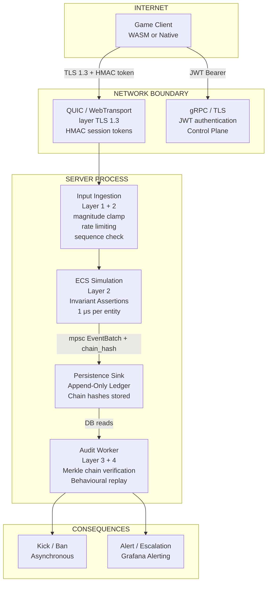
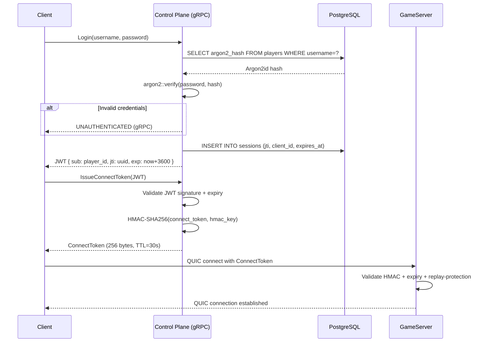
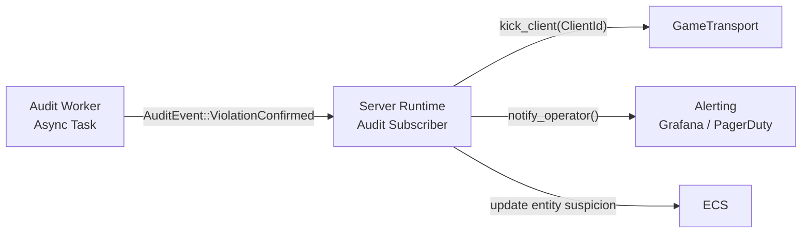

# Aetheris Engine — Security Architecture & Design Document

## Table of Contents

1. [Executive Summary](#executive-summary)
2. [Threat Model](#2-threat-model)
3. [Architecture Overview — Defence in Depth](#3-architecture-overview--defence-in-depth)
4. [Layer 1 — Transport Security](#4-layer-1--transport-security)
5. [Layer 2 — Real-Time Simulation Invariants](#5-layer-2--real-time-simulation-invariants)
6. [Layer 3 — Cryptographic Integrity (Merkle Chain)](#6-layer-3--cryptographic-integrity-merkle-chain)
7. [Identity & Authentication](#7-identity--authentication)
8. [SuspicionScore System](#8-suspicionscore-system)
9. [The Audit Feedback Loop](#9-the-audit-feedback-loop)
10. [Input Sanitisation & Validation](#10-input-sanitisation--validation)
11. [Secrets Management](#11-secrets-management)
12. [Performance Contracts](#12-performance-contracts)
13. [Open Questions](#13-open-questions)
14. [Appendix A — Glossary](#appendix-a--glossary)
15. [Appendix B — Decision Log](#appendix-b--decision-log)

---

## Executive Summary

Aetheris implements security as a **four-layer, passive-observation architecture**. There are no hard gates inside the tick loop — all security actions that involve IO, cryptography, or coordination happen outside the 16.6 ms simulation budget.

The **Zero-Trust Simulation Principle** governs all design decisions:

> **No client is trusted. The server state machine is the only source of truth. Every client input is a request; no request is automatically granted.**

The four layers are:

1. **Transport Security** — TLS 1.3 on QUIC/WebTransport, JWT auth, HMAC session tokens.
2. **Simulation Invariants** — Cheap, synchronous bound-checks inside the tick budget (velocity clamps, action rate limits, delta ranges).
3. **Merkle Chain** — Cryptographic integrity chain maintained asynchronously by the Audit Worker for Elevated/Critical entities.
4. **Behavioural Replay** — The Audit Worker replays a verified snapshot + event log offline to detect semantic anomalies (impossible movement, duplication, etc.).

None of these layers is a hard real-time gate. They are **detection and evidence-collection** mechanisms. The consequence of a detected violation is asynchronous (kick, ban, escalation) — the tick loop is never blocked waiting for a security verdict.

---

## 2. Threat Model

### 2.1 Attacker Taxonomy

| Actor | Capabilities | Goals |
|---|---|---|
| **Speed Hacker** | Modified client binary, injects large delta values | Move faster than physics allows |
| **Injection Attacker** | Sends malformed or oversized packets | Crash the server / DoS simulation |
| **Replay Attacker** | Re-sends captured valid packets | Re-trigger actions out of sequence |
| **Privilege Escalator** | Crafts packets with other players' NetworkIds | Mutate another player's entity |
| **Economy Exploiter** | Finds duplication/race condition in server logic | Generate infinite in-game resources |
| **Insider Threat** | DB admin, server operator | Delete audit trail, forge events |

### 2.2 Threats Explicitly Out of Scope

| Threat | Reason Out of Scope |
|---|---|
| Client-side cheating (aim-assist, wallhack) | Client owns its GPU; server-side consequences only addressable via game design |
| Distributed Denial of Service at network layer | Handled by CDN/DDoS mitigation upstream (Cloudflare, AWS Shield) |
| Physical server compromise | Infrastructure responsibility, not engine responsibility |

---

## 3. Architecture Overview — Defence in Depth



---

## 4. Layer 1 — Transport Security

### 4.1 TLS 1.3 on QUIC

All data plane connections use QUIC (RFC 9000) with mandatory TLS 1.3. TLS 1.2 and below are rejected at the QUIC handshake layer. The minimum cipher suites are:

```
TLS_AES_256_GCM_SHA384
TLS_CHACHA20_POLY1305_SHA256
```

```rust
// rustls ServerConfig: reject anything below TLS 1.3
let config = ServerConfig::builder()
    .with_safe_defaults()       // TLS 1.3 only
    .with_no_client_auth()
    .with_single_cert(certs, key)?;
```

**Certificate management:**

- **Development:** Self-signed certificate, generated at startup, stored in `target/dev-certs/`.
- **Production:** Certificates obtained via ACME (Let's Encrypt or ZeroSSL), auto-renewed 30 days before expiry.

### 4.2 Session Token — HMAC-SHA256 Connect Token

After a successful JWT authentication with the Control Plane, the client receives a short-lived QUIC connect token. This token is presented on the UDP data-plane connection and does not require a TLS client certificate:

```
Token format (256 bytes, binary):
┌─────────────────────────────────────────────────────────────────┐
│ Version      (1 byte)   = 0x01                                  │
│ ClientId     (8 bytes)  = u64, randomly assigned at auth        │
│ ServerAddr   (18 bytes) = IPv6 address + port                   │
│ ExpireAt     (8 bytes)  = Unix timestamp, TTL = 30 seconds      │
│ ServerNonce  (24 bytes) = random, unique per token              │
│ HMAC-SHA256  (32 bytes) = HMAC over all preceding fields        │
│ Padding      (165 bytes)= zero-filled to 256 bytes              │
└─────────────────────────────────────────────────────────────────┘
```

Token validation on the server:

```rust
fn validate_connect_token(token: &[u8; 256], hmac_key: &[u8; 32]) -> Result<ClientId> {
    // 1. Check version byte
    if token[0] != 0x01 {
        return Err(SecurityError::InvalidTokenVersion);
    }
    // 2. Verify HMAC before reading any other fields (constant-time)
    let mac = Hmac::<Sha256>::new_from_slice(hmac_key)?;
    let expected = mac.chain_update(&token[..224]).finalize();
    if !constant_time_eq(&expected.into_bytes(), &token[224..256]) {
        return Err(SecurityError::InvalidTokenMac);
    }
    // 3. Check expiry
    let expire_at = u64::from_le_bytes(token[27..35].try_into()?);
    if unix_now() > expire_at {
        return Err(SecurityError::TokenExpired);
    }
    // 4. Extract ClientId
    let client_id = u64::from_le_bytes(token[1..9].try_into()?);
    Ok(ClientId(client_id))
}
```

The HMAC key is rotated every 24 hours; a 60-second grace window accepts old-key signatures to allow token delivery lag.

### 4.3 Anti-Replay Protection

Connect tokens are single-use. The server stores a seen-token set (100K entries, rolling 60-second window, using a Bloom filter backed by a ring buffer). A replayed token is rejected at the transport layer before any game state is touched.

```
RenetServer (P1): built-in netcode.io replay protection — 256-entry sliding window
           (P3): custom Bloom filter + ring buffer — 100K entries, 30-second window
```

### 4.4 Denial of Service (DoS) Protection

The transport layer implements per-IP rate limiting to protect against amplification and flooding. See [TRANSPORT_DESIGN.md §4.3](https://github.com/garnizeh-labs/aetheris-protocol/blob/main/docs/TRANSPORT_DESIGN.md#43-renettransport-internals) for implementation details using the token-bucket `RateLimiter`.

---

## 5. Layer 2 — Real-Time Simulation Invariants

Layer 2 operates **inside** the tick budget. It must be O(1) per entity and take < 1 μs per entity, as all invariant checks happen in Stage 2 (apply) of the 5-stage tick pipeline.

### 5.1 Invariant Categories

```rust
pub trait SimulationInvariant: Send + Sync {
    /// Called once per entity per tick during Stage 2 (apply).
    /// Must complete in < 1 μs. Must NOT allocate.
    /// Returns Violation if the invariant is broken.
    fn check(&self, entity: &EntityState, update: &ComponentUpdate) -> Option<Violation>;
}
```

**Velocity Clamp Invariant:**

```rust
pub struct VelocityClamp {
    pub max_speed_units_per_tick: f32,  // e.g., 0.5 for a 30 unit/s max at 60 Hz
}

impl SimulationInvariant for VelocityClamp {
    fn check(&self, entity: &EntityState, update: &ComponentUpdate) -> Option<Violation> {
        // ComponentKind is a u16 newtype — compare by constant, then decode payload.
        if update.component_kind != ComponentKind::POSITION {
            return None;
        }
        let new_pos: Vec3 = decode_component(&update.payload).ok()?;
        let old_pos = entity.position();
        let delta = (new_pos - old_pos).length();
        if delta > self.max_speed_units_per_tick {
            Some(Violation {
                network_id: entity.network_id,
                kind: ViolationKind::VelocityExceeded { delta, limit: self.max_speed_units_per_tick },
                tick: entity.tick,
            })
        } else {
            None
        }
    }
}
```

**Action Rate Limiter:**

```rust
pub struct ActionRateLimit {
    pub max_actions_per_second: u32,  // e.g., 5 for ability activations
}
// Tracks per-entity action counts using a compact sliding window (token bucket).
// Implementation uses no allocations: the window is stored in a fixed-size entity 
// component (ActionRateState) with a tick counter and u8 bucket.
```

**Delta Range Validator:**

```rust
// Rejects component updates that fall outside the valid encoding range.
// These cannot be produced by an unmodified client; they indicate injection.
fn validate_delta_range(update: &ComponentUpdate) -> Option<Violation> {
    match update.component {
        ComponentKind::Health(v) if v < 0.0 || v > 10_000.0 => Some(Violation {
            kind: ViolationKind::OutOfRangeValue { component: "Health", value: v as f64 },
            ..
        }),
        _ => None
    }
}
```

### 5.2 Invariant Violation Handling

When an invariant fires, the violation is:

1. **Logged** via `tracing::warn!` with the entity's `NetworkId`, violating component, and tick.
2. **Counted** via `aetheris_security_violations_total{kind}` Prometheus counter.
3. **Forwarded** asynchronously to the Audit Worker via its own mpsc channel — never processed inline.
4. **Not acted upon immediately.** The simulation continues; the entity update is applied using the **clamped** (corrected) value, not the attacker's value.

**Clamp-and-continue** is the P1 strategy for invariant violations. The attacker does not benefit from the violation (their speed is clamped) but is not banned immediately. The Audit Worker accumulates violation events and raises the entity's SuspicionScore, which eventually triggers a kick or ban.

> [!NOTE]
> **Boundary Wrapping (Toroidal World)**: Velocity invariants and position clamps must account for room-level toroidal wrapping. A jump from one extreme of the `RoomBounds` to the other (e.g., -250.0 to 250.0) is a valid simulation rule and MUST NOT be flagged as a `VelocityExceeded` violation if the delta corresponds to a wrap-around event.

---

## 6. Layer 3 — Cryptographic Integrity (Merkle Chain)

The Merkle Chain is maintained asynchronously by the Audit Worker for all Elevated and Critical entities. It provides **tamper-evidence** for the event ledger.

### 6.1 Chain Design

Each entity under Merkle tracking has a per-entity hash chain stored in `entity_events.chain_hash`:

See [PROTOCOL_DESIGN.md](https://github.com/garnizeh-labs/aetheris-protocol/blob/main/docs/PROTOCOL_DESIGN.md#merklehash-formula) for the canonical `MerkleHash` formula.

Where:

- `H_0 = SHA-256( network_id || "GENESIS" )` — deterministic genesis hash, never stored.
- `||` denotes concatenation.
- `H_n` is the `chain_hash` written to `entity_events` for the n-th event.

This is not a full Merkle tree — it is a **hash chain** (linked list of hashes). A full Merkle tree would require knowing all events in a tick before computing any hash; a hash chain can be computed incrementally as events arrive.

### 6.2 Chain Computation (Audit Worker)

```rust
/// Verifies the chain for one entity from last_verified_hash to the tip.
async fn verify_chain(
    pool: &sqlx::PgPool,
    network_id: u64,
    from_tick: u64,
    start_hash: Option<[u8; 32]>,
) -> ChainVerificationResult {
    let events = sqlx::query!(
        "SELECT tick, component_kind, payload, chain_hash, sequence
         FROM entity_events
         WHERE network_id = $1 AND tick >= $2
         ORDER BY tick ASC, sequence ASC",
        network_id as i64, from_tick as i64,
    )
    .fetch_all(pool).await.unwrap();

    let mut prev_hash: [u8; 32] = start_hash.unwrap_or_else(|| genesis_hash(network_id));
    for (i, event) in events.iter().enumerate() {
        let expected = compute_hash(prev_hash, network_id, event.tick as u64,
                                    event.component_kind as u16, &event.payload);
        let stored: [u8; 32] = event.chain_hash.as_ref()
            .and_then(|h| h.try_into().ok())
            .unwrap_or([0u8; 32]);
        if expected != stored {
            return ChainVerificationResult::Breach {
                at_tick: event.tick as u64,
                expected,
                stored,
            };
        }
        prev_hash = expected;
    }
    ChainVerificationResult::Valid { tip_hash: prev_hash }
}
```

### 6.3 Chain Breach Consequences

A `ChainBreach` signals:

1. **Event deletion:** A DB admin (or attacker with DB access) deleted a row. The chain skips.
2. **Event modification:** A stored event was modified after the fact.
3. **Legitimate gap:** A Baseline-tier event was legitimately dropped under backpressure. The Persistence Sink records an explicit `PersistenceGap` marker event for this case.

The Audit Worker distinguishes case 3 from cases 1–2 by checking for a `PersistenceGap` event at the gap tick. A chain breach without a gap marker triggers:

- `aetheris_audit_chain_breach_total` counter increment.
- Immediate security alert via Grafana alerting.
- The entity's SuspicionScore is forced to `Critical`.

---

## 7. Identity & Authentication

### 7.1 Authentication Flow



### 7.2 JWT Structure

```json
{
  "alg": "HS256",
  "typ": "JWT"
}
{
  "sub": "player_9942",
  "jti": "01HX...",       // UUID v7 — for revocation
  "iat": 1744000000,
  "exp": 1744003600,      // 1 hour TTL
  "roles": ["player"],
  "session_id": "sess_abc"
}
```

JWTs are signed with `HS256` using a 256-bit server secret. The secret is stored in an environment variable (`AETHERIS_JWT_SECRET`) and never in source code. In production it is loaded from a secrets manager (AWS Secrets Manager, Vault, or Kubernetes Secret).

### 7.3 JWT Revocation

Revocation uses a server-side deny-list in PostgreSQL:

```sql
CREATE TABLE revoked_tokens (
    jti         UUID        PRIMARY KEY,
    revoked_at  TIMESTAMPTZ NOT NULL DEFAULT NOW(),
    reason      TEXT
);
CREATE INDEX ON revoked_tokens (revoked_at);  -- For cleanup job

-- Auto-cleanup: delete expired tokens (beyond max TTL = 1 hour)
DELETE FROM revoked_tokens WHERE revoked_at < NOW() - INTERVAL '2 hours';
```

The Control Plane checks `revoked_tokens` on every JWT validation request. To minimise DB round-trips, the deny-list is cached in-process with a 30-second TTL (small cache, fast expiry — intentional trade-off between revocation speed and DB load).

### 7.4 Password Storage — Argon2id

```rust
use argon2::{Argon2, PasswordHash, PasswordHasher, PasswordVerifier};
use argon2::password_hash::{rand_core::OsRng, SaltString};

fn hash_password(password: &str) -> String {
    let salt = SaltString::generate(&mut OsRng);
    let argon2 = Argon2::default();  // Argon2id, memory=19456 KiB, iterations=2, parallelism=1
    argon2.hash_password(password.as_bytes(), &salt)
        .expect("Argon2id hashing should succeed")
        .to_string()
}

fn verify_password(password: &str, hash: &str) -> bool {
    let parsed_hash = PasswordHash::new(hash).expect("valid hash");
    Argon2::default()
        .verify_password(password.as_bytes(), &parsed_hash)
        .is_ok()
}
```

**Parameters:** Argon2id with memory=19456 KiB (19 MB), iterations=2, parallelism=1. This produces ~400ms hash verification time on a test server, which is well within acceptable bounds for authentication endpoints.

---

## 8. SuspicionScore System

Every entity that is connected to the server has a `SuspicionScore` (u32, capped at `u32::MAX`). The score is ephemeral (in-memory only, not persisted). It determines how the engine allocates security resources:

```rust
#[derive(Debug, Clone, Copy, PartialEq, Eq, PartialOrd, Ord)]
pub enum SuspicionLevel {
    Baseline,  // Score 0–99:    standard player, minimal security overhead
    Elevated,  // Score 100–499: increased monitoring, Merkle chain enabled
    Critical,  // Score 500+:    kick candidate, maximum audit, operator alerted
}

impl SuspicionLevel {
    pub fn from_score(score: u32) -> Self {
        match score {
            0..=99 => Self::Baseline,
            100..=499 => Self::Elevated,
            500.. => Self::Critical,
        }
    }
}
```

### 8.1 Score Modification Events

| Event | Score Delta |
|---|---|
| VelocityExceeded violation | +25 |
| ActionRateExceeded violation | +15 |
| OutOfRangeValue violation | +50 |
| Sequence gap detected (replay suspicion) | +30 |
| Merkle chain breach detected | +500 (force Critical) |
| Behavioural replay anomaly detected | +100 |
| Clean session (no violations for 300 ticks) | −5 per 300 ticks |
| Operator manual clearance | −∞ (reset to 0) |

### 8.2 SuspicionLevel Effects

| Level | Merkle Chain | Persistence Send | mpsc Budget | Kick Threshold |
|---|---|---|---|---|
| Baseline | Off | `try_send` (fire-and-forget) | 0ms | Never auto-kicked |
| Elevated | On (async) | `send_timeout(2ms)` | 2ms | SuspicionScore ≥ 800 |
| Critical | On (priority) | `send_timeout(10ms)` | 10ms | SuspicionScore ≥ 500 |

---

## 9. The Audit Feedback Loop

> **Status:** This module is not available yet.

The Audit Worker (detailed in AUDIT_DESIGN.md) communicates security verdicts back to the running server via an `AuditEvent` mpsc channel. The server processes these asynchronously:



```rust
pub enum AuditEvent {
    /// Audit Worker has confirmed a violation pattern beyond reasonable doubt.
    ViolationConfirmed {
        network_id: NetworkId,
        client_id: ClientId,
        violation: ConfirmedViolation,
        confidence: f32,    // 0.0–1.0
    },
    /// Merkle chain integrity breach — DB tampering suspected.
    ChainBreach {
        network_id: NetworkId,
        at_tick: u64,
    },
    /// An entity's suspicion score crossed a tier boundary.
    SuspicionTierChanged {
        network_id: NetworkId,
        old: SuspicionLevel,
        new: SuspicionLevel,
    },
}
```

The Audit Worker is intentionally **lagging** — it analyses events from the past, typically 5–30 seconds behind real-time. This is acceptable: catching cheaters within 30 seconds of first detection is fast enough for gameplay integrity.

---


> **Status:** This module is not available yet.

## 10. Input Sanitisation & Validation

### 10.1 Decoder Hardening

The `Encoder::decode` implementation is the first point of contact for untrusted bytes. It must be hardened against malformed input:

```rust
impl Encoder for SerdeEncoder {
    fn decode(&self, bytes: &[u8]) -> Result<ComponentUpdate, EncodeError> {
        // 1. Minimum/maximum size checks before any parsing
        if bytes.len() < MIN_PACKET_SIZE || bytes.len() > MAX_PACKET_SIZE {
            return Err(EncodeError::InvalidSize { got: bytes.len() });
        }
        // 2. Parse using rmp_serde — returns Err on malformed MessagePack
        // rmp_serde does NOT panic on malformed input; it returns Err variants.
        let update: ComponentUpdate = rmp_serde::from_slice(bytes)
            .map_err(|e| EncodeError::Deserialise(e.to_string()))?;
        // 3. Validate field ranges before returning the parsed struct
        validate_component_update(&update)?;
        Ok(update)
    }
}
```

**Invariants enforced at decode time:**

- `NetworkId` must be non-zero and within the allocated range for this session.
- `ComponentKind` discriminant must be a known variant (reject unknown future-protocol values from modified clients).
- String fields must be valid UTF-8 and within maximum length limits.
- Float fields must be finite (not `NaN`, not `Inf`).

### 10.2 Sequence Number & Tick Validation

Aetheris enforces twofold monotonicity in Stage 2 (Authorize) to prevent historical state injection:

1. **Protocol Sequence**: Built-in transport-level sequence validation rejects replayed UDP packets.
2. **Tick Monotonicity**: The `InputCommandReplicator` maintains a `last_client_tick` for each target entity via the `LatestInput` component. Any inbound `InputCommand` with a `client_tick <= latest.last_client_tick` for that specific entity is dropped. This prevents "look-back" attacks where an attacker captures a valid past input to re-run physics from an earlier state.

Each client message carries a monotonically increasing sequence number. The server maintains a per-client expected sequence and rejects out-of-order or replayed messages:

```rust
fn validate_sequence(client: &mut ClientState, seq: u64) -> Result<(), SecurityError> {
    if seq <= client.last_seen_seq {
        // Replay attack or clock reset
        metrics::counter!("aetheris_security_replay_rejected_total").increment(1);
        return Err(SecurityError::ReplayedSequence { got: seq, expected: client.last_seen_seq + 1 });
    }
    if seq > client.last_seen_seq + MAX_SEQUENCE_GAP {
        // Gap too large — possible injection attempt
        return Err(SecurityError::SequenceGapTooLarge { gap: seq - client.last_seen_seq });
    }
    client.last_seen_seq = seq;
    Ok(())
}
```

---

## 11. Secrets Management

| Secret | Storage | Rotation |
|---|---|---|
| `AETHERIS_JWT_SECRET` | Env var / Kubernetes Secret | 90 days, hot-reload via SIGHUP |
| `AETHERIS_HMAC_CONNECT_KEY` | Env var / Kubernetes Secret | 24 hours, overlap window 60s |
| `AETHERIS_DB_PASSWORD` | Env var / Kubernetes Secret | Manual + credential rotation job |
| TLS private key | Mounted volume / cert-manager | Auto-renewed 30 days before expiry |
| Argon2 hash (per-user) | PostgreSQL `players` table | On password change only |

**Rules:**

- No secret is ever written to a source code file, log line, or error message.
- All secrets are loaded from environment variables at startup; missing secrets cause an immediate panic with a descriptive message (fail-fast instead of partial initialisation).
- `tracing::Span` fields never include secret values; use masking helpers if session tokens appear in logs.

---

## 12. Performance Contracts

| Metric | Target | Layer |
|---|---|---|
| Invariant check latency per entity | ≤ 1 μs | Layer 2 |
| Connect token HMAC validation | ≤ 500 ns | Layer 1 |
| JWT RS256 / HS256 validation (cached) | ≤ 10 μs | Control Plane |
| Argon2id verification (auth path only) | ≤ 500 ms | Auth endpoint |
| Audit Worker lag behind real-time | ≤ 30 s  | Layer 3 + 4 |
| Merkle chain verification throughput | ≥ 50,000 events/s | Layer 3 |
| SuspicionScore update (in ECS apply) | O(1), 0 allocations | Layer 2 |

### 12.1 Telemetry Metrics

| Metric | Type | Description |
|---|---|---|
| `aetheris_security_violations_total{kind}` | Counter | Layer 2 invariant violations by type |
| `aetheris_security_replay_rejected_total` | Counter | Replayed sequence numbers rejected |
| `aetheris_security_token_invalid_total{reason}` | Counter | Invalid connect tokens by reason |
| `aetheris_audit_chain_breach_total` | Counter | Merkle chain integrity breaches |
| `aetheris_suspicion_level{level}` | Gauge | Current count of entities by SuspicionLevel |
| `aetheris_security_kicks_total{reason}` | Counter | Client kicks by reason |
| `aetheris_security_bans_total` | Counter | Confirmed bans applied |

---

## 13. Open Questions

| Question | Context | Impact |
|---|---|---|
| **P3 Token Revocation** | Should we use a bloom filter for global token revocation to reduce DB latency? | Faster rejection of accounts across all shards. |
| **Encrypted Event Payloads** | Should event ledger payloads be encrypted at rest with per-player keys? | Data privacy vs query performance. |
| **Hardware Attestation** | Can we integrate TPM/TEE attestation for native desktop clients? | Prevention of modified client binaries. |

---

## Appendix A — Glossary

### Mini-Glossary (Quick Reference)

- **Zero-Trust Simulation**: A principle where no client input is trusted without server verification.
- **HMAC (Hash-based Message Authentication Code)**: Used for verifying the integrity and authenticity of session tokens.
- **Argon2id**: A modern password hashing algorithm resistant to GPU-based cracking.
- **Merkle Chain**: A cryptographic sequence providing tamper-evidence for stored game events.
- **SuspicionScore**: An ephemeral metric driving how much monitoring a client receives.

[Full Glossary Document](https://github.com/garnize/aetheris/blob/main/docs/GLOSSARY.md)

---

## Appendix B — Decision Log

| # | Decision | Rationale | Revisit If... | Date |
|---|---|---|---|---|
| D1 | Clamp-and-continue | Prevents attackers from griefing the server by triggering sync-gates. | Sync-gates are proven faster or more secure. | 2026-04-15 |
| D2 | Asynchronous ban | Decouples security verdicts from the 60Hz tick loop, preventing lag spikes. | Real-time bans become mandatory for economic safety. | 2026-04-15 |
| D3 | HS256 JWT for internal | Faster than RS256 when signer and verifier share a trust boundary. | External third-party token issuance is required. | 2026-04-15 |
| D4 | Per-entity hash chain | Incremental hashing as events arrive, avoiding batch delays. | Global Merkle tree becomes necessary for cross-entity proof. | 2026-04-15 |
| D5 | Bloom filter replay (P3) | Scales better than a sliding window for 10K+ concurrent clients. | Bloom filter false positive rate exceeds 0.001%. | 2026-04-15 |
