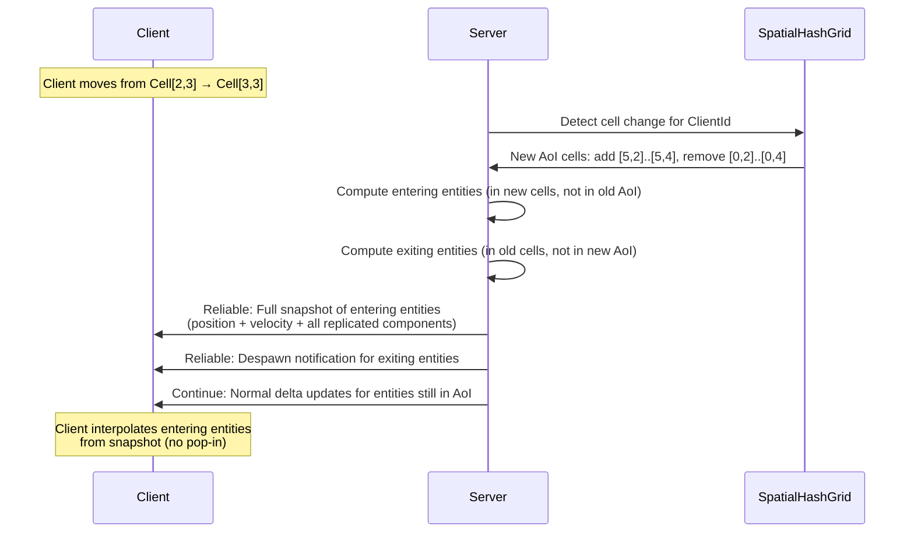
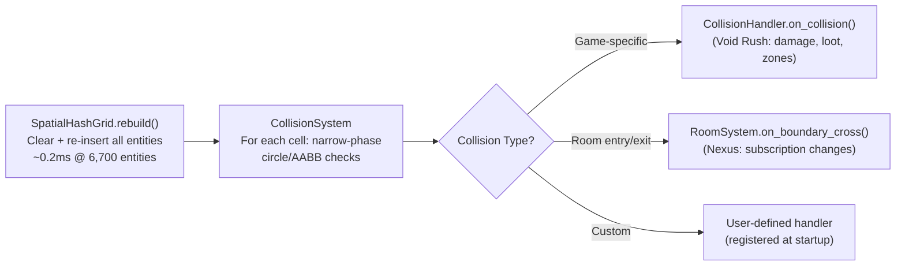

---Version: 0.1.0-draft
Status: Phase 1 — MVP / Phase 3 — Full Implementation
Phase: P1 | P3
Last Updated: 2026-04-16
Authors: Team (Antigravity)
Spec References: [ENGINE_DESIGN, ECS_DESIGN, PRIORITY_CHANNELS_DESIGN, NETWORKING_DESIGN, VOID_RUSH_GDD, NEXUS_PLATFORM_DESIGN]
Tier: 2
---

# Aetheris Engine — Spatial Partitioning & Area of Interest Design Document

## Executive Summary

Spatial partitioning is the **primary scale mechanism** of the Aetheris Engine. Without it, a world with 10,000 entities would require every client to receive every entity's delta every tick — approximately 4.3 MB/s per client for transforms alone. With spatial partitioning, each client receives only the ~50 entities within their **Area of Interest (AoI)**, reducing bandwidth by 96–99%.

This document is the **canonical source** for the engine's spatial partitioning system. It consolidates design fragments previously spread across [ENGINE_DESIGN.md](ENGINE_DESIGN.md) (§5), [PRIORITY_CHANNELS_DESIGN.md](PRIORITY_CHANNELS_DESIGN.md) (§9), [PLATFORM_DESIGN.md](PLATFORM_DESIGN.md) (§4.2), [VOID_RUSH_GDD.md](VOID_RUSH_GDD.md) (§9), and [NEXUS_PLATFORM_DESIGN.md](NEXUS_PLATFORM_DESIGN.md) (§7.2) into a single authoritative reference.

The spatial system serves two orthogonal purposes:

1. **Interest Management** — Determines which entities each client should receive replication deltas for. Runs in Stage 4 (Extract) of the tick pipeline.
2. **Collision Detection Acceleration** — Reduces pairwise collision checks from O(N²) to O(N×K). Runs in Stage 3 (Simulate).

Both use the same underlying data structure (the Spatial Hash Grid) but query it with different parameters.

## Table of Contents

1. [Executive Summary](#1-executive-summary)
2. [Motivation — Why Spatial Partitioning Matters](#2-motivation--why-spatial-partitioning-matters)
3. [Spatial Hash Grid — Core Data Structure](#3-spatial-hash-grid--core-data-structure)
4. [Area of Interest (AoI) — Visibility Model](#4-area-of-interest-aoi--visibility-model)
5. [Integration with the Tick Pipeline](#5-integration-with-the-tick-pipeline)
6. [Configuration & Tuning](#6-configuration--tuning)
7. [SpatialIndex Trait — Abstraction Layer](#7-spatialindex-trait--abstraction-layer)
8. [Collision Detection Acceleration](#8-collision-detection-acceleration)
9. [Performance Contracts & Complexity](#9-performance-contracts--complexity)
10. [Extensibility for Non-Game Use Cases](#10-extensibility-for-non-game-use-cases)
11. [Open Questions](#11-open-questions)
12. [Appendix A — Glossary](#appendix-a--glossary)
13. [Appendix B — Decision Log](#appendix-b--decision-log)

---

## 1. Executive Summary

Spatial partitioning is the **primary scale mechanism** of the Aetheris Engine. Without it, a world with 10,000 entities would require every client to receive every entity's delta every tick — approximately 4.3 MB/s per client for transforms alone. With spatial partitioning, each client receives only the ~50 entities within their **Area of Interest (AoI)**, reducing bandwidth by 96–99%.

This document is the **canonical source** for the engine's spatial partitioning system. It consolidates design fragments previously spread across [ENGINE_DESIGN.md](ENGINE_DESIGN.md) (§5), [PRIORITY_CHANNELS_DESIGN.md](PRIORITY_CHANNELS_DESIGN.md) (§9), [PLATFORM_DESIGN.md](PLATFORM_DESIGN.md) (§4.2), [VOID_RUSH_GDD.md](VOID_RUSH_GDD.md) (§9), and [NEXUS_PLATFORM_DESIGN.md](NEXUS_PLATFORM_DESIGN.md) (§7.2) into a single authoritative reference.

The spatial system serves two orthogonal purposes:

1. **Interest Management** — Determines which entities each client should receive replication deltas for. Runs in Stage 4 (Extract) of the tick pipeline.
2. **Collision Detection Acceleration** — Reduces pairwise collision checks from O(N²) to O(N×K). Runs in Stage 3 (Simulate).

Both use the same underlying data structure (the Spatial Hash Grid) but query it with different parameters.

---

## 2. Motivation — Why Spatial Partitioning Matters

### 2.1 The Bandwidth Problem

Without spatial filtering, every entity delta is broadcast to every connected client:

| Entity Count | Bytes/Update | Tick Rate | Clients | Total Bandwidth (No AoI) |
|---|---|---|---|---|
| 1,000 | 36 B | 60 Hz | 100 | 216 MB/s |
| 2,500 | 36 B | 60 Hz | 500 | 2.7 GB/s |
| 10,000 | 36 B | 60 Hz | 2,500 | 54 GB/s |

These numbers are physically impossible on any network. Spatial partitioning makes large worlds viable.

### 2.2 The Collision Problem

Brute-force collision detection scales quadratically:

$$C_{\text{brute}} = \binom{N}{2} = \frac{N(N-1)}{2}$$

At $N = 6{,}700$ entities (Void Rush P2 target): $C_{\text{brute}} \approx 22.4\text{M checks/tick} \approx 50\text{ms}$ — exceeding the entire 16.6ms tick budget.

Spatial hashing reduces this to:

$$C_{\text{spatial}} = \sum_{c \in \text{cells}} \binom{|c|}{2} \approx N \times K$$

Where $K$ is the average entities per cell (including adjacent cell checks). With well-tuned cell sizes, $K \approx 10$, yielding ~67,000 checks/tick ≈ 0.5ms.

---

## 3. Spatial Hash Grid — Core Data Structure

### 3.1 Design Choice: Hash Grid vs. Alternatives

| Structure | Insert | Query | Memory | Dynamic Entities | Decision |
|---|---|---|---|---|---|
| **Spatial Hash Grid** | O(1) | O(K) per cell | Sparse (only populated cells) | Excellent (full rebuild per tick) | **Selected (P1–P3)** |
| k-d Tree | O(N log N) rebuild | O(log N + K) | Contiguous | Requires full rebuild | Considered for P3 stdlib |
| Octree | O(log D) | O(log D + K) | Pointer-heavy | Incremental possible | Reserved for 3D-heavy P4+ |
| Quadtree | O(log D) | O(log D + K) | Pointer-heavy | Incremental possible | 2D only — insufficient |

The hash grid is selected for P1–P3 because:

1. **Full rebuild is acceptable.** At 6,700 entities, hash insertion is ~0.2ms — well within budget.
2. **Sparse storage.** Only populated cells allocate. A 20×20 grid with 100 populated cells uses ~100 hash entries.
3. **Cache-friendly iteration.** Iterating entities within a cell traverses a contiguous `Vec<EntityRef>`.
4. **Simplicity.** No tree rotations, no pointer chasing, no rebalancing.

### 3.2 Data Structure

```rust
/// Spatial Hash Grid — engine-level primitive.
/// Lives in `aetheris-protocol` (or `aetheris-stdlib` once extracted).
///
/// The grid is rebuilt from scratch every tick. This is intentional:
/// incremental updates add complexity and subtle bugs for negligible
/// gain at <10K entities. If profiling shows rebuild > 1ms, switch
/// to incremental update with dirty tracking.
pub struct SpatialHashGrid {
    /// Cell size in world units (metres). All cells are square.
    cell_size: f32,
    /// Inverse cell size, precomputed to avoid division in hot loop.
    inv_cell_size: f32,
    /// Sparse map from cell coordinates to entity lists.
    /// `FxHashMap` uses a fast, non-cryptographic hash — appropriate
    /// for integer keys where DoS resistance is irrelevant.
    cells: FxHashMap<CellCoord, SmallVec<[EntityRef; 16]>>,
    /// Total entity count (for metrics).
    entity_count: u32,
}

/// Integer cell coordinates. Using i32 allows negative-quadrant worlds.
#[derive(Debug, Clone, Copy, PartialEq, Eq, Hash)]
pub struct CellCoord {
    pub x: i32,
    pub y: i32,
}

/// Lightweight reference to an entity within a cell.
/// Contains only the data needed for spatial queries — no components.
#[derive(Debug, Clone, Copy)]
pub struct EntityRef {
    pub network_id: NetworkId,
    pub position: Vec3,
    /// Bounding radius for collision detection (0.0 if not collidable).
    pub radius: f32,
}
```

### 3.3 Cell Coordinate Computation

```rust
impl SpatialHashGrid {
    /// Convert a world-space position to a cell coordinate.
    /// Uses floor division to handle negative coordinates correctly.
    #[inline]
    pub fn world_to_cell(&self, position: Vec3) -> CellCoord {
        CellCoord {
            x: (position.x * self.inv_cell_size).floor() as i32,
            y: (position.z * self.inv_cell_size).floor() as i32,
            // Note: Y (vertical) is ignored for 2D grid partitioning.
            // 3D partitioning (Octree) is reserved for P4+.
        }
    }

    /// Rebuild the entire grid from an iterator of entities.
    /// Called once per tick in Stage 3 (Simulate), before collision detection.
    pub fn rebuild(&mut self, entities: impl Iterator<Item = EntityRef>) {
        // Clear all cells but retain allocated memory (avoid reallocation).
        for cell in self.cells.values_mut() {
            cell.clear();
        }
        self.entity_count = 0;

        for entity in entities {
            let coord = self.world_to_cell(entity.position);
            self.cells.entry(coord).or_default().push(entity);
            self.entity_count += 1;
        }
    }
}
```

### 3.4 Grid Dimensions by Application

| Application | Cell Size | Grid Extent | Rationale |
|---|---|---|---|
| **Void Rush** (space MMO) | 500m × 500m | 20×20 (10km²) | Largest weapon range (missile: 500m) fits in one cell |
| **Corporate Campus** (Nexus) | 50m × 50m | 40×40 (2km²) | Room-sized granularity; one building floor per cell |
| **Trading Floor** (Nexus) | 20m × 20m | 10×10 (200m²) | Desk-level granularity |
| **Classroom** (Nexus) | 10m × 10m | 5×5 (50m²) | Seat-level granularity |

Cell size is configurable at server startup via `SpatialConfig` (see §6). It is **not** runtime-mutable — changing cell size mid-session would invalidate all client interest sets.

---

## 4. Area of Interest (AoI) — Visibility Model

### 4.1 AoI Definition

Each connected client has an **Area of Interest** centered on their avatar's position. Only entities within this area are replicated to the client. The AoI is defined as a **cell radius** around the client's current cell:

```
AoI radius = 2 cells
Client in cell [5, 5]

  [3,3] [4,3] [5,3] [6,3] [7,3]
  [3,4] [4,4] [5,4] [6,4] [7,4]
  [3,5] [4,5] [5,5] [6,5] [7,5]   ← Client here
  [3,6] [4,6] [5,6] [6,6] [7,6]
  [3,7] [4,7] [5,7] [6,7] [7,7]

Total: (2×2+1)² = 25 cells in AoI
```

### 4.2 Per-Client Interest Set

The interest set is the collection of `NetworkId`s that a client should receive deltas for. It is recomputed every tick (or when the client changes cells — see §4.3):

```rust
/// Per-client interest tracking.
pub struct ClientInterestSet {
    /// The client's current cell.
    pub current_cell: CellCoord,
    /// AoI radius in cells.
    pub aoi_radius: u32,
    /// Set of NetworkIds currently within the client's AoI.
    /// Used for enter/exit detection.
    pub visible_entities: FxHashSet<NetworkId>,
    /// Entities that entered the AoI this tick (need full snapshot).
    pub entered_this_tick: SmallVec<[NetworkId; 32]>,
    /// Entities that exited the AoI this tick (need despawn notification).
    pub exited_this_tick: SmallVec<[NetworkId; 32]>,
}
```

### 4.3 Cell Transition Protocol

When a client moves from one cell to another, the interest set changes. This requires careful handling to avoid entity "pop-in" (suddenly appearing without interpolation data):



**Key invariant:** Entering entities receive a **full snapshot** (not a delta) on their first tick of visibility. Without this, the client would have no base state to apply deltas against.

### 4.4 AoI Radius by Priority Channel

Different Priority Channels can have different effective AoI radii. High-priority channels (P0–P1) have the full AoI radius. Lower-priority channels can have reduced radii to save bandwidth:

| Channel | AoI Radius (Void Rush) | AoI Radius (Corporate) | Rationale |
|---|---|---|---|
| P0: Self | ∞ (always) | ∞ (always) | Own entity is always visible |
| P1: Combat / Collaboration | 2 cells (1000m) | 3 cells (150m) | Immediate interaction range |
| P2: Nearby / Spatial | 2 cells (1000m) | 2 cells (100m) | Full visual range |
| P3: Distant / Presence | 3 cells (1500m) | 4 cells (200m) | Peripheral awareness |
| P4: Environment / Notifications | 4 cells (2000m) | 6 cells (300m) | Ambient world state |
| P5: Cosmetics | 1 cell (500m) | 1 cell (50m) | Only very close entities |

This is configured via the `ChannelRegistry` builder (see [PRIORITY_CHANNELS_DESIGN.md](PRIORITY_CHANNELS_DESIGN.md) §9).

---

## 5. Integration with the Tick Pipeline

The spatial grid integrates at two points in the five-stage tick pipeline:

```
Poll → Apply → Simulate → Extract → Send
                   ↑           ↑
                   │           │
            Grid Rebuild   AoI Filtering
            + Collision    (per-client)
```

### 5.1 Stage 3 — Simulate: Grid Rebuild + Collision

```rust
/// Called during Stage 3 (Simulate).
/// Budget allocation: ~0.5ms for rebuild + collision at 6,700 entities.
fn simulate_spatial(
    world: &dyn WorldState,
    grid: &mut SpatialHashGrid,
    collision_handler: &dyn CollisionHandler,
) {
    // 1. Rebuild grid from all positioned entities.
    let _span = tracing::info_span!("spatial_rebuild").entered();
    grid.rebuild(world.positioned_entities());

    // 2. Run collision detection within and between adjacent cells.
    let _span = tracing::info_span!("collision_detect").entered();
    for (coord, entities) in grid.cells() {
        // Intra-cell collisions
        for i in 0..entities.len() {
            for j in (i + 1)..entities.len() {
                if check_overlap(&entities[i], &entities[j]) {
                    collision_handler.on_collision(entities[i].network_id, entities[j].network_id);
                }
            }
        }
        // Cross-cell collisions (adjacent cells only)
        for neighbor_coord in grid.adjacent_cells(coord) {
            if let Some(neighbor_entities) = grid.get_cell(neighbor_coord) {
                for a in entities.iter() {
                    for b in neighbor_entities.iter() {
                        if check_overlap(a, b) {
                            collision_handler.on_collision(a.network_id, b.network_id);
                        }
                    }
                }
            }
        }
    }
}
```

### 5.2 Stage 4 — Extract: AoI Filtering

```rust
/// Called during Stage 4 (Extract).
/// Filters the full delta set down to per-client interest sets.
fn extract_with_aoi(
    world: &dyn WorldState,
    grid: &SpatialHashGrid,
    client_interests: &mut FxHashMap<ClientId, ClientInterestSet>,
    encoder: &dyn Encoder,
) -> Vec<(ClientId, Vec<u8>)> {
    let all_deltas = world.extract_deltas();
    let mut per_client_packets = Vec::new();

    for (client_id, interest) in client_interests.iter_mut() {
        // Recompute interest set from grid
        let visible_now = grid.query_aoi(interest.current_cell, interest.aoi_radius);

        // Detect enter/exit
        interest.entered_this_tick.clear();
        interest.exited_this_tick.clear();
        for &nid in &visible_now {
            if !interest.visible_entities.contains(&nid) {
                interest.entered_this_tick.push(nid);
            }
        }
        for &nid in &interest.visible_entities {
            if !visible_now.contains(&nid) {
                interest.exited_this_tick.push(nid);
            }
        }
        interest.visible_entities = visible_now;

        // Filter deltas to only those in the interest set
        let client_deltas: Vec<_> = all_deltas.iter()
            .filter(|d| interest.visible_entities.contains(&d.network_id))
            .collect();

        // Encode per-client packet
        let packet = encoder.encode_batch(&client_deltas)?;
        per_client_packets.push((*client_id, packet));
    }

    per_client_packets
}
```

---

## 6. Configuration & Tuning

### 6.1 SpatialConfig

```rust
/// Configuration for the spatial partitioning system.
/// Set once at server startup. Immutable at runtime.
pub struct SpatialConfig {
    /// Cell size in world units (metres).
    pub cell_size: f32,
    /// Default AoI radius in cells for new clients.
    pub default_aoi_radius: u32,
    /// Maximum entities per cell before a warning is logged.
    /// Not a hard limit — just an observability signal.
    pub warn_entities_per_cell: u32,
    /// Whether to enable cross-cell collision detection.
    /// Disable for applications that don't need physics (e.g., corporate campus).
    pub enable_collision: bool,
}

impl Default for SpatialConfig {
    fn default() -> Self {
        Self {
            cell_size: 500.0,          // Void Rush default
            default_aoi_radius: 2,
            warn_entities_per_cell: 200,
            enable_collision: true,
        }
    }
}
```

### 6.2 Tuning Guidelines

| Parameter | Too Small | Optimal | Too Large |
|---|---|---|---|
| **Cell Size** | Many entities per cell → O(K²) collision cost | ~10–50 entities per cell | Many empty cells → wasted hash lookups |
| **AoI Radius** | Entities pop in too close → immersion breaking | Visual range + weapon range + margin | Too many entities per client → bandwidth saturation |

**Rule of thumb:** Cell size ≈ largest interaction range (weapon range, voice range, etc.). AoI radius ≈ 2–4× cell size.

---

## 7. SpatialIndex Trait — Abstraction Layer

Following the Trait Facade pattern, the spatial system is accessed through a trait. This allows swapping the hash grid for a k-d tree or octree without modifying the tick pipeline.

```rust
/// Trait for spatial indexing structures.
/// The tick pipeline accesses spatial data exclusively through this trait.
///
/// # Phase Evolution
/// - **P1:** `SpatialHashGrid` implements this trait.
/// - **P3 (stdlib):** `KdTreeIndex` and `OctreeIndex` added as alternatives.
pub trait SpatialIndex: Send + Sync {
    /// Insert or update an entity's position.
    fn upsert(&mut self, entity: EntityRef);

    /// Remove an entity from the index.
    fn remove(&mut self, network_id: NetworkId);

    /// Rebuild the entire index from scratch.
    fn rebuild(&mut self, entities: impl Iterator<Item = EntityRef>);

    /// Query all entities within `radius` world units of `center`.
    fn query_radius(&self, center: Vec3, radius: f32) -> SmallVec<[NetworkId; 64]>;

    /// Query all entities within the AoI of a given cell coordinate.
    /// Returns the set of NetworkIds visible from that cell.
    fn query_aoi(&self, cell: CellCoord, aoi_radius: u32) -> FxHashSet<NetworkId>;

    /// Query all entities in a specific cell (for collision detection).
    fn query_cell(&self, cell: CellCoord) -> Option<&[EntityRef]>;

    /// Iterate over all populated cells and their adjacent neighbors.
    /// Used by collision detection systems.
    fn cells_with_neighbors(&self) -> impl Iterator<Item = (CellCoord, &[EntityRef], Vec<&[EntityRef]>)>;

    /// Total number of indexed entities (for metrics).
    fn entity_count(&self) -> u32;
}
```

### 7.1 Dependency Rule

```
aetheris-protocol (SpatialIndex trait + SpatialConfig)
    ▲
    │
    ├── aetheris-ecs-bevy (SpatialHashGrid implements SpatialIndex)
    ├── aetheris-ecs-custom (SpatialHashGrid implements SpatialIndex)
    └── aetheris-stdlib [P3] (KdTreeIndex, OctreeIndex implement SpatialIndex)
```

The trait lives in `aetheris-protocol` alongside `GameTransport`, `WorldState`, and `Encoder`. Implementations live in ECS or stdlib crates.

---

## 8. Collision Detection Acceleration

### 8.1 Collision Pipeline

The spatial grid accelerates collision detection by reducing the search space. The collision pipeline runs in Stage 3 (Simulate):



### 8.2 CollisionHandler Trait

```rust
/// Trait for handling collision events.
/// Decouples collision detection from collision response.
pub trait CollisionHandler: Send + Sync {
    /// Called when two entities overlap spatially.
    fn on_collision(&self, a: NetworkId, b: NetworkId, world: &mut dyn WorldState);
}
```

Games register their `CollisionHandler` at startup. Nexus applications that don't need physics set `SpatialConfig::enable_collision = false` and skip this entirely.

### 8.3 Complexity Summary

| Operation | Complexity | Budget (6,700 entities) |
|---|---|---|
| Grid rebuild | O(N) | ~0.2ms |
| Intra-cell + cross-cell collision | O(N × K) | ~0.5ms |
| AoI query (per client) | O(R²) where R = AoI cells | ~0.01ms |
| Enter/exit detection (per client) | O(V) where V = visible entities | ~0.01ms |
| **Total spatial per tick** | | **~0.7ms + 0.02ms × clients** |

At 500 clients: ~0.7 + 10 = ~10.7ms. Tight, but within the 16.6ms budget when combined with other stages. If profiling shows this is the bottleneck, AoI computation can be parallelized across clients with `rayon`.

---

## 9. Performance Contracts & Complexity

### 9.1 Metrics

| Metric | Source | Threshold | Action |
|---|---|---|---|
| `aetheris_spatial_rebuild_seconds` | `tracing::span` around `rebuild()` | > 1ms | Profile hash function; consider incremental update |
| `aetheris_spatial_collision_seconds` | `tracing::span` around collision loop | > 2ms | Increase cell size; reduce entity density |
| `aetheris_spatial_aoi_seconds` | `tracing::span` around AoI filtering | > 0.05ms per client | Reduce AoI radius; enable rayon parallelism |
| `aetheris_spatial_max_entities_per_cell` | Per-tick max across all cells | > `warn_entities_per_cell` | Entities are clustering — tune cell size or add gameplay spread mechanics |
| `aetheris_spatial_populated_cells` | `cells.len()` | Information only | Sparse grid health indicator |

### 9.2 Memory Usage

| Component | Size | At 6,700 entities |
|---|---|---|
| `EntityRef` | 28 bytes | 183 KB |
| `FxHashMap` overhead | ~64 bytes per cell | ~6.4 KB (100 cells) |
| `ClientInterestSet` per client | ~2 KB (HashSet + SmallVecs) | 1 MB (500 clients) |
| **Total** | | **~1.2 MB** |

Negligible. The spatial system is not a memory bottleneck.

---

## 10. Extensibility for Non-Game Use Cases

The spatial system is designed to be useful beyond collision detection. Nexus platform applications use it for:

| Use Case | Spatial Feature | Configuration |
|---|---|---|
| **Meeting room AoI** | Only replicate room contents to occupants | Small cells (50m), collision disabled |
| **Proximity voice** | Attenuate voice based on distance | `query_radius()` with voice falloff distance |
| **Trading floor sectors** | Traders see only their desk area's tickers | 20m cells, AoI radius 2 |
| **Campus navigation** | Avatars visible only in current building | 50m cells, AoI radius 3 |

The `SpatialIndex` trait and `SpatialConfig` are intentionally generic — they reference world positions, not game-specific concepts. Non-game applications simply register different cell sizes and AoI radii.

For room-based scoping (which composes with spatial AoI), see [ROOM_AND_INSTANCE_DESIGN.md](ROOM_AND_INSTANCE_DESIGN.md).

For the full per-client subscription model (which composes AoI + rooms + tenants), see [INTEREST_MANAGEMENT_DESIGN.md](INTEREST_MANAGEMENT_DESIGN.md).

---

## 11. Open Questions

| # | Question | Context | Status |
|---|---|---|---|
| Q1 | **3D spatial partitioning** | Void Rush is top-down (2D grid sufficient). If a future game requires true 3D (underwater, multilevel buildings), switch to octree. | Deferred to P4. Monitor via Trait Facade. |
| Q2 | **Incremental grid update** | Full rebuild at 10K+ entities may approach 1ms. Incremental (dirty-only) update trades complexity for speed. | Deferred to P3. Measure first. |
| Q3 | **Per-client AoI shape** | Current model is square (cell radius). Circular AoI would be more accurate but requires distance checks per entity. | Square is sufficient for P1–P3. |
| Q4 | **Dynamic AoI radius** | Adjust AoI based on client bandwidth/RTT. Clients with poor connections get smaller AoI. | Specified in [INTEREST_MANAGEMENT_DESIGN.md](INTEREST_MANAGEMENT_DESIGN.md) §5. |

---

## Appendix A — Glossary

| Term | Definition |
|---|---|
| **AoI (Area of Interest)** | The spatial region around a client's avatar within which entity updates are replicated. |
| **Cell** | A fixed-size square partition of the world space, identified by integer coordinates `CellCoord(x, y)`. |
| **Cell Radius** | The number of cells in each direction from the client's cell that constitute the AoI. Radius 2 = 5×5 = 25 cells. |
| **EntityRef** | Lightweight spatial reference containing only `NetworkId`, `Vec3` position, and collision radius. |
| **Interest Set** | The set of `NetworkId`s currently within a client's AoI. Used for delta filtering and enter/exit detection. |
| **Pop-in** | Visual artifact where entities suddenly appear without interpolation. Prevented by sending full snapshots on AoI entry. |
| **Spatial Hash Grid** | A data structure mapping integer cell coordinates to lists of entities. O(1) insert, O(K) query per cell. |
| **SpatialIndex** | Engine trait abstracting spatial data structures. Implementations: `SpatialHashGrid` (P1), `KdTreeIndex` (P3). |

---

## Appendix B — Decision Log

| # | Decision | Rationale | Revisit If... | Date |
|---|---|---|---|---|
| S1 | Spatial Hash Grid over k-d Tree for P1–P3 | O(1) insert, simple full rebuild, sparse storage. k-d tree adds O(N log N) rebuild cost for marginal query improvement. | Full rebuild exceeds 1ms at entity counts > 20K. | 2026-04-16 |
| S2 | 2D grid (XZ plane), not 3D | Void Rush is top-down. Corporate campuses are single-floor. 3D adds complexity with no P1–P3 benefit. | Game requires true 3D spatial queries (multilevel dungeons, flight combat). | 2026-04-16 |
| S3 | Full rebuild every tick, not incremental | At 6,700 entities, rebuild = 0.2ms. Incremental tracking adds dirty flags and edge cases for marginal savings. | Rebuild exceeds 1ms (measure first). | 2026-04-16 |
| S4 | `SpatialIndex` trait in `aetheris-protocol` | Follows the Trait Facade pattern. Enables k-d tree / octree swap in P3 stdlib without modifying tick pipeline. | Trait surface area proves too narrow for specialized spatial structures. Extend trait. | 2026-04-16 |
| S5 | Square AoI (cell radius), not circular | Square AoI is trivially computed from cell coordinates (no per-entity distance check). The error margin (corner entities slightly outside true circular range) is cosmetically irrelevant. | Visual pop-in at AoI corners becomes noticeable at very small cell sizes. | 2026-04-16 |
| S6 | `FxHashMap` for cell storage | Non-cryptographic hash is faster for integer keys. Cell coordinates are not attacker-controlled — no DoS risk. | Profiling shows hash collisions degrading performance. Switch to `IndexMap` or custom hash. | 2026-04-16 |
